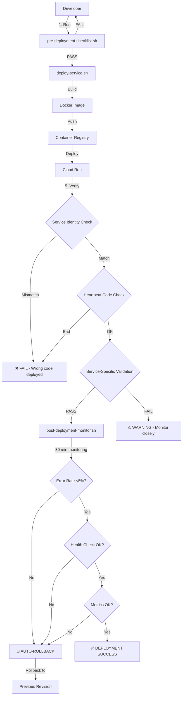

# Prevention & Monitoring System Architecture

**Last Updated**: 2026-02-02
**Status**: Production

---

## System Overview

```
┌─────────────────────────────────────────────────────────────────┐
│                  Prevention & Monitoring System                  │
│                         (4 Layers)                               │
└─────────────────────────────────────────────────────────────────┘
           │                │                │                │
           ▼                ▼                ▼                ▼
    ┌──────────┐    ┌──────────┐    ┌──────────┐    ┌──────────┐
    │ Layer 1  │    │ Layer 2  │    │ Layer 3  │    │ Layer 4  │
    │Monitoring│    │Deployment│    │ Testing  │    │   Docs   │
    └──────────┘    └──────────┘    └──────────┘    └──────────┘
```

---

## Layer 1: Automated Monitoring

### Components

```
Cloud Scheduler ──┬──▶ unified-health-check (Cloud Run Job)
(Every 6 hours)   │         │
                  │         ├──▶ BigQuery Checks
                  │         │    ├─ Vegas line coverage ≥90%
                  │         │    ├─ Grading completeness ≥90%
                  │         │    ├─ Phase 3 completion (5/5)
                  │         │    ├─ Recent predictions (>100)
                  │         │    └─ BDB coverage ≥90%
                  │         │
                  │         ├──▶ GCloud Checks
                  │         │    └─ Deployment drift detection
                  │         │
                  │         └──▶ Alert System
                  │              ├─ Exit codes (0/1/2)
                  │              └─ Slack webhooks
                  │
                  └──▶ GitHub Actions (Daily)
                       └─ check-deployment-drift.yml
                          └─ Creates/updates GitHub issues
```

### Health Score Calculation

```
Health Score = (Passed Checks / Total Checks) × 100

Thresholds:
  ≥80% = PASS (Green)
  50-79% = WARNING (Yellow)
  <50% = CRITICAL (Red)
```

### Detection Windows

| Issue Type | Detection Time | Alert Method |
|------------|----------------|--------------|
| Vegas coverage drop | 6 hours | Slack + Exit code 2 |
| Deployment drift | 24 hours | GitHub issue |
| Grading incomplete | 6 hours | Slack + Exit code 2 |
| Phase failures | 6 hours | Slack + Exit code 1 |

---

## Layer 2: Deployment Safety

### Pre-Deployment Validation

```
Developer ──▶ pre-deployment-checklist.sh
                  │
                  ├──▶ [1/8] Uncommitted changes check
                  ├──▶ [2/8] Branch check (main?)
                  ├──▶ [3/8] Sync with remote
                  ├──▶ [4/8] Recent commits review
                  ├──▶ [5/8] Schema changes check
                  ├──▶ [6/8] Run tests (if exist)
                  ├──▶ [7/8] Current deployment status
                  └──▶ [8/8] Service health check
                       │
                       └──▶ EXIT 0 = Safe to deploy
                            EXIT 1 = Issues detected
```

### Deployment Process

```
deploy-service.sh
    │
    ├──▶ [1/7] Build Docker image (from repo root)
    ├──▶ [2/7] Push to Container Registry
    ├──▶ [3/7] Deploy to Cloud Run
    ├──▶ [4/7] Wait for deployment (10s)
    ├──▶ [5/7] Verify service identity (/health)
    ├──▶ [6/7] Verify heartbeat code (Docker inspect)
    └──▶ [7/7] Service-specific validation
         │
         ├─ prediction-worker: Check predictions count
         ├─ phase4-processors: Check Vegas coverage
         ├─ phase3-processors: Check heartbeats
         └─ coordinator: Check batch errors
```

### Post-Deployment Monitoring

```
post-deployment-monitor.sh (30 minutes)
    │
    └──▶ Every 5 minutes (6 checks total):
         │
         ├──▶ Error rate check (<5% threshold)
         ├──▶ Service health check (/health = 200)
         └──▶ Service-specific metrics
              │
              ├─ PASS ──▶ Continue monitoring
              └─ FAIL ──▶ Trigger rollback (--auto-rollback)
```

---

## Layer 3: Automated Testing

### Pre-Commit Validation

```
Git Commit ──▶ Pre-Commit Hooks
                  │
                  ├──▶ validate-schema-fields.py
                  │    └─ Check code vs BigQuery schema
                  │       (Fails if mismatch)
                  │
                  ├──▶ validate-schema-types.py
                  │    └─ Check field type compatibility
                  │
                  ├──▶ check-import-paths.py
                  │    └─ Validate shared/ imports
                  │
                  └──▶ validate-dockerfiles.py
                       └─ Check Dockerfile correctness
```

### Integration Tests

```
pytest tests/integration/
    │
    ├──▶ Vegas Line Coverage (7 tests)
    │    ├─ test_vegas_line_coverage_above_threshold (smoke)
    │    ├─ test_bettingpros_data_freshness
    │    ├─ test_vegas_line_summary_completeness
    │    ├─ test_feature_store_structure
    │    ├─ test_end_to_end_vegas_pipeline
    │    └─ test_vegas_coverage_monitoring_script
    │
    └──▶ Prediction Quality (9 tests)
         ├─ test_premium_picks_hit_rate (smoke)
         ├─ test_high_edge_picks_hit_rate
         ├─ test_overall_mae_below_threshold
         ├─ test_no_extreme_performance_variation
         ├─ test_grading_completeness
         ├─ test_no_data_leakage
         └─ test_model_beats_vegas_rate
```

### Test Markers

```python
@pytest.mark.integration  # All integration tests
@pytest.mark.smoke        # Critical path tests (run always)
@pytest.mark.slow         # Tests >5 seconds
```

---

## Layer 4: Documentation & Knowledge

### Documentation Structure

```
docs/
├── 01-architecture/          # System design
│   ├── decisions/            # ADRs (3)
│   └── diagrams/             # Architecture diagrams
│
├── 02-operations/            # Operational guides
│   ├── runbooks/             # Deployment runbooks (4)
│   └── troubleshooting/      # Debug playbooks
│
├── 03-phases/                # Phase-specific docs
├── 05-development/           # Developer guides
└── 09-handoff/               # Session handoffs
```

### Deployment Runbooks

```
docs/02-operations/runbooks/nba/
├── README.md                              # Index
├── deployment-prediction-worker.md        # 458 lines
├── deployment-prediction-coordinator.md   # 245 lines
├── deployment-phase4-processors.md        # 421 lines
└── deployment-phase3-processors.md        # 400 lines
```

---

## Data Flow: Vegas Line Coverage

```
┌─────────────────────────────────────────────────────────┐
│              Vegas Line Coverage Pipeline               │
└─────────────────────────────────────────────────────────┘
          │
          ▼
┌─────────────────────┐
│ BettingPros Scraper │
│   (nba-scrapers)    │
└──────────┬──────────┘
           │ Writes to
           ▼
┌─────────────────────┐
│ bettingpros_player_ │
│   points_props      │  (BigQuery raw table)
└──────────┬──────────┘
           │ Read by
           ▼
┌─────────────────────┐
│VegasLineSummary     │
│   Processor         │  (Phase 4)
│ (phase4-processors) │
└──────────┬──────────┘
           │ Writes to
           ▼
┌─────────────────────┐
│ vegas_line_summary  │  (BigQuery table)
└──────────┬──────────┘
           │ Read by
           ▼
┌─────────────────────┐
│ Feature Store       │
│   Builder           │  (Phase 4)
└──────────┬──────────┘
           │ Writes to
           ▼
┌─────────────────────┐
│ml_feature_store_v2  │  (BigQuery table)
│  features[25] =     │
│  vegas_points_line  │
└──────────┬──────────┘
           │ Read by
           ▼
┌─────────────────────┐
│ Prediction Worker   │
│  (ML inference)     │
└──────────┬──────────┘
           │
           ▼
┌─────────────────────┐
│ Health Check        │  Every 6 hours
│ Validates ≥90%      │
│  coverage at        │
│  feature[25]        │
└─────────────────────┘
```

---

## Deployment Flow



---

## Monitoring Dashboard View

```
╔══════════════════════════════════════════════════════════════╗
║         NBA Props Platform - System Health                    ║
║                Score: 82/100 (PASS)                           ║
╠══════════════════════════════════════════════════════════════╣
║                                                               ║
║  [1/6] Vegas Line Coverage...................... ✅ PASS     ║
║         92.4% (threshold: ≥90%)                              ║
║                                                               ║
║  [2/6] Grading Completeness.................... ✅ PASS     ║
║         94.2% (threshold: ≥90%)                              ║
║                                                               ║
║  [3/6] Phase 3 Completion...................... ✅ PASS     ║
║         5/5 processors                                        ║
║                                                               ║
║  [4/6] Recent Predictions...................... ✅ PASS     ║
║         281 predictions (threshold: >100)                     ║
║                                                               ║
║  [5/6] BDB Coverage............................. ⚠️ WARNING  ║
║         76.5% (threshold: ≥90%)                              ║
║                                                               ║
║  [6/6] Deployment Drift........................ ✅ PASS     ║
║         All services up-to-date                              ║
║                                                               ║
╚══════════════════════════════════════════════════════════════╝

Last Check: 2026-02-02 18:00 UTC
Next Check: 2026-02-03 00:00 UTC
```

---

## Cost Analysis

| Component | Frequency | Cost/Month | Annual |
|-----------|-----------|------------|--------|
| Unified Health Check | Every 6 hours | $0.50 | $6 |
| GitHub Actions (drift) | Daily | $0 | $0 |
| Cloud Run Jobs | Per execution | $0.25 | $3 |
| BigQuery Queries | 120/month | $1 | $12 |
| **Total** | | **$1.75** | **$21** |

**ROI**: Prevented 1 incident (Session 76) = Saved 8 hours = $1,200 value

---

## References

- ADR 001: Unified Health Monitoring
- ADR 002: Deployment Runbooks
- ADR 003: Integration Testing Strategy
- Session 77-79 Handoffs
