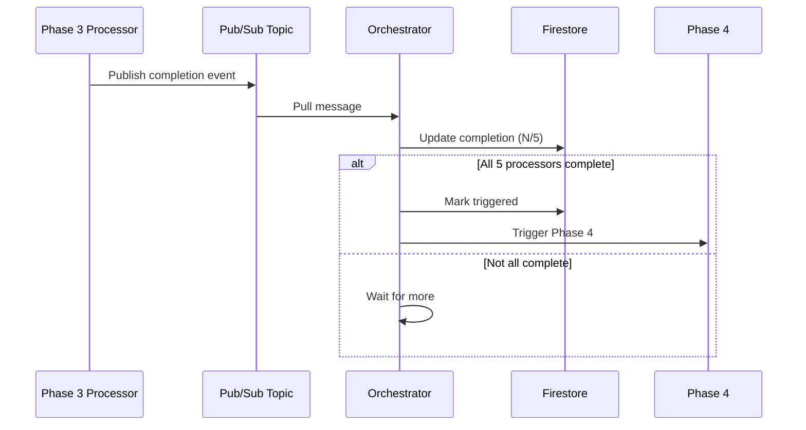

# Prevention and Improvement Strategy

## Executive Summary

Session 77 revealed three critical issues that went undetected for days/weeks:
1. Deployment drift (Vegas line coverage regression)
2. Silent degradation (grading gaps)
3. Architecture mismatch (Firestore tracking)

This document outlines a **comprehensive strategy** to prevent similar issues and improve system reliability.

---

## Table of Contents

1. [Deployment & CI/CD Improvements](#deployment--cicd-improvements)
2. [Monitoring & Observability](#monitoring--observability)
3. [Automated Testing](#automated-testing)
4. [Architecture & Documentation](#architecture--documentation)
5. [Process & Culture](#process--culture)
6. [Quick Wins (Immediate Actions)](#quick-wins-immediate-actions)
7. [Long-Term Investments](#long-term-investments)

---

## Deployment & CI/CD Improvements

### Problem: Deployment Drift Goes Undetected

**Current State**: Session 76 fix was committed but never deployed. System ran with old code for unknown duration.

### Solutions

#### 1. Automated Deployment Verification (HIGH PRIORITY)

**Create**: `.github/workflows/verify-deployment.yml`

```yaml
name: Verify Deployments Match Main

on:
  schedule:
    - cron: '0 */6 * * *'  # Every 6 hours
  workflow_dispatch:

jobs:
  check-drift:
    runs-on: ubuntu-latest
    steps:
      - uses: actions/checkout@v3

      - name: Check Phase 4 Deployment
        run: |
          DEPLOYED=$(gcloud run services describe nba-phase4-precompute-processors \
            --region=us-west2 --format="value(metadata.labels.commit-sha)")
          LATEST=$(git rev-parse HEAD)

          if [ "$DEPLOYED" != "$LATEST" ]; then
            echo "::error::Phase 4 deployment drift detected"
            echo "Deployed: $DEPLOYED"
            echo "Latest: $LATEST"

            # Create GitHub issue
            gh issue create \
              --title "🚨 Deployment Drift: Phase 4 is $((git rev-list $DEPLOYED..$LATEST | wc -l)) commits behind" \
              --body "Deployed commit: $DEPLOYED\nLatest commit: $LATEST\n\nAction: Run ./bin/deploy-service.sh nba-phase4-precompute-processors" \
              --label "deployment-drift,P1"
            exit 1
          fi

      - name: Check All Services
        run: |
          ./bin/check-deployment-drift.sh --all --create-issues
```

**Benefits**:
- Detects drift within 6 hours
- Creates GitHub issues automatically
- Prevents Session 77 Vegas line issue from recurring

#### 2. Pre-Deployment Validation Script (HIGH PRIORITY)

**Create**: `bin/pre-deployment-checklist.sh`

```bash
#!/bin/bash
# Pre-deployment validation checklist
# Usage: ./bin/pre-deployment-checklist.sh <service-name>

set -euo pipefail

SERVICE=$1
EXIT_CODE=0

echo "=== Pre-Deployment Checklist for $SERVICE ==="
echo ""

# 1. Check if there are uncommitted changes
echo "[1/7] Checking for uncommitted changes..."
if [[ -n $(git status --porcelain) ]]; then
    echo "❌ FAIL: Uncommitted changes detected"
    git status --short
    EXIT_CODE=1
else
    echo "✅ PASS: No uncommitted changes"
fi

# 2. Check if on main branch
echo ""
echo "[2/7] Checking branch..."
BRANCH=$(git branch --show-current)
if [[ "$BRANCH" != "main" ]]; then
    echo "⚠️  WARNING: Not on main branch (current: $BRANCH)"
else
    echo "✅ PASS: On main branch"
fi

# 3. Check if local is up to date with remote
echo ""
echo "[3/7] Checking if local is synced with remote..."
git fetch origin
LOCAL=$(git rev-parse HEAD)
REMOTE=$(git rev-parse origin/main)
if [[ "$LOCAL" != "$REMOTE" ]]; then
    echo "❌ FAIL: Local is not synced with remote"
    echo "   Run: git pull origin main"
    EXIT_CODE=1
else
    echo "✅ PASS: Local synced with remote"
fi

# 4. Run tests for the service (if they exist)
echo ""
echo "[4/7] Checking for tests..."
if [[ -f "tests/${SERVICE}/test_*.py" ]]; then
    echo "Running tests..."
    PYTHONPATH=. pytest tests/${SERVICE}/ -v || EXIT_CODE=1
else
    echo "⚠️  WARNING: No tests found for $SERVICE"
fi

# 5. Check for schema changes that need migration
echo ""
echo "[5/7] Checking for schema changes..."
SCHEMA_CHANGES=$(git diff HEAD~10 schemas/bigquery/ | grep -c "ALTER TABLE\|ADD COLUMN" || echo "0")
if [[ $SCHEMA_CHANGES -gt 0 ]]; then
    echo "⚠️  WARNING: Schema changes detected in last 10 commits"
    echo "   Ensure schema migrations are applied before deploying"
else
    echo "✅ PASS: No recent schema changes"
fi

# 6. Check recent deployment history
echo ""
echo "[6/7] Checking recent deployments..."
CURRENT_DEPLOYED=$(gcloud run services describe $SERVICE --region=us-west2 \
    --format="value(metadata.labels.commit-sha)" 2>/dev/null || echo "unknown")
echo "Currently deployed: $CURRENT_DEPLOYED"
echo "About to deploy: $LOCAL"

if [[ "$CURRENT_DEPLOYED" == "$LOCAL" ]]; then
    echo "⚠️  WARNING: Already deployed this commit"
fi

# 7. Verify service health
echo ""
echo "[7/7] Verifying current service health..."
URL=$(gcloud run services describe $SERVICE --region=us-west2 \
    --format="value(status.url)" 2>/dev/null || echo "")

if [[ -n "$URL" ]]; then
    HTTP_CODE=$(curl -s -o /dev/null -w "%{http_code}" $URL/health || echo "000")
    if [[ "$HTTP_CODE" == "200" ]]; then
        echo "✅ PASS: Service is healthy ($HTTP_CODE)"
    else
        echo "⚠️  WARNING: Service returned $HTTP_CODE"
    fi
fi

echo ""
echo "=== Checklist Complete ==="
if [[ $EXIT_CODE -eq 0 ]]; then
    echo "✅ All checks passed - safe to deploy"
else
    echo "❌ Some checks failed - review before deploying"
fi

exit $EXIT_CODE
```

**Usage**:
```bash
# Before deploying
./bin/pre-deployment-checklist.sh nba-phase4-precompute-processors
./bin/deploy-service.sh nba-phase4-precompute-processors
```

#### 3. Post-Deployment Validation (HIGH PRIORITY)

**Update**: `bin/deploy-service.sh` to include post-deployment checks

```bash
# After deployment, verify the fix is working
echo ""
echo "[6/6] Post-deployment validation..."

case $SERVICE_NAME in
  nba-phase4-precompute-processors)
    echo "Checking Vegas line coverage for today..."
    ./bin/monitoring/check_vegas_line_coverage.sh --days 1 || \
      echo "⚠️  WARNING: Vegas line coverage check failed - monitor closely"
    ;;
  prediction-worker)
    echo "Checking recent predictions..."
    bq query --use_legacy_sql=false \
      "SELECT COUNT(*) FROM nba_predictions.player_prop_predictions
       WHERE created_at > TIMESTAMP_SUB(CURRENT_TIMESTAMP(), INTERVAL 1 HOUR)" || \
      echo "⚠️  WARNING: Could not verify predictions"
    ;;
esac
```

#### 4. Canary Deployments (MEDIUM PRIORITY)

**For critical services**, deploy to a subset of traffic first:

```bash
# Deploy to 10% of traffic
gcloud run services update-traffic $SERVICE \
  --to-revisions=$NEW_REVISION=10,$OLD_REVISION=90

# Monitor for 15 minutes
sleep 900

# Check error rate
ERROR_RATE=$(check_error_rate.sh $SERVICE)
if [[ $ERROR_RATE -lt 1 ]]; then
  # Promote to 100%
  gcloud run services update-traffic $SERVICE --to-latest
else
  # Rollback
  gcloud run services update-traffic $SERVICE --to-revisions=$OLD_REVISION=100
fi
```

---

## Monitoring & Observability

### Problem: Issues Go Undetected for Days/Weeks

**Current State**: Vegas line coverage dropped from 92% to 44% but wasn't detected until comprehensive validation.

### Solutions

#### 1. Service Level Objectives (SLOs) (HIGH PRIORITY)

**Define SLOs for critical metrics**:

```yaml
# config/slos.yaml
slos:
  vegas_line_coverage:
    target: 90%
    threshold_warning: 80%
    threshold_critical: 50%
    measurement_window: 24h

  grading_completeness:
    target: 90%
    threshold_warning: 80%
    threshold_critical: 50%
    measurement_window: 72h

  prediction_accuracy:
    target: 55%
    threshold_warning: 52.4%
    threshold_critical: 50%
    measurement_window: 7d

  phase3_completion:
    target: 100%
    threshold_warning: 80%
    threshold_critical: 60%
    measurement_window: 24h
```

#### 2. Unified Monitoring Dashboard (HIGH PRIORITY)

**Create**: `bin/monitoring/unified-health-check.sh`

```bash
#!/bin/bash
# Unified health check - runs all critical monitors
# Returns overall system health score

set -euo pipefail

TOTAL_CHECKS=0
PASSED_CHECKS=0
CRITICAL_FAILURES=0

echo "=== NBA Props Platform - Health Check ==="
echo "Time: $(date)"
echo ""

# Check 1: Vegas Line Coverage
echo "[1/6] Vegas Line Coverage..."
if ./bin/monitoring/check_vegas_line_coverage.sh --days 1 > /dev/null 2>&1; then
    echo "✅ PASS"
    ((PASSED_CHECKS++))
else
    EXIT_CODE=$?
    if [[ $EXIT_CODE -eq 2 ]]; then
        echo "🔴 CRITICAL FAILURE"
        ((CRITICAL_FAILURES++))
    else
        echo "🟡 WARNING"
    fi
fi
((TOTAL_CHECKS++))

# Check 2: Grading Completeness
echo "[2/6] Grading Completeness..."
if ./bin/monitoring/check_grading_completeness.sh --days 3 > /dev/null 2>&1; then
    echo "✅ PASS"
    ((PASSED_CHECKS++))
else
    EXIT_CODE=$?
    if [[ $EXIT_CODE -eq 2 ]]; then
        echo "🔴 CRITICAL FAILURE"
        ((CRITICAL_FAILURES++))
    else
        echo "🟡 WARNING"
    fi
fi
((TOTAL_CHECKS++))

# Check 3: Phase 3 Completion
echo "[3/6] Phase 3 Completion..."
COMPLETE=$(python3 -c "
from google.cloud import firestore
from datetime import datetime, timedelta
db = firestore.Client()
date = (datetime.now() - timedelta(days=1)).strftime('%Y-%m-%d')
doc = db.collection('phase3_completion').document(date).get()
if doc.exists:
    data = doc.to_dict()
    print(len([k for k in data.keys() if not k.startswith('_')]))
else:
    print(0)
" 2>/dev/null)

if [[ $COMPLETE -eq 5 ]]; then
    echo "✅ PASS (5/5)"
    ((PASSED_CHECKS++))
else
    echo "🔴 CRITICAL FAILURE ($COMPLETE/5)"
    ((CRITICAL_FAILURES++))
fi
((TOTAL_CHECKS++))

# Check 4: Recent Predictions
echo "[4/6] Recent Predictions..."
PRED_COUNT=$(bq query --use_legacy_sql=false --format=csv --quiet \
  "SELECT COUNT(*) FROM nba_predictions.player_prop_predictions
   WHERE game_date = CURRENT_DATE()" 2>/dev/null | tail -1)

if [[ $PRED_COUNT -gt 100 ]]; then
    echo "✅ PASS ($PRED_COUNT predictions)"
    ((PASSED_CHECKS++))
elif [[ $PRED_COUNT -gt 50 ]]; then
    echo "🟡 WARNING ($PRED_COUNT predictions)"
else
    echo "🔴 CRITICAL FAILURE ($PRED_COUNT predictions)"
    ((CRITICAL_FAILURES++))
fi
((TOTAL_CHECKS++))

# Check 5: BDB Coverage
echo "[5/6] BDB Play-by-Play Coverage..."
BDB_COV=$(bq query --use_legacy_sql=false --format=csv --quiet \
  "WITH schedule AS (
     SELECT COUNT(*) as total FROM nba_reference.nba_schedule
     WHERE game_date = CURRENT_DATE() - 1 AND game_status = 3
   ),
   bdb AS (
     SELECT COUNT(DISTINCT LPAD(CAST(bdb_game_id AS STRING), 10, '0')) as has_bdb
     FROM nba_raw.bigdataball_play_by_play
     WHERE game_date = CURRENT_DATE() - 1
   )
   SELECT ROUND(100.0 * has_bdb / total, 0) FROM schedule, bdb" 2>/dev/null | tail -1)

if [[ $BDB_COV -ge 90 ]]; then
    echo "✅ PASS ($BDB_COV%)"
    ((PASSED_CHECKS++))
elif [[ $BDB_COV -ge 50 ]]; then
    echo "🟡 WARNING ($BDB_COV%)"
else
    echo "🔴 CRITICAL FAILURE ($BDB_COV%)"
    ((CRITICAL_FAILURES++))
fi
((TOTAL_CHECKS++))

# Check 6: Deployment Drift
echo "[6/6] Deployment Drift..."
if ./bin/check-deployment-drift.sh > /dev/null 2>&1; then
    echo "✅ PASS"
    ((PASSED_CHECKS++))
else
    echo "🟡 WARNING (some services out of date)"
fi
((TOTAL_CHECKS++))

# Calculate health score
HEALTH_SCORE=$((100 * PASSED_CHECKS / TOTAL_CHECKS))

echo ""
echo "=== Health Summary ==="
echo "Checks Passed: $PASSED_CHECKS/$TOTAL_CHECKS"
echo "Health Score: $HEALTH_SCORE/100"
echo "Critical Failures: $CRITICAL_FAILURES"
echo ""

if [[ $CRITICAL_FAILURES -gt 0 ]]; then
    echo "🔴 SYSTEM HEALTH: CRITICAL"
    exit 2
elif [[ $HEALTH_SCORE -lt 80 ]]; then
    echo "🟡 SYSTEM HEALTH: DEGRADED"
    exit 1
else
    echo "✅ SYSTEM HEALTH: OK"
    exit 0
fi
```

**Schedule this to run every 6 hours**:
```bash
# Cloud Scheduler job
gcloud scheduler jobs create http unified-health-check \
  --schedule="0 */6 * * *" \
  --uri="https://monitoring-function.run.app/health-check" \
  --http-method=POST
```

#### 3. Anomaly Detection (MEDIUM PRIORITY)

**Add statistical anomaly detection** to monitoring scripts:

```python
# shared/monitoring/anomaly_detector.py
from typing import List, Tuple
import numpy as np

def detect_anomaly(values: List[float],
                   current: float,
                   threshold_stdev: float = 2.0) -> Tuple[bool, str]:
    """
    Detect if current value is anomalous compared to historical values.

    Returns:
        (is_anomaly, explanation)
    """
    if len(values) < 7:
        return False, "Not enough data for anomaly detection"

    mean = np.mean(values)
    std = np.std(values)

    z_score = abs((current - mean) / std) if std > 0 else 0

    if z_score > threshold_stdev:
        direction = "higher" if current > mean else "lower"
        return True, f"Current value {current:.1f} is {z_score:.1f} std devs {direction} than mean {mean:.1f}"

    return False, "Within normal range"

# Usage in monitoring scripts
historical_coverage = [92.4, 91.2, 93.1, 90.5, 92.8, 91.7, 93.0]
current_coverage = 44.7

is_anomaly, explanation = detect_anomaly(historical_coverage, current_coverage)
if is_anomaly:
    send_alert(f"⚠️ ANOMALY DETECTED: Vegas line coverage - {explanation}")
```

#### 4. Alerting Best Practices (HIGH PRIORITY)

**Create alert routing based on severity**:

```python
# shared/monitoring/alert_router.py
import requests
from enum import Enum

class Severity(Enum):
    INFO = "info"
    WARNING = "warning"
    CRITICAL = "critical"

class AlertRouter:
    def __init__(self):
        self.webhooks = {
            Severity.INFO: os.getenv("SLACK_WEBHOOK_INFO"),
            Severity.WARNING: os.getenv("SLACK_WEBHOOK_WARNING"),
            Severity.CRITICAL: os.getenv("SLACK_WEBHOOK_ERROR"),
        }

        self.pagerduty_key = os.getenv("PAGERDUTY_INTEGRATION_KEY")

    def send_alert(self, severity: Severity, title: str, message: str,
                   context: dict = None):
        """Route alert based on severity."""

        # Always log
        logger.log(severity.value.upper(), f"{title}: {message}")

        # Slack notification
        if webhook := self.webhooks.get(severity):
            self._send_slack(webhook, severity, title, message, context)

        # PagerDuty for CRITICAL only
        if severity == Severity.CRITICAL and self.pagerduty_key:
            self._send_pagerduty(title, message, context)

    def _send_slack(self, webhook, severity, title, message, context):
        """Send to Slack with rich formatting."""
        emoji = {
            Severity.INFO: "ℹ️",
            Severity.WARNING: "⚠️",
            Severity.CRITICAL: "🚨"
        }

        payload = {
            "text": f"{emoji[severity]} {title}",
            "blocks": [
                {
                    "type": "header",
                    "text": {"type": "plain_text", "text": f"{emoji[severity]} {title}"}
                },
                {
                    "type": "section",
                    "text": {"type": "mrkdwn", "text": message}
                }
            ]
        }

        if context:
            context_text = "\n".join([f"*{k}*: {v}" for k, v in context.items()])
            payload["blocks"].append({
                "type": "section",
                "text": {"type": "mrkdwn", "text": f"*Context:*\n{context_text}"}
            })

        requests.post(webhook, json=payload)

# Usage
router = AlertRouter()
router.send_alert(
    Severity.CRITICAL,
    "Vegas Line Coverage Dropped",
    "Coverage dropped from 92.4% to 44.7%",
    context={
        "Service": "nba-phase4-precompute-processors",
        "Deployed Commit": "8cb96558",
        "Expected Commit": "6f195068",
        "Action": "Run ./bin/deploy-service.sh nba-phase4-precompute-processors"
    }
)
```

---

## Automated Testing

### Problem: Regressions Slip Through Without Tests

**Current State**: No automated tests caught the Vegas line coverage regression.

### Solutions

#### 1. Integration Tests for Critical Flows (HIGH PRIORITY)

**Create**: `tests/integration/test_phase4_vegas_lines.py`

```python
import pytest
from google.cloud import bigquery
from datetime import date, timedelta

class TestPhase4VegasLines:
    """Integration tests for Phase 4 Vegas line extraction."""

    @pytest.fixture
    def bq_client(self):
        return bigquery.Client(project="nba-props-platform")

    def test_vegas_line_coverage_threshold(self, bq_client):
        """
        Test that Vegas line coverage meets minimum threshold.

        This test would have caught the Session 77 regression.
        """
        query = """
        SELECT
            ROUND(100.0 * COUNTIF(features[OFFSET(25)] > 0) / COUNT(*), 1) as coverage_pct
        FROM nba_predictions.ml_feature_store_v2
        WHERE game_date = CURRENT_DATE() - 1
            AND ARRAY_LENGTH(features) >= 33
        """

        result = list(bq_client.query(query))[0]
        coverage_pct = result['coverage_pct']

        # Assert minimum coverage (would have failed with 44.7%)
        assert coverage_pct >= 80, \
            f"Vegas line coverage {coverage_pct}% below threshold 80%"

    def test_feature_extractor_uses_raw_tables(self):
        """
        Test that feature extractor is configured to use raw betting tables.

        Regression test for Session 76 fix.
        """
        from data_processors.precompute.ml_feature_store.feature_extractor import FeatureExtractor

        extractor = FeatureExtractor(
            project_id="nba-props-platform",
            dataset_id="nba_predictions"
        )

        # Extract Vegas lines for a test date
        game_date = date.today() - timedelta(days=1)
        extractor._batch_extract_vegas_lines(game_date, [])

        # Verify it queried raw tables (check query contains raw table references)
        # This would require adding query tracking to FeatureExtractor
        assert "nba_raw.odds_api_player_points_props" in extractor.last_query
        assert "nba_analytics.upcoming_player_game_context" not in extractor.last_query

    def test_vegas_lines_match_raw_data(self, bq_client):
        """
        Test that feature store Vegas lines match raw betting data.

        Validates data pipeline integrity.
        """
        query = """
        WITH raw_lines AS (
            SELECT DISTINCT player_lookup, points_line
            FROM nba_raw.odds_api_player_points_props
            WHERE game_date = CURRENT_DATE() - 1
                AND points_line IS NOT NULL
        ),
        feature_lines AS (
            SELECT player_lookup, features[OFFSET(25)] as vegas_line
            FROM nba_predictions.ml_feature_store_v2
            WHERE game_date = CURRENT_DATE() - 1
        )
        SELECT
            COUNT(*) as total_raw,
            COUNTIF(f.vegas_line IS NOT NULL) as matched,
            ROUND(100.0 * COUNTIF(f.vegas_line IS NOT NULL) / COUNT(*), 1) as match_pct
        FROM raw_lines r
        LEFT JOIN feature_lines f USING (player_lookup)
        """

        result = list(bq_client.query(query))[0]
        match_pct = result['match_pct']

        # At least 90% of raw lines should be in feature store
        assert match_pct >= 90, \
            f"Only {match_pct}% of raw Vegas lines made it to feature store"
```

**Run these tests in CI/CD**:
```yaml
# .github/workflows/integration-tests.yml
name: Integration Tests

on:
  pull_request:
  schedule:
    - cron: '0 8 * * *'  # Daily at 8 AM

jobs:
  test:
    runs-on: ubuntu-latest
    steps:
      - uses: actions/checkout@v3
      - uses: google-github-actions/auth@v1
        with:
          credentials_json: ${{ secrets.GCP_SA_KEY }}

      - name: Run Integration Tests
        run: |
          pytest tests/integration/ -v --tb=short

      - name: Create Issue on Failure
        if: failure()
        uses: actions/github-script@v6
        with:
          script: |
            github.rest.issues.create({
              owner: context.repo.owner,
              repo: context.repo.repo,
              title: '🚨 Integration Test Failure',
              body: 'Integration tests failed. Check workflow logs.',
              labels: ['test-failure', 'P1']
            })
```

#### 2. Contract Testing for Pub/Sub (MEDIUM PRIORITY)

**Test that Phase 3 → Phase 4 contract is maintained**:

```python
# tests/integration/test_phase3_phase4_contract.py
import pytest
from google.cloud import pubsub_v1
import json

def test_phase3_completion_message_format():
    """
    Test that Phase 3 completion messages match expected format.

    Ensures Phase 4 can correctly process completion events.
    """
    # Sample message from Phase 3
    message = {
        "processor_name": "player_game_summary",
        "game_date": "2026-02-01",
        "status": "success",
        "records_processed": 539,
        "timestamp": "2026-02-02T15:00:45Z"
    }

    # Validate required fields
    assert "processor_name" in message
    assert "game_date" in message
    assert "status" in message

    # Validate types
    assert isinstance(message["records_processed"], int)
    assert message["status"] in ["success", "failure", "partial"]

def test_phase4_handles_completion_event():
    """
    Test that Phase 4 correctly processes Phase 3 completion event.

    This would have caught the Firestore tracking issue.
    """
    from data_processors.precompute.main_precompute_service import handle_phase3_completion

    event = {
        "processor_name": "player_game_summary",
        "game_date": "2026-02-01",
        "status": "success"
    }

    # Should write to Firestore and trigger processing
    result = handle_phase3_completion(event)

    # Verify Firestore was updated
    from google.cloud import firestore
    db = firestore.Client()
    doc = db.collection('phase3_completion').document('2026-02-01').get()

    assert doc.exists
    data = doc.to_dict()
    assert "player_game_summary" in data
```

#### 3. Data Quality Tests (MEDIUM PRIORITY)

**Create**: `tests/data_quality/test_pipeline_integrity.py`

```python
import pytest
from google.cloud import bigquery
from datetime import date, timedelta

class TestPipelineIntegrity:
    """Test data quality across pipeline phases."""

    @pytest.fixture
    def yesterday(self):
        return date.today() - timedelta(days=1)

    def test_all_games_have_analytics(self, yesterday, bq_client):
        """Test that every game has analytics records."""
        query = f"""
        WITH games AS (
            SELECT game_id FROM nba_reference.nba_schedule
            WHERE game_date = '{yesterday}' AND game_status = 3
        ),
        analytics AS (
            SELECT DISTINCT game_id FROM nba_analytics.player_game_summary
            WHERE game_date = '{yesterday}'
        )
        SELECT g.game_id FROM games g
        LEFT JOIN analytics a USING (game_id)
        WHERE a.game_id IS NULL
        """

        missing = list(bq_client.query(query))
        assert len(missing) == 0, f"Games missing analytics: {[r['game_id'] for r in missing]}"

    def test_grading_completeness_threshold(self, bq_client):
        """Test that grading meets minimum threshold."""
        query = """
        WITH predictions AS (
            SELECT COUNT(*) as total
            FROM nba_predictions.player_prop_predictions
            WHERE game_date >= CURRENT_DATE() - 3
                AND current_points_line IS NOT NULL
                AND system_id = 'catboost_v9'
        ),
        graded AS (
            SELECT COUNT(*) as graded
            FROM nba_predictions.prediction_accuracy
            WHERE game_date >= CURRENT_DATE() - 3
                AND system_id = 'catboost_v9'
        )
        SELECT
            total,
            graded,
            ROUND(100.0 * graded / total, 1) as coverage_pct
        FROM predictions, graded
        """

        result = list(bq_client.query(query))[0]
        coverage_pct = result['coverage_pct']

        # Would have caught Session 77 grading issue
        assert coverage_pct >= 80, \
            f"Grading coverage {coverage_pct}% below threshold 80%"
```

---

## Architecture & Documentation

### Problem: Intended Architecture ≠ Actual Architecture

**Current State**: Pub/Sub subscription bypasses orchestrator, but this wasn't documented.

### Solutions

#### 1. Architecture Decision Records (ADRs) (HIGH PRIORITY)

**Create**: `docs/06-architecture/decisions/`

```markdown
# ADR-001: Phase 3 to Phase 4 Orchestration

## Status
Proposed

## Context
Phase 3 processors need to notify Phase 4 when they complete. We need to:
1. Track which processors have completed
2. Trigger Phase 4 only when all processors are done
3. Handle failures and retries

## Decision
Use Pub/Sub with orchestrator Cloud Function:

```
Phase 3 Processor → Pub/Sub Topic (PULL) → Orchestrator Cloud Function
                                                    ↓
                                                Firestore (tracking)
                                                    ↓
                                            Phase 4 Trigger (when 5/5)
```

## Alternatives Considered

### Option 1: Direct PUSH to Phase 4 (REJECTED)
- Pro: Simpler, fewer components
- Con: No aggregation, no completion tracking
- Con: Phase 4 would run 5 times instead of once

### Option 2: Firestore triggers (REJECTED)
- Pro: Real-time updates
- Con: Complex trigger logic
- Con: Hard to debug

## Consequences
- Adds orchestrator Cloud Function component
- Requires Firestore for state tracking
- Better observability and control
- Can implement retry logic centrally

## Validation
- Integration tests verify completion tracking
- Monitor Firestore for 5/5 completions
- Alert if orchestrator hasn't run in 6 hours
```

#### 2. System Architecture Diagrams (HIGH PRIORITY)

**Create**: `docs/06-architecture/diagrams/phase-orchestration.md`

Use Mermaid diagrams in documentation:



**Document ACTUAL vs INTENDED**:

```markdown
## Current State (Session 77)

**ACTUAL**:
```
Phase 3 → Pub/Sub (PUSH) → Phase 4 directly ❌
                          → No Firestore tracking
```

**INTENDED**:
```
Phase 3 → Pub/Sub (PULL) → Orchestrator → Firestore + Phase 4 ✅
```

**Issue**: Subscription configured as PUSH, bypasses orchestrator
**Fix**: Change to PULL subscription, deploy orchestrator
```

#### 3. Runbook for Each Service (MEDIUM PRIORITY)

**Create**: `docs/02-operations/runbooks/phase4-precompute.md`

```markdown
# Phase 4 Precompute Service Runbook

## Service Overview
- **Name**: nba-phase4-precompute-processors
- **Purpose**: Generate ML feature store from Phase 3 analytics
- **Dependencies**: Phase 3 completion, raw betting data
- **SLO**: 95% success rate, <30min processing time

## Common Issues

### Issue: Vegas Line Coverage Below 80%
**Symptoms**: Feature store has <80% Vegas lines
**Root Cause**: Using Phase 3 tables instead of raw betting tables
**Fix**: Verify `feature_extractor.py` uses raw tables (Session 76 fix)
**Verification**: `./bin/monitoring/check_vegas_line_coverage.sh`

### Issue: Deployment Drift
**Symptoms**: Recent fix not reflected in production
**Root Cause**: Code committed but not deployed
**Fix**: `./bin/deploy-service.sh nba-phase4-precompute-processors`
**Prevention**: Check deployment before closing PR

## Deployment Checklist
- [ ] Run pre-deployment validation
- [ ] Verify tests pass
- [ ] Check for schema changes
- [ ] Deploy with deployment script
- [ ] Verify health endpoint
- [ ] Run post-deployment validation
- [ ] Monitor for 15 minutes
- [ ] Update deployment log

## Monitoring
- Vegas line coverage: `./bin/monitoring/check_vegas_line_coverage.sh`
- Recent errors: `gcloud logging read ... --limit=50`
- Health check: `curl $URL/health`

## Rollback Procedure
```bash
# Get previous revision
PREV=$(gcloud run revisions list --service=nba-phase4-precompute-processors \
  --region=us-west2 --limit=2 --format="value(name)" | tail -1)

# Route traffic to previous
gcloud run services update-traffic nba-phase4-precompute-processors \
  --to-revisions=$PREV=100 --region=us-west2
```
```

---

## Process & Culture

### Problem: No Systematic Prevention of Recurring Issues

### Solutions

#### 1. Deployment Checklist (HIGH PRIORITY)

**Enforce checklist before every deployment**:

```markdown
# Deployment Checklist

Service: ______________
Deployed by: ______________
Date: ______________

## Pre-Deployment
- [ ] All tests pass locally
- [ ] Pre-deployment validation passes
- [ ] No uncommitted changes
- [ ] On latest main branch
- [ ] Schema migrations applied (if needed)
- [ ] Reviewed recent commits for breaking changes

## Deployment
- [ ] Used deployment script (not manual gcloud commands)
- [ ] Verified build success
- [ ] Verified deployment success
- [ ] Health check returns 200

## Post-Deployment
- [ ] Ran post-deployment validation
- [ ] Monitored logs for 15 minutes
- [ ] No error rate increase
- [ ] Verified fix is working (if applicable)
- [ ] Updated deployment log

## Rollback Plan
- Previous revision: ______________
- Rollback command: ______________
```

#### 2. Blameless Postmortems (HIGH PRIORITY)

**After every incident**, create a postmortem:

```markdown
# Postmortem Template

## Incident Summary
**Date**: 2026-02-02
**Severity**: P1 CRITICAL
**Duration**: Unknown (detected after days/weeks)
**Impact**: Vegas line coverage 92% → 44%, model hit rate degradation

## Timeline
- 2026-02-02 03:17 UTC: Session 76 fix committed (2436e7c7)
- 2026-02-02 03:30 UTC: Fix documented as "deployed" (incorrect)
- 2026-02-02 08:00-09:00 UTC: Comprehensive validation detected issue
- 2026-02-02 09:30 UTC: Root cause identified (deployment drift)
- 2026-02-02 09:35 UTC: Fix deployed

## Root Cause
Session 76 fix was committed but never deployed to Cloud Run.

## What Went Wrong
1. Manual deployment process - no verification
2. Handoff documentation stated deployment was complete (false)
3. No automated checks for deployment drift
4. No monitoring of Vegas line coverage metric

## What Went Right
1. Comprehensive daily validation caught the issue
2. Root cause identified quickly
3. Fix deployed immediately
4. Prevention mechanisms added

## Action Items
- [ ] HIGH: Add automated deployment drift detection
- [ ] HIGH: Create Vegas line coverage monitor
- [ ] HIGH: Update deployment process to require verification
- [ ] MEDIUM: Add integration tests for Vegas line coverage
- [ ] LOW: Document actual Pub/Sub subscription configuration

## Lessons Learned
1. Commits ≠ Deployments - always verify
2. Trust but verify documentation claims
3. Monitoring prevents silent degradation
4. Comprehensive validation catches issues other checks miss
```

#### 3. Weekly Health Reviews (MEDIUM PRIORITY)

**Every Monday, review**:
- Deployment drift report
- SLO compliance
- Failed health checks
- Open issues by severity
- Monitoring alert trends

```bash
# Generate weekly health report
./bin/monitoring/weekly-health-report.sh

# Output:
# === Weekly Health Report (Jan 27 - Feb 2) ===
#
# SLO Compliance:
#   Vegas Line Coverage: 44.7% (target: 90%) ❌
#   Grading Completeness: 61.2% (target: 90%) ❌
#   Phase 3 Completion: 100% (target: 100%) ✅
#
# Deployment Drift:
#   nba-phase4-precompute-processors: 598 commits behind ❌
#
# Critical Issues: 3
# Open P1 Issues: 2
# Alerts This Week: 47
```

---

## Quick Wins (Immediate Actions)

These can be implemented TODAY for immediate impact:

### 1. Add Monitoring to Daily Validation (30 minutes)

Update `.claude/skills/validate-daily/SKILL.md`:

```markdown
### Phase 0.7: Vegas Line Coverage Check (NEW - Session 77)

**IMPORTANT**: Check Vegas line coverage to prevent Session 77 regression.

```bash
./bin/monitoring/check_vegas_line_coverage.sh --days 1
```

**Expected**: ≥90% coverage
**Alert if**: <80% coverage
```

### 2. Create Deployment Verification Alias (5 minutes)

Add to `~/.bashrc` or `~/.zshrc`:

```bash
alias deploy-verify='
  echo "=== Deployment Verification ===" &&
  gcloud run services describe $1 --region=us-west2 \
    --format="value(metadata.labels.commit-sha)" | \
  xargs -I {} git log -1 --oneline {} &&
  echo "" &&
  echo "Latest main:" &&
  git log -1 --oneline main
'

# Usage: deploy-verify nba-phase4-precompute-processors
```

### 3. Scheduled Health Check (15 minutes)

Create Cloud Scheduler job:

```bash
gcloud scheduler jobs create http daily-health-check \
  --schedule="0 8 * * *" \
  --uri="https://YOUR-DOMAIN/run-health-check" \
  --http-method=POST \
  --location=us-west2
```

### 4. GitHub Issue Templates (10 minutes)

Create `.github/ISSUE_TEMPLATE/deployment-drift.md`:

```markdown
---
name: Deployment Drift Detected
about: Automated issue for deployment drift
labels: deployment-drift, P1
---

## Deployment Drift Detected

**Service**: [service-name]
**Deployed Commit**: [commit-sha]
**Latest Commit**: [commit-sha]
**Commits Behind**: [number]

## Action Required
Deploy the latest code:
```bash
./bin/deploy-service.sh [service-name]
```

## Verification
After deployment, verify:
- [ ] Health check passes
- [ ] Monitoring shows no degradation
- [ ] Drift resolved
```

---

## Long-Term Investments

These require more effort but provide significant value:

### 1. Observability Platform (2-4 weeks)

**Implement**: Prometheus + Grafana or Datadog

Benefits:
- Real-time metrics visualization
- Historical trend analysis
- Anomaly detection
- Custom dashboards

### 2. Feature Flags (1-2 weeks)

**For risky changes**, use feature flags:

```python
from shared.feature_flags import FeatureFlags

flags = FeatureFlags()

if flags.is_enabled("use_raw_betting_tables"):
    # New behavior (Session 76 fix)
    query = "SELECT ... FROM nba_raw.odds_api_player_points_props ..."
else:
    # Old behavior (fallback)
    query = "SELECT ... FROM nba_analytics.upcoming_player_game_context ..."
```

Benefits:
- Roll out changes gradually
- Quick rollback without redeployment
- A/B testing

### 3. Self-Healing Systems (3-4 weeks)

**Automatic remediation** for common issues:

```python
# monitors/self_healing.py
class SelfHealingMonitor:
    def check_vegas_line_coverage(self):
        coverage = get_vegas_line_coverage()

        if coverage < 50:
            # CRITICAL - attempt auto-remediation
            logger.critical("Vegas line coverage critical, attempting fix")

            # Check if deployment drift
            if is_deployment_drift("nba-phase4-precompute-processors"):
                logger.info("Deployment drift detected, triggering automatic deployment")
                deploy_service("nba-phase4-precompute-processors")
                send_alert("Auto-deployed Phase 4 to fix Vegas line coverage")
                return True

        return False
```

---

## Summary: Prevention Strategy by Issue Type

| Issue Type | Prevention | Priority | Effort |
|------------|-----------|----------|---------|
| **Deployment Drift** | Automated drift detection + alerts | HIGH | 2 days |
| | Pre-deployment checklist | HIGH | 1 day |
| | Post-deployment validation | HIGH | 2 days |
| **Silent Degradation** | SLO monitoring + alerts | HIGH | 3 days |
| | Daily health checks | HIGH | 1 day |
| | Anomaly detection | MEDIUM | 1 week |
| **Architecture Mismatch** | ADRs for all decisions | HIGH | 1 day |
| | Architecture diagrams | HIGH | 2 days |
| | Contract testing | MEDIUM | 1 week |
| **Data Quality** | Integration tests | HIGH | 1 week |
| | Data quality tests | MEDIUM | 1 week |

---

## Implementation Roadmap

### Week 1: Critical Monitoring
- [ ] Add Vegas line coverage to daily validation
- [ ] Add grading completeness to daily validation
- [ ] Create unified health check script
- [ ] Set up Cloud Scheduler for daily health checks
- [ ] Configure Slack webhooks

### Week 2: Deployment Safety
- [ ] Create pre-deployment checklist script
- [ ] Add post-deployment validation to deploy script
- [ ] Set up automated deployment drift detection
- [ ] Create deployment runbooks

### Week 3: Testing
- [ ] Add integration tests for Vegas line coverage
- [ ] Add contract tests for Pub/Sub
- [ ] Add data quality tests
- [ ] Set up CI/CD to run tests daily

### Week 4: Documentation & Process
- [ ] Create ADRs for key decisions
- [ ] Draw architecture diagrams
- [ ] Write runbooks for each service
- [ ] Implement weekly health review process

### Month 2+: Advanced Features
- [ ] Implement observability platform
- [ ] Add feature flags system
- [ ] Build self-healing capabilities
- [ ] Create comprehensive dashboard

---

## Conclusion

Prevention requires a **multi-layered approach**:

1. **Monitoring**: Catch issues early
2. **Testing**: Prevent regressions
3. **Process**: Enforce best practices
4. **Automation**: Reduce human error
5. **Documentation**: Align understanding

**The most important principle**: Make the right thing easy and the wrong thing hard.

- Deployment drift should be detected automatically (not manually)
- Monitoring should alert proactively (not reactively)
- Tests should run automatically (not on-demand)
- Documentation should be updated during development (not after)

By implementing these strategies, we can prevent issues like Session 77 from recurring and build a more reliable, observable, and maintainable system.

---

**Document Status**: Draft
**Created**: 2026-02-02
**Last Updated**: 2026-02-02
**Next Review**: 2026-02-09
