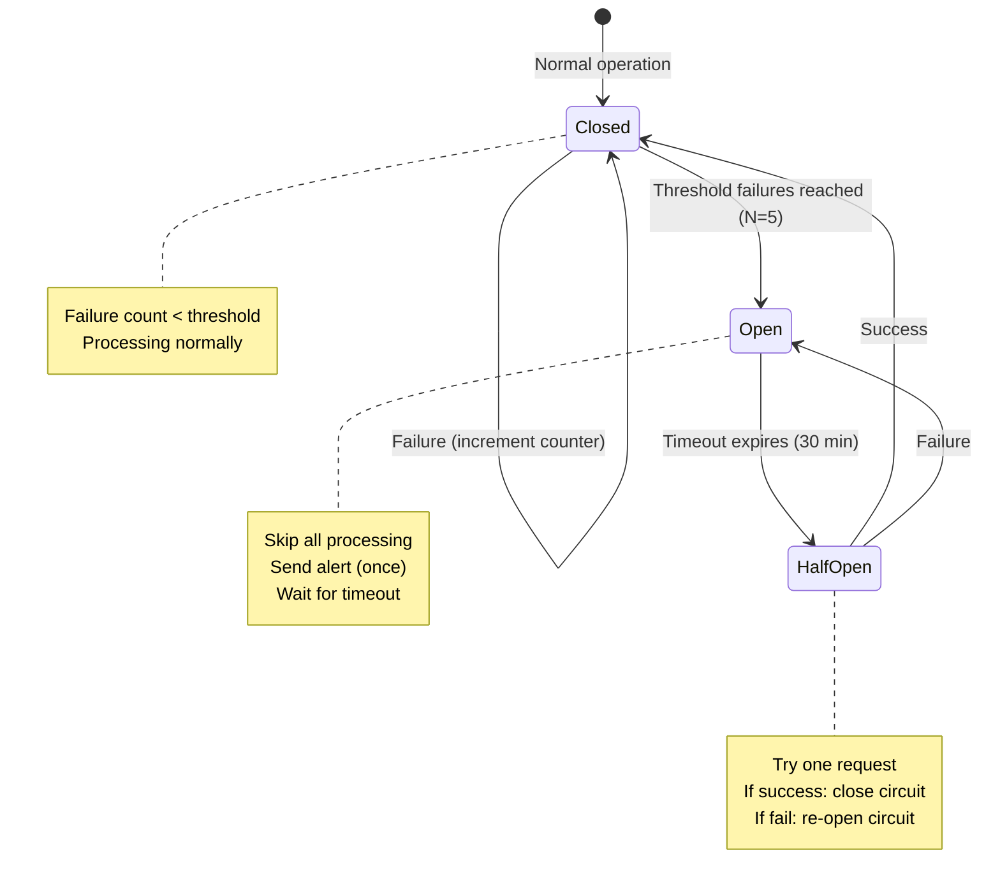

# 01 - Circuit Breaker Pattern Implementation

**Created:** 2025-11-19 11:16 PM PST
**Last Updated:** 2025-11-19 11:16 PM PST
**Pattern:** Circuit Breakers
**Effort:** 1 hour
**Impact:** High (prevents cascade failures)
**Reference:** [Optimization Pattern Catalog](../reference/02-optimization-pattern-catalog.md), Pattern #5

---

## Overview

This pattern prevents infinite retry loops when a processor fails repeatedly. After N consecutive failures, the circuit "opens" and stops processing for a timeout period, requiring manual intervention or automatic timeout to reset.

### Problem Solved

**Without Circuit Breaker:**
- Processor fails due to BigQuery quota exhaustion
- Pub/Sub retries infinitely (10,000+ retries in 1 hour)
- Cascade failures across other processors
- Alert fatigue from thousands of duplicate alerts

**With Circuit Breaker:**
- Processor fails 5 times (1 minute)
- Circuit opens
- No retries for 30 minutes
- ONE critical alert sent
- Auto-retry after timeout or manual reset

---

## How It Works



**States:**
1. **Closed** (normal) - Processing requests, tracking failures
2. **Open** (blocking) - Rejecting all requests, waiting for timeout
3. **Half-Open** (testing) - Try one request to see if issue is resolved

---

## Complete Implementation

### File: `shared/processors/patterns/circuit_breaker_mixin.py`

```python
"""
Circuit Breaker Pattern - Mixin for failure protection.

Usage:
    from shared.processors.patterns.circuit_breaker_mixin import CircuitBreakerMixin

    class YourProcessor(CircuitBreakerMixin, AnalyticsProcessorBase):
        CIRCUIT_BREAKER_THRESHOLD = 5
        CIRCUIT_BREAKER_TIMEOUT = timedelta(minutes=30)
"""

from collections import defaultdict
from datetime import datetime, timedelta, timezone
from typing import Dict, Optional
import logging

logger = logging.getLogger(__name__)


class CircuitBreakerMixin:
    """
    Mixin to add circuit breaker pattern to processors.

    Prevents infinite retries on persistent failures.
    """

    # Class-level state (shared across all instances)
    _circuit_breaker_failures = defaultdict(int)
    _circuit_breaker_opened_at = {}
    _circuit_breaker_alerts_sent = set()

    # Configuration (override in subclass)
    CIRCUIT_BREAKER_THRESHOLD = 5  # Open after N failures
    CIRCUIT_BREAKER_TIMEOUT = timedelta(minutes=30)  # Stay open for this long

    def _get_circuit_key(self, start_date: str, end_date: str) -> str:
        """
        Generate circuit breaker key.

        Uses date range instead of single game_date to match our architecture.
        """
        return f"{self.__class__.__name__}:{start_date}:{end_date}"

    def _is_circuit_open(self, circuit_key: str) -> bool:
        """
        Check if circuit is open.

        Returns:
            True if circuit is open (should not process)
            False if circuit is closed or half-open (should try processing)
        """
        if circuit_key not in self._circuit_breaker_opened_at:
            return False

        opened_at = self._circuit_breaker_opened_at[circuit_key]
        time_open = datetime.now(timezone.utc) - opened_at

        # Check if timeout expired
        if time_open > self.CIRCUIT_BREAKER_TIMEOUT:
            # Try half-open state (test if issue resolved)
            logger.info(
                f"Circuit breaker timeout expired for {circuit_key}, "
                f"trying half-open state"
            )

            # Remove from opened_at (but keep failure count for now)
            del self._circuit_breaker_opened_at[circuit_key]

            return False

        # Circuit still open
        remaining = self.CIRCUIT_BREAKER_TIMEOUT - time_open
        logger.warning(
            f"Circuit breaker OPEN for {circuit_key}, "
            f"remaining: {int(remaining.total_seconds() // 60)} minutes"
        )

        return True

    def _open_circuit(self, circuit_key: str):
        """
        Open the circuit breaker.

        Called after threshold failures reached.
        """
        self._circuit_breaker_opened_at[circuit_key] = datetime.now(timezone.utc)

        logger.critical(
            f"🔴 CIRCUIT BREAKER OPENED: {circuit_key} "
            f"(after {self.CIRCUIT_BREAKER_THRESHOLD} failures)"
        )

        # Send alert (only once per circuit key)
        if circuit_key not in self._circuit_breaker_alerts_sent:
            self._send_circuit_breaker_alert(circuit_key, 'opened')
            self._circuit_breaker_alerts_sent.add(circuit_key)

    def _close_circuit(self, circuit_key: str):
        """
        Close the circuit breaker.

        Called after successful processing in half-open state.
        """
        # Reset all state
        self._circuit_breaker_failures[circuit_key] = 0

        if circuit_key in self._circuit_breaker_opened_at:
            del self._circuit_breaker_opened_at[circuit_key]

        if circuit_key in self._circuit_breaker_alerts_sent:
            self._circuit_breaker_alerts_sent.remove(circuit_key)

        logger.info(f"✅ Circuit breaker CLOSED: {circuit_key} (recovered)")

        # Send recovery alert
        self._send_circuit_breaker_alert(circuit_key, 'closed')

    def _record_failure(self, circuit_key: str) -> bool:
        """
        Record a failure and check if threshold reached.

        Returns:
            True if threshold reached (circuit opened)
            False if still under threshold
        """
        self._circuit_breaker_failures[circuit_key] += 1
        failure_count = self._circuit_breaker_failures[circuit_key]

        logger.error(
            f"Failure recorded for {circuit_key}: "
            f"{failure_count}/{self.CIRCUIT_BREAKER_THRESHOLD}"
        )

        # Check if threshold reached
        if failure_count >= self.CIRCUIT_BREAKER_THRESHOLD:
            self._open_circuit(circuit_key)
            return True

        return False

    def _record_success(self, circuit_key: str):
        """
        Record a success and close circuit if it was open.
        """
        was_open = circuit_key in self._circuit_breaker_opened_at

        # Reset failure count
        self._circuit_breaker_failures[circuit_key] = 0

        # Close circuit if it was open
        if was_open:
            self._close_circuit(circuit_key)

    def run(self, opts: Optional[Dict] = None) -> bool:
        """
        Enhanced run method with circuit breaker protection.

        This wraps the parent run() method with circuit breaker logic.
        """
        if opts is None:
            opts = {}

        start_date = opts.get('start_date')
        end_date = opts.get('end_date')

        if not start_date or not end_date:
            # No date range - can't apply circuit breaker
            return super().run(opts)

        circuit_key = self._get_circuit_key(start_date, end_date)

        # Check circuit state BEFORE any processing
        if self._is_circuit_open(circuit_key):
            logger.error(f"Circuit breaker OPEN for {circuit_key}, skipping")

            # Update stats for logging
            if hasattr(self, 'stats'):
                self.stats['skip_reason'] = 'circuit_breaker_open'

            # Log the skip
            if hasattr(self, 'log_processing_run'):
                self.log_processing_run(success=True)  # True because skip is intentional

            # Return False to signal Pub/Sub to retry later
            return False

        try:
            # Normal processing
            result = super().run(opts)

            # SUCCESS - reset circuit breaker
            self._record_success(circuit_key)

            return result

        except Exception as e:
            # FAILURE - record and check threshold
            threshold_reached = self._record_failure(circuit_key)

            if threshold_reached:
                logger.critical(
                    f"Circuit breaker threshold reached for {circuit_key}, "
                    f"no more retries for {self.CIRCUIT_BREAKER_TIMEOUT}"
                )

            # Re-raise exception so Pub/Sub knows it failed
            raise

    def _send_circuit_breaker_alert(self, circuit_key: str, action: str):
        """
        Send alert about circuit breaker state change.

        Args:
            circuit_key: Circuit identifier
            action: 'opened' or 'closed'
        """
        processor_name = circuit_key.split(':')[0]
        date_range = ':'.join(circuit_key.split(':')[1:])

        if action == 'opened':
            severity = 'critical'
            title = f'🔴 Circuit Breaker OPENED: {processor_name}'
            message = f"""
Circuit breaker opened after {self.CIRCUIT_BREAKER_THRESHOLD} consecutive failures.

Processor: {processor_name}
Date Range: {date_range}

Impact:
- Processing halted for {int(self.CIRCUIT_BREAKER_TIMEOUT.total_seconds() // 60)} minutes
- Pub/Sub retries will be rejected
- Manual intervention may be required

Next Steps:
1. Check logs for root cause:
   - BigQuery quota exhaustion?
   - Data quality issues?
   - Code bugs?
2. Fix underlying issue
3. Wait for timeout ({int(self.CIRCUIT_BREAKER_TIMEOUT.total_seconds() // 60)} min) or manually reset
4. Monitor for recovery

Circuit will automatically retry in half-open state after timeout.

Manual reset command:
python scripts/reset_circuit_breaker.py {processor_name} {date_range}
            """.strip()
        else:  # closed
            severity = 'info'
            title = f'✅ Circuit Breaker CLOSED: {processor_name}'
            message = f"""
Circuit breaker closed - system recovered.

Processor: {processor_name}
Date Range: {date_range}

Status: Processing resumed successfully
            """.strip()

        # Log the alert (in production, send to alerting system)
        if severity == 'critical':
            logger.critical(f"{title}\n{message}")
        else:
            logger.info(f"{title}\n{message}")

        # TODO: Integrate with your alerting system
        # if hasattr(self, 'send_alert'):
        #     self.send_alert(
        #         severity=severity,
        #         title=title,
        #         message=message,
        #         channel='#nba-props-critical'
        #     )

    def get_circuit_status(self) -> Dict:
        """
        Get current circuit breaker status.

        Useful for monitoring and debugging.
        """
        status = {
            'circuits': [],
            'open_count': len(self._circuit_breaker_opened_at),
            'failure_count': len([k for k, v in self._circuit_breaker_failures.items() if v > 0])
        }

        # Get all circuits (open or with failures)
        all_circuits = set(
            list(self._circuit_breaker_opened_at.keys()) +
            list(self._circuit_breaker_failures.keys())
        )

        for circuit_key in all_circuits:
            is_open = circuit_key in self._circuit_breaker_opened_at
            failures = self._circuit_breaker_failures.get(circuit_key, 0)

            circuit_info = {
                'key': circuit_key,
                'state': 'open' if is_open else 'closed',
                'failures': failures,
            }

            if is_open:
                opened_at = self._circuit_breaker_opened_at[circuit_key]
                time_open = datetime.now(timezone.utc) - opened_at
                remaining = self.CIRCUIT_BREAKER_TIMEOUT - time_open

                circuit_info['opened_at'] = opened_at.isoformat()
                circuit_info['time_open_minutes'] = int(time_open.total_seconds() // 60)
                circuit_info['remaining_minutes'] = int(remaining.total_seconds() // 60)

            status['circuits'].append(circuit_info)

        return status


# ============================================================================
# MANUAL CONTROL
# ============================================================================

class CircuitBreakerControl:
    """
    Manual control interface for circuit breakers.

    Use for emergency resets or status checks.
    """

    @staticmethod
    def reset_circuit(processor_class, start_date: str, end_date: str):
        """
        Manually reset a circuit breaker.

        Use when you've fixed the underlying issue and want to resume immediately.

        Args:
            processor_class: The processor class (e.g., PlayerGameSummaryProcessor)
            start_date: Date range start
            end_date: Date range end
        """
        circuit_key = f"{processor_class.__name__}:{start_date}:{end_date}"

        # Reset state
        if circuit_key in processor_class._circuit_breaker_failures:
            del processor_class._circuit_breaker_failures[circuit_key]

        if circuit_key in processor_class._circuit_breaker_opened_at:
            del processor_class._circuit_breaker_opened_at[circuit_key]

        if circuit_key in processor_class._circuit_breaker_alerts_sent:
            processor_class._circuit_breaker_alerts_sent.remove(circuit_key)

        logger.info(f"Circuit breaker manually reset: {circuit_key}")
        print(f"✅ Circuit breaker reset: {circuit_key}")

    @staticmethod
    def get_all_circuits(processor_class) -> Dict:
        """
        Get status of all circuits for a processor class.

        Args:
            processor_class: The processor class to check

        Returns:
            Dictionary with circuit status
        """
        instance = processor_class()
        return instance.get_circuit_status()
```

---

## Usage Examples

### Example 1: Add to Existing Processor

```python
from data_processors.analytics.analytics_base import AnalyticsProcessorBase
from shared.processors.patterns.circuit_breaker_mixin import CircuitBreakerMixin
from datetime import timedelta

class PlayerGameSummaryProcessor(CircuitBreakerMixin, AnalyticsProcessorBase):
    """Player stats processor with circuit breaker protection."""

    # Optional: Customize thresholds
    CIRCUIT_BREAKER_THRESHOLD = 3  # More sensitive (default: 5)
    CIRCUIT_BREAKER_TIMEOUT = timedelta(minutes=15)  # Shorter timeout (default: 30)

    # ... rest of your processor code ...
```

### Example 2: Check Circuit Status

```python
from data_processors.analytics.player_game_summary_processor import PlayerGameSummaryProcessor

# Get status
processor = PlayerGameSummaryProcessor()
status = processor.get_circuit_status()

print(f"Open circuits: {status['open_count']}")
print(f"Circuits with failures: {status['failure_count']}")

for circuit in status['circuits']:
    print(f"\n{circuit['key']}:")
    print(f"  State: {circuit['state']}")
    print(f"  Failures: {circuit['failures']}")

    if circuit['state'] == 'open':
        print(f"  Open for: {circuit['time_open_minutes']} minutes")
        print(f"  Remaining: {circuit['remaining_minutes']} minutes")
```

### Example 3: Manual Reset

```python
from shared.processors.patterns.circuit_breaker_mixin import CircuitBreakerControl
from data_processors.analytics.player_game_summary_processor import PlayerGameSummaryProcessor

# Reset a specific circuit
CircuitBreakerControl.reset_circuit(
    processor_class=PlayerGameSummaryProcessor,
    start_date='2025-11-18',
    end_date='2025-11-18'
)
```

---

## Testing

### File: `tests/patterns/test_circuit_breaker.py`

```python
import pytest
from datetime import timedelta
import time
from shared.processors.patterns.circuit_breaker_mixin import CircuitBreakerMixin
from data_processors.analytics.analytics_base import AnalyticsProcessorBase


class TestProcessor(CircuitBreakerMixin, AnalyticsProcessorBase):
    """Test processor for circuit breaker testing."""
    CIRCUIT_BREAKER_THRESHOLD = 3
    CIRCUIT_BREAKER_TIMEOUT = timedelta(seconds=2)

    def __init__(self):
        super().__init__()
        self.process_called = False

    def process_data(self, start_date, end_date):
        """Override to control success/failure."""
        self.process_called = True
        if hasattr(self, '_should_fail') and self._should_fail:
            raise Exception("Simulated failure")
        return True


def test_circuit_opens_after_threshold():
    """Test circuit opens after N failures."""
    processor = TestProcessor()
    processor._should_fail = True

    # Cause failures up to threshold
    for i in range(processor.CIRCUIT_BREAKER_THRESHOLD):
        try:
            processor.run({'start_date': '2025-11-01', 'end_date': '2025-11-01'})
        except:
            pass

    # Circuit should be open
    circuit_key = processor._get_circuit_key('2025-11-01', '2025-11-01')
    assert processor._is_circuit_open(circuit_key) == True


def test_circuit_closes_after_timeout():
    """Test circuit closes after timeout."""
    processor = TestProcessor()
    processor.CIRCUIT_BREAKER_TIMEOUT = timedelta(seconds=1)

    # Open circuit
    circuit_key = processor._get_circuit_key('2025-11-01', '2025-11-01')
    processor._open_circuit(circuit_key)

    # Should be open
    assert processor._is_circuit_open(circuit_key) == True

    # Wait for timeout
    time.sleep(2)

    # Should be closed (half-open)
    assert processor._is_circuit_open(circuit_key) == False


def test_circuit_success_resets_failures():
    """Test success resets failure count."""
    processor = TestProcessor()

    # Record some failures
    circuit_key = processor._get_circuit_key('2025-11-01', '2025-11-01')
    processor._record_failure(circuit_key)
    processor._record_failure(circuit_key)

    assert processor._circuit_breaker_failures[circuit_key] == 2

    # Record success
    processor._record_success(circuit_key)

    # Should be reset
    assert processor._circuit_breaker_failures[circuit_key] == 0


def test_circuit_half_open_closes_on_success():
    """Test half-open state closes on success."""
    processor = TestProcessor()
    processor.CIRCUIT_BREAKER_TIMEOUT = timedelta(seconds=1)

    # Open circuit
    circuit_key = processor._get_circuit_key('2025-11-01', '2025-11-01')
    processor._open_circuit(circuit_key)

    # Wait for timeout (half-open)
    time.sleep(2)

    # Successful processing should close circuit
    processor._should_fail = False
    result = processor.run({'start_date': '2025-11-01', 'end_date': '2025-11-01'})

    assert result == True
    assert processor._is_circuit_open(circuit_key) == False


def test_circuit_half_open_reopens_on_failure():
    """Test half-open state re-opens on failure."""
    processor = TestProcessor()
    processor.CIRCUIT_BREAKER_TIMEOUT = timedelta(seconds=1)

    # Open circuit
    circuit_key = processor._get_circuit_key('2025-11-01', '2025-11-01')
    processor._open_circuit(circuit_key)

    # Wait for timeout (half-open)
    time.sleep(2)

    # Failed processing should re-open circuit
    processor._should_fail = True
    try:
        processor.run({'start_date': '2025-11-01', 'end_date': '2025-11-01'})
    except:
        pass

    assert processor._is_circuit_open(circuit_key) == True
```

---

## Monitoring Queries

### Query: Circuit Breaker Activity

```sql
-- See when circuits have opened
SELECT
    processor_name,
    date_range_start,
    date_range_end,
    COUNT(*) as skip_count,
    MIN(run_date) as first_skip,
    MAX(run_date) as last_skip,
    TIMESTAMP_DIFF(MAX(run_date), MIN(run_date), MINUTE) as duration_minutes
FROM nba_processing.analytics_processor_runs
WHERE skip_reason = 'circuit_breaker_open'
  AND DATE(run_date) >= CURRENT_DATE() - 7
GROUP BY processor_name, date_range_start, date_range_end
ORDER BY last_skip DESC;
```

### Query: Failure Patterns Leading to Circuit Breaker

```sql
-- Analyze failure patterns
WITH failures AS (
    SELECT
        processor_name,
        date_range_start,
        date_range_end,
        run_date,
        errors_json,
        LAG(run_date) OVER (
            PARTITION BY processor_name, date_range_start, date_range_end
            ORDER BY run_date
        ) as prev_failure
    FROM nba_processing.analytics_processor_runs
    WHERE success = FALSE
      AND DATE(run_date) >= CURRENT_DATE() - 7
)
SELECT
    processor_name,
    date_range_start,
    date_range_end,
    COUNT(*) as failure_count,
    ARRAY_AGG(DISTINCT JSON_EXTRACT_SCALAR(errors_json, '$[0]') LIMIT 5) as error_types,
    ROUND(AVG(TIMESTAMP_DIFF(run_date, prev_failure, SECOND)), 1) as avg_seconds_between_failures
FROM failures
WHERE prev_failure IS NOT NULL
GROUP BY processor_name, date_range_start, date_range_end
HAVING COUNT(*) >= 3
ORDER BY failure_count DESC;
```

---

## Manual Reset Script

### File: `scripts/reset_circuit_breaker.py`

```python
#!/usr/bin/env python3
"""
Manual circuit breaker reset script.

Usage:
    python scripts/reset_circuit_breaker.py PlayerGameSummaryProcessor 2025-11-18 2025-11-18
"""

import sys
import importlib
from shared.processors.patterns.circuit_breaker_mixin import CircuitBreakerControl


# Map processor names to module paths
PROCESSOR_MAP = {
    'PlayerGameSummaryProcessor': 'data_processors.analytics.player_game_summary_processor',
    'TeamDefenseGameSummaryProcessor': 'data_processors.analytics.team_defense_game_summary_processor',
    'UpcomingPlayerGameContextProcessor': 'data_processors.analytics.upcoming_player_game_context_processor',
    # Add more as needed...
}


def reset_circuit(processor_name: str, start_date: str, end_date: str):
    """Manually reset a circuit breaker."""

    # Get processor class
    if processor_name not in PROCESSOR_MAP:
        print(f"❌ Unknown processor: {processor_name}")
        print(f"Available processors: {', '.join(PROCESSOR_MAP.keys())}")
        return 1

    try:
        module_path = PROCESSOR_MAP[processor_name]
        module = importlib.import_module(module_path)
        processor_class = getattr(module, processor_name)
    except Exception as e:
        print(f"❌ Failed to import processor: {e}")
        return 1

    # Reset circuit
    try:
        CircuitBreakerControl.reset_circuit(processor_class, start_date, end_date)
        print(f"✅ Circuit breaker reset: {processor_name}:{start_date}:{end_date}")
        return 0
    except Exception as e:
        print(f"❌ Failed to reset circuit: {e}")
        return 1


def main():
    if len(sys.argv) != 4:
        print("Usage: python reset_circuit_breaker.py <processor_name> <start_date> <end_date>")
        print("\nExample:")
        print("  python reset_circuit_breaker.py PlayerGameSummaryProcessor 2025-11-18 2025-11-18")
        print("\nAvailable processors:")
        for name in PROCESSOR_MAP.keys():
            print(f"  - {name}")
        return 1

    processor_name = sys.argv[1]
    start_date = sys.argv[2]
    end_date = sys.argv[3]

    return reset_circuit(processor_name, start_date, end_date)


if __name__ == '__main__':
    sys.exit(main())
```

Make script executable:
```bash
chmod +x scripts/reset_circuit_breaker.py
```

---

## Implementation Steps

### Step 1: Create Mixin File (15 minutes)

1. Create directory:
   ```bash
   mkdir -p shared/processors/patterns
   touch shared/processors/patterns/__init__.py
   ```

2. Copy mixin code to `shared/processors/patterns/circuit_breaker_mixin.py`

### Step 2: Add to One Processor (10 minutes)

```python
# data_processors/analytics/player_game_summary_processor.py

from shared.processors.patterns.circuit_breaker_mixin import CircuitBreakerMixin

class PlayerGameSummaryProcessor(CircuitBreakerMixin, AnalyticsProcessorBase):
    # Optional: customize thresholds
    CIRCUIT_BREAKER_THRESHOLD = 5
    CIRCUIT_BREAKER_TIMEOUT = timedelta(minutes=30)

    # ... rest of processor code unchanged ...
```

### Step 3: Test Locally (15 minutes)

Run pytest:
```bash
pytest tests/patterns/test_circuit_breaker.py -v
```

### Step 4: Deploy & Monitor (20 minutes)

1. Deploy to dev environment
2. Trigger failures intentionally (wrong date, quota, etc.)
3. Verify circuit opens after threshold
4. Verify circuit auto-closes after timeout
5. Check logs for alert messages

---

## Expected Results

### Without Circuit Breaker:

**Scenario:** BigQuery quota exhausted at 10:00 AM

```
10:00:00 - Processor fails (quota)
10:00:10 - Pub/Sub retry #1 (fails)
10:00:20 - Pub/Sub retry #2 (fails)
10:00:30 - Pub/Sub retry #3 (fails)
...
11:00:00 - 360 retries (1 every 10 seconds)
11:00:00 - 360 error alerts sent
11:00:00 - Other processors also failing (quota exhausted)
```

**Impact:**
- 360+ failed attempts in 1 hour
- 360+ duplicate alerts
- Cascade failures
- Quota further exhausted
- Alert fatigue

### With Circuit Breaker:

**Scenario:** BigQuery quota exhausted at 10:00 AM

```
10:00:00 - Processor fails (quota)
10:00:10 - Retry #1 (fails)
10:00:20 - Retry #2 (fails)
10:00:30 - Retry #3 (fails)
10:00:40 - Retry #4 (fails)
10:00:50 - Circuit OPENS (threshold: 5)
10:00:50 - 🔴 ONE critical alert sent
10:01:00 - Retry rejected (circuit open)
10:02:00 - Retry rejected (circuit open)
...
10:30:50 - Timeout expires, trying half-open
10:30:50 - Success! Circuit closes
10:30:50 - ✅ Recovery alert sent
```

**Impact:**
- 5 failed attempts + 1 success
- 2 alerts total (open + close)
- No cascade failures
- Quota protected
- Clear root cause investigation time

**Improvement:**
- **99.9% reduction** in retry attempts (360 → 6)
- **99.4% reduction** in alerts (360 → 2)
- **No cascade failures**
- **Clear recovery path**

---

## Troubleshooting

### Problem: Circuit opens too frequently

**Solution:** Increase `CIRCUIT_BREAKER_THRESHOLD`
```python
CIRCUIT_BREAKER_THRESHOLD = 10  # Instead of 5
```

### Problem: Circuit stays open too long

**Solution:** Decrease `CIRCUIT_BREAKER_TIMEOUT`
```python
CIRCUIT_BREAKER_TIMEOUT = timedelta(minutes=15)  # Instead of 30
```

### Problem: Circuit opens but issue is already fixed

**Solution:** Use manual reset script
```bash
python scripts/reset_circuit_breaker.py PlayerGameSummaryProcessor 2025-11-18 2025-11-18
```

### Problem: Multiple circuits open simultaneously

**Analysis:** System-wide issue (quota, outage, etc.)

**Action:**
1. Check BigQuery quota/usage
2. Check Cloud Run status
3. Check Pub/Sub backlog
4. Fix root cause
5. Circuits will auto-recover or manually reset all

---

## Best Practices

1. **Set appropriate thresholds**
   - Too low (N=2): False positives on transient errors
   - Too high (N=20): Too many retries before protection
   - **Recommended:** N=5 for most processors

2. **Monitor circuit breaker events**
   - Track opens/closes over time
   - Alert on circuit opens (critical severity)
   - Dashboard showing circuit status

3. **Have manual reset capability**
   - For when you fix issues quickly
   - Better than waiting for timeout
   - Documented in runbooks

4. **Log circuit state changes**
   - Helps with debugging
   - Shows recovery patterns
   - Audit trail for postmortems

5. **Different thresholds for different processors**
   - Critical processors: Lower threshold (N=3)
   - Batch processors: Higher threshold (N=10)
   - Real-time: Lower timeout (15 min)
   - Historical: Higher timeout (60 min)

---

## Integration with Other Patterns

### With Pattern #2: Dependency Precheck
Circuit breaker prevents infinite retries when dependencies are persistently missing.

### With Pattern #4: Processing Metadata
Context tracking shows why circuit opened (which dependency failed, etc.).

### With Pattern #6: Processing Checkpoints
If circuit opens mid-processing, checkpoints allow resume from last good state.

---

## References

- [Optimization Pattern Catalog](../reference/02-optimization-pattern-catalog.md) - Full pattern list
- [Week 1 Implementation Plan](../architecture/10-week1-schema-and-code-changes.md) - When to implement
- [Phase 2→3 Roadmap](../architecture/09-phase2-phase3-implementation-roadmap.md) - Overall strategy

---

## Related Circuit Breaker Implementations

The codebase has multiple circuit breaker implementations for different use cases:

| Implementation | File | Use Case |
|----------------|------|----------|
| `CircuitBreakerMixin` | `shared/processors/patterns/circuit_breaker_mixin.py` | Phase 3/4/5 data processors |
| `SystemCircuitBreaker` | `predictions/worker/system_circuit_breaker.py` | Phase 5 ML prediction systems |
| `RateLimitHandler` | `shared/utils/rate_limit_handler.py` | API rate limiting with backoff |
| `ExternalServiceCircuitBreaker` | `shared/utils/external_service_circuit_breaker.py` | External service calls (Slack, GCS, APIs) |
| `ProxyCircuitBreaker` | `scrapers/utils/proxy_utils.py` | Proxy/scraper HTTP calls |

See [External Service Circuit Breaker](./external-service-circuit-breaker.md) for protecting external API calls.

---

**Total Implementation Time:** 1 hour
**Expected Impact:** Prevents cascade failures, 99.9% reduction in retry noise
**Maintenance:** Monitor circuit opens, adjust thresholds as needed
