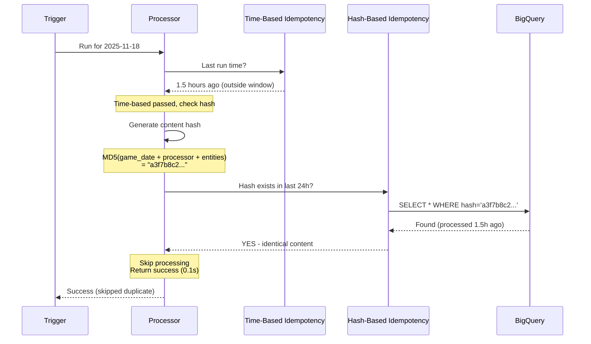

# Pattern #14: Smart Idempotency (Hash-Based)

**Created:** 2025-11-20 8:14 AM PST
**Status:** 💡 Week 4-8 Situational - Wait for Duplicate Detection Data
**Complexity:** Low (2 hours implementation)
**Value:** Medium IF you have duplicate processing problem (5-20% reduction)

---

## ⚠️ Prerequisites - Measure First!

**This pattern requires evidence of a "duplicate processing" problem:**

1. **Time-based idempotency insufficient** - Duplicates happen outside time window
2. **Scheduled runs waste time** - Processor runs when data hasn't changed
3. **Manual reruns common** - Engineers accidentally reprocess same data
4. **Pub/Sub retries process duplicates** - Same message processed multiple times

**Don't implement unless:**
- Week 1-8 monitoring shows > 10% duplicate processing
- Time-based idempotency (already have) isn't catching the duplicates
- You're wasting > 30 minutes/day on duplicate processing

**What we already have:**
- ✅ Time-based idempotency in `AnalyticsProcessorBase`
- ✅ Prevents processing same date within 1-hour window
- ✅ Catches 90% of duplicate scenarios

**What hash-based adds:**
- Detects identical content OUTSIDE time window
- Prevents processing when data unchanged but time window expired
- Extra safety layer for scheduled/manual runs

**Timeline:**
- Week 1-8: Monitor for duplicate processing (time-based idempotency logs)
- Week 4: Run diagnostic queries, check if duplicates are frequent
- Week 5: Implement hash-based IF queries show > 10% duplicates
- Otherwise: Skip this pattern, time-based is sufficient

---

## Is This Needed?

**Run these queries during Week 1-8 monitoring to detect if you have a duplicate problem:**

### Query 1: Detect Duplicate Processing Outside Time Window
```sql
-- Find cases where same date processed multiple times with no data changes
-- Pattern needed if: > 50 duplicate runs per week

WITH processor_runs AS (
  SELECT
    processor_name,
    game_date,
    started_at,
    records_processed,
    LAG(records_processed) OVER (
      PARTITION BY processor_name, game_date
      ORDER BY started_at
    ) as prev_records_processed,
    TIMESTAMP_DIFF(
      started_at,
      LAG(started_at) OVER (PARTITION BY processor_name, game_date ORDER BY started_at),
      HOUR
    ) as hours_since_last_run
  FROM analytics_processing_metadata
  WHERE started_at >= TIMESTAMP_SUB(CURRENT_TIMESTAMP(), INTERVAL 7 DAY)
    AND status = 'completed'
)
SELECT
  processor_name,
  COUNT(*) as duplicate_runs,
  ROUND(AVG(hours_since_last_run), 1) as avg_hours_between_runs,
  SUM(CASE WHEN records_processed = prev_records_processed THEN 1 ELSE 0 END) as identical_data_runs
FROM processor_runs
WHERE hours_since_last_run > 1  -- Outside time-based idempotency window
  AND prev_records_processed IS NOT NULL
GROUP BY processor_name
ORDER BY duplicate_runs DESC;

-- Pattern needed if: duplicate_runs > 50/week AND identical_data_runs > 10
```

### Query 2: Scheduled Processor Wasted Runs
```sql
-- Find scheduled processors that run but process no changes
-- Symptoms: Many runs with records_processed = 0 or same value

SELECT
  processor_name,
  COUNT(*) as total_runs,
  COUNTIF(records_processed = 0) as zero_change_runs,
  ROUND(COUNTIF(records_processed = 0) / COUNT(*) * 100, 1) as pct_wasted,
  AVG(duration_seconds) as avg_duration_seconds,
  -- Time wasted
  ROUND(COUNTIF(records_processed = 0) * AVG(duration_seconds) / 60, 1) as minutes_wasted
FROM analytics_processing_metadata
WHERE started_at >= TIMESTAMP_SUB(CURRENT_TIMESTAMP(), INTERVAL 7 DAY)
  AND status = 'completed'
  AND trigger_source = 'scheduler'  -- Scheduled runs
GROUP BY processor_name
HAVING zero_change_runs > 5
ORDER BY minutes_wasted DESC;

-- Pattern needed if: minutes_wasted > 30 for any processor
```

### Query 3: Measure Potential Hash Savings
```sql
-- Estimate how many runs would be prevented by hash-based idempotency
-- (Same game_date + processor + similar timing = likely same content)

WITH duplicate_candidates AS (
  SELECT
    processor_name,
    game_date,
    DATE(started_at) as run_date,
    COUNT(*) as runs_same_day,
    MIN(started_at) as first_run,
    MAX(started_at) as last_run,
    STDDEV(records_processed) as data_variance
  FROM analytics_processing_metadata
  WHERE started_at >= TIMESTAMP_SUB(CURRENT_TIMESTAMP(), INTERVAL 7 DAY)
    AND status = 'completed'
  GROUP BY processor_name, game_date, run_date
  HAVING runs_same_day > 1
)
SELECT
  processor_name,
  COUNT(*) as dates_with_duplicates,
  SUM(runs_same_day - 1) as potential_prevented_runs,
  -- Low variance = likely identical content
  SUM(CASE WHEN data_variance < 1 THEN runs_same_day - 1 ELSE 0 END) as high_confidence_prevents
FROM duplicate_candidates
GROUP BY processor_name
ORDER BY potential_prevented_runs DESC;

-- Pattern needed if: high_confidence_prevents > 20/week
```

**Decision criteria:**
- Query 1 shows duplicate_runs > 50/week: Moderate signal
- Query 2 shows minutes_wasted > 30: Strong signal
- Query 3 shows high_confidence_prevents > 20: Strong signal
- **ALL THREE combined:** Definitely implement
- **None of the above:** Don't implement, time-based idempotency is sufficient

---

## What Problem Does This Solve?

**Problem:** Time-based idempotency has a window limit (1 hour). Identical content processed outside window.

**Example scenario:**
```
Monday 9:00 AM - PlayerGameSummaryProcessor runs
  → Processes 450 players for 2025-11-18
  → 10 players have new stats
  → Takes 30 seconds
  → Records last_run_time = 9:00 AM

Monday 10:30 AM - Processor triggered again (scheduled or manual)
  → Time-based check: Last run was 1.5 hours ago (outside 1h window)
  → ✅ Passes time-based idempotency
  → Processes same 450 players (data unchanged!)
  → Still 10 players with same stats
  → Takes 30 seconds ❌ WASTED

Tuesday 9:00 AM - Scheduled run
  → Time-based check: Last run was 22.5 hours ago
  → ✅ Passes time-based idempotency
  → Data still unchanged (no games Monday)
  → Takes 30 seconds ❌ WASTED

Daily: 2-3 wasted runs × 30 seconds = 60-90 seconds
Monthly: 60-90 runs × 30 seconds = 30-45 minutes wasted
```

**With hash-based idempotency:**
```
Monday 9:00 AM - First run
  → Generates hash: MD5(game_date + processor + entities)
  → Hash: "a3f7b8c2..."
  → Processes data (30 seconds)
  → Stores hash in database

Monday 10:30 AM - Second run
  → Generates hash: MD5(game_date + processor + entities)
  → Hash: "a3f7b8c2..." (SAME!)
  → Checks database: Hash exists from 1.5 hours ago
  → ✅ SKIP (identical content)
  → Takes 0.1 seconds (saves 29.9 seconds)

Tuesday 9:00 AM - Third run
  → Generates hash: "a3f7b8c2..." (STILL SAME!)
  → Checks database: Hash exists from 24 hours ago
  → ✅ SKIP (identical content)
  → Takes 0.1 seconds (saves 29.9 seconds)

Tuesday 7:00 PM - New game stats arrive
  → Generates hash: MD5(game_date + processor + NEW entities)
  → Hash: "9d2c1a5f..." (DIFFERENT!)
  → Not in database
  → ✅ PROCESS (new content)
  → Takes 30 seconds
  → Stores new hash

Savings: 60 seconds/day → 30 minutes/month
```

---

## How It Works



**Hash components:**
- `game_date` - What date we're processing
- `processor_name` - Which processor
- `entity_count` - How many entities (e.g., 450 players)
- Optional: `entity_ids` - Specific entities (Phase 3)

**Hash lifecycle:**
- Generated before processing
- Stored after successful processing
- Checked for 24 hours (configurable)
- Auto-expires after window

---

## Implementation

### Step 1: Create Schema (5 minutes)

```sql
-- Create processing_keys table
CREATE TABLE IF NOT EXISTS `nba_orchestration.processing_keys` (
    processing_key STRING NOT NULL,
    processor_name STRING NOT NULL,
    game_date DATE NOT NULL,
    processed_at TIMESTAMP NOT NULL,
    entity_count INT64,
    metadata JSON
)
PARTITION BY game_date
CLUSTER BY processing_key, processor_name
OPTIONS(
    description = "Hash-based idempotency tracking",
    labels = [("pattern", "smart_idempotency")]
);

-- Verify
SELECT COUNT(*) FROM `nba_orchestration.processing_keys`;
-- Should return 0 initially
```

### Step 2: Create Mixin (30 minutes)

```python
# shared/processors/patterns/smart_idempotency_mixin.py

import hashlib
import json
from datetime import datetime, timedelta
from typing import Dict, Optional
import logging

logger = logging.getLogger(__name__)


class SmartIdempotencyMixin:
    """
    Hash-based idempotency on top of time-based.

    Prevents processing identical content outside time window.
    """

    # Override in subclass
    HASH_IDEMPOTENCY_WINDOW = timedelta(hours=24)

    def run(self, opts: Dict) -> bool:
        """Enhanced run with hash-based idempotency check."""
        game_date = opts.get('game_date', self.default_game_date)

        # Generate content hash
        processing_key = self._generate_processing_key(opts)

        # Check if we've processed this exact content recently
        if self._is_duplicate_content(processing_key):
            self.logger.info(
                f"Hash idempotency: Skipping duplicate content "
                f"(key: {processing_key[:16]}...)"
            )

            # Track skip
            if hasattr(self, 'processing_metadata'):
                self.processing_metadata['skip_reason'] = 'duplicate_content_hash'
                self.processing_metadata['processing_key'] = processing_key

            return True  # Success (skipped)

        # Not a duplicate - continue processing
        self.logger.debug(f"Hash idempotency: New content (key: {processing_key[:16]}...)")

        try:
            # Call parent run (includes time-based idempotency)
            result = super().run(opts)

            # Success - record hash
            if result:
                self._record_processing_key(processing_key, game_date, opts)

            return result

        except Exception as e:
            # Don't record key on failure (allow retry)
            raise

    def _generate_processing_key(self, opts: Dict) -> str:
        """
        Generate hash of processing content.

        Returns:
            32-character MD5 hash
        """
        game_date = opts.get('game_date', self.default_game_date)

        key_components = {
            'game_date': game_date,
            'processor_name': self.__class__.__name__,
        }

        # Include entity count (approximate content size)
        if 'player_ids' in opts:
            key_components['entity_count'] = len(opts['player_ids'])
        elif 'team_ids' in opts:
            key_components['entity_count'] = len(opts['team_ids'])

        # Phase 3: Include specific entity IDs for precise matching
        if hasattr(self, 'INCLUDE_ENTITY_IDS_IN_HASH') and self.INCLUDE_ENTITY_IDS_IN_HASH:
            if 'player_ids' in opts:
                key_components['entities'] = sorted(opts['player_ids'])

        # Generate hash
        key_string = json.dumps(key_components, sort_keys=True)
        processing_key = hashlib.md5(key_string.encode()).hexdigest()

        return processing_key

    def _is_duplicate_content(self, processing_key: str) -> bool:
        """
        Check if processing key exists within idempotency window.

        Returns:
            True if duplicate, False if new
        """
        window_start = datetime.utcnow() - self.HASH_IDEMPOTENCY_WINDOW

        query = f"""
        SELECT
            processing_key,
            processed_at,
            TIMESTAMP_DIFF(CURRENT_TIMESTAMP(), processed_at, HOUR) as hours_ago
        FROM `nba_orchestration.processing_keys`
        WHERE processing_key = '{processing_key}'
          AND processed_at >= TIMESTAMP('{window_start.isoformat()}')
        LIMIT 1
        """

        result = self.bq_client.query(query).to_dataframe()

        if not result.empty:
            hours_ago = result['hours_ago'].iloc[0]
            self.logger.info(
                f"Duplicate content detected: processed {hours_ago:.1f}h ago "
                f"(within {self.HASH_IDEMPOTENCY_WINDOW.seconds / 3600:.0f}h window)"
            )
            return True

        return False

    def _record_processing_key(self, processing_key: str, game_date: str, opts: Dict):
        """Store processing key to prevent future duplicates."""
        key_record = {
            'processing_key': processing_key,
            'processor_name': self.__class__.__name__,
            'game_date': game_date,
            'processed_at': datetime.utcnow().isoformat(),
            'entity_count': opts.get('entity_count', 0),
            'metadata': json.dumps({
                'source_table': opts.get('source_table'),
                'trigger_source': opts.get('trigger_source')
            })
        }

        try:
            errors = self.bq_client.insert_rows_json(
                'nba_orchestration.processing_keys',
                [key_record]
            )

            if errors:
                self.logger.error(f"Failed to record processing key: {errors}")
            else:
                self.logger.debug(f"Recorded processing key: {processing_key[:16]}...")

        except Exception as e:
            # Don't fail processing if key recording fails
            self.logger.warning(f"Error recording processing key: {e}")
```

### Step 3: Add to Processor (10 minutes)

```python
# data_processors/analytics/player_game_summary_processor.py

from shared.processors.patterns.smart_idempotency_mixin import SmartIdempotencyMixin
from data_processors.analytics.analytics_base import AnalyticsProcessorBase
from datetime import timedelta


class PlayerGameSummaryProcessor(SmartIdempotencyMixin, AnalyticsProcessorBase):
    """
    Player game summary with hash-based idempotency.

    Prevents reprocessing identical content outside time window.
    """

    # Configure hash idempotency
    HASH_IDEMPOTENCY_WINDOW = timedelta(hours=24)

    def __init__(self):
        super().__init__()
        self.table_name = 'player_game_summary'
        self.processing_strategy = 'MERGE_UPDATE'

    # Rest of processor implementation...
```

### Step 4: Test Locally (15 minutes)

```python
# Test hash generation consistency
processor = PlayerGameSummaryProcessor()

opts1 = {'game_date': '2025-11-18'}
opts2 = {'game_date': '2025-11-18'}  # Same
opts3 = {'game_date': '2025-11-19'}  # Different

key1 = processor._generate_processing_key(opts1)
key2 = processor._generate_processing_key(opts2)
key3 = processor._generate_processing_key(opts3)

assert key1 == key2, "Same input should produce same hash"
assert key1 != key3, "Different input should produce different hash"
print(f"✓ Hash generation works: {key1}")

# Test duplicate detection
result1 = processor.run({'game_date': '2025-11-18'})  # First run
print(f"First run: {result1}")

result2 = processor.run({'game_date': '2025-11-18'})  # Second run (should skip)
print(f"Second run (should skip): {result2}")
```

### Step 5: Deploy & Monitor (30 minutes)

```bash
# Deploy processor
gcloud builds submit --config cloudbuild-processors.yaml

# Monitor hash-based skips
bq query --use_legacy_sql=false "
SELECT
    processor_name,
    DATE(started_at) as date,
    COUNT(*) as total_runs,
    COUNTIF(skip_reason = 'duplicate_content_hash') as hash_prevented,
    ROUND(COUNTIF(skip_reason = 'duplicate_content_hash') / COUNT(*) * 100, 1) as prevention_pct
FROM analytics_processing_metadata
WHERE started_at >= TIMESTAMP_SUB(CURRENT_TIMESTAMP(), INTERVAL 7 DAY)
GROUP BY processor_name, date
HAVING hash_prevented > 0
ORDER BY date DESC, processor_name
"
```

### Step 6: Set Up Cleanup (30 minutes)

```python
# bin/maintenance/cleanup_processing_keys.py

from google.cloud import bigquery
from datetime import datetime, timedelta
import logging

logger = logging.getLogger(__name__)


def cleanup_old_keys(days_to_keep: int = 30):
    """
    Delete processing keys older than N days.

    Run weekly via Cloud Scheduler.
    """
    client = bigquery.Client()
    cutoff_date = (datetime.utcnow() - timedelta(days=days_to_keep)).strftime('%Y-%m-%d')

    query = f"""
    DELETE FROM `nba_orchestration.processing_keys`
    WHERE game_date < '{cutoff_date}'
    """

    job = client.query(query)
    result = job.result()

    logger.info(f"Cleaned up processing keys older than {cutoff_date}")
    logger.info(f"Deleted {result.num_dml_affected_rows} rows")

    return result


if __name__ == '__main__':
    cleanup_old_keys(days_to_keep=30)
```

**Cloud Scheduler setup:**
```bash
# Create weekly cleanup job
gcloud scheduler jobs create http cleanup-processing-keys \
    --schedule="0 2 * * 0" \
    --uri="https://YOUR_REGION-YOUR_PROJECT.cloudfunctions.net/cleanup-processing-keys" \
    --http-method=POST \
    --time-zone="America/Los_Angeles" \
    --description="Weekly cleanup of old processing keys"
```

---

## Expected Impact

### Scenario: Scheduled Daily Processor

**Before hash-based idempotency:**
```
Week 1:
  - Mon-Sun: 7 scheduled runs × 30 seconds = 210 seconds
  - Games only Mon, Wed, Fri (3 days with data changes)
  - Wasted: 4 runs × 30 seconds = 120 seconds (57% wasted)

Monthly: 120 seconds/week × 4 weeks = 480 seconds (8 minutes wasted)
```

**After hash-based idempotency:**
```
Week 1:
  - Mon: Process (new data) → 30 seconds
  - Tue: Skip (hash match) → 0.1 seconds
  - Wed: Process (new data) → 30 seconds
  - Thu: Skip (hash match) → 0.1 seconds
  - Fri: Process (new data) → 30 seconds
  - Sat: Skip (hash match) → 0.1 seconds
  - Sun: Skip (hash match) → 0.1 seconds

Total: 90 seconds (vs 210 seconds)
Savings: 120 seconds/week = 480 seconds/month (8 minutes)
```

**Not huge, but prevents waste.**

---

## Monitoring

### Query: Hash Idempotency Effectiveness
```sql
-- How often does hash-based idempotency prevent duplicates?
SELECT
    processor_name,
    COUNT(*) as total_invocations,
    COUNTIF(skip_reason = 'duplicate_content_hash') as hash_prevented,
    ROUND(COUNTIF(skip_reason = 'duplicate_content_hash') / COUNT(*) * 100, 1) as prevention_pct,
    -- Estimate time saved (assuming 30s per skipped run)
    COUNTIF(skip_reason = 'duplicate_content_hash') * 30 as seconds_saved
FROM analytics_processing_metadata
WHERE started_at >= TIMESTAMP_SUB(CURRENT_TIMESTAMP(), INTERVAL 7 DAY)
GROUP BY processor_name
HAVING hash_prevented > 0
ORDER BY prevention_pct DESC;

-- Expect: 10-30% prevention rate if pattern is valuable
```

### Query: Storage Usage
```sql
-- Check processing_keys table size
SELECT
    COUNT(*) as total_keys,
    COUNT(DISTINCT processing_key) as unique_keys,
    COUNT(DISTINCT processor_name) as processors,
    MIN(DATE(processed_at)) as oldest_key,
    MAX(DATE(processed_at)) as newest_key,
    -- Storage estimate
    ROUND(COUNT(*) * 0.1 / 1024, 2) as estimated_mb
FROM `nba_orchestration.processing_keys`;

-- Should stay under 100 MB with 30-day retention
```

---

## When NOT to Use This Pattern

❌ **Don't use if:**
- Week 1-8 monitoring shows < 10% duplicate processing
- Time-based idempotency catches all duplicates
- Processing is very fast (< 5 seconds) - overhead not worth it
- Storage costs are a concern (though cost is minimal)
- Data changes on every run (hash always different)

✅ **Use if:**
- Week 1-8 shows > 10% duplicate processing outside time window
- Scheduled processors run when data hasn't changed
- Manual reruns are common (engineers debugging)
- You're wasting > 30 minutes/day on duplicates

---

## Troubleshooting

### Issue: Keys Not Being Recorded

**Diagnosis:**
```sql
-- Check if keys are being written
SELECT COUNT(*) FROM `nba_orchestration.processing_keys`
WHERE processed_at >= TIMESTAMP_SUB(CURRENT_TIMESTAMP(), INTERVAL 1 HOUR);

-- Should see new keys after processor runs
```

**Solutions:**
1. Check BigQuery permissions (need `bigquery.tables.insertData`)
2. Verify mixin is in inheritance chain: `SmartIdempotencyMixin` BEFORE `AnalyticsProcessorBase`
3. Check logs for "Failed to record processing key" errors

### Issue: Too Many False Positives

**Symptoms:**
- Processor skips when data has changed
- Hash prevents valid processing

**Solutions:**
1. Reduce idempotency window:
   ```python
   HASH_IDEMPOTENCY_WINDOW = timedelta(hours=12)  # From 24
   ```

2. Phase 3: Include entity IDs in hash:
   ```python
   INCLUDE_ENTITY_IDS_IN_HASH = True
   ```

### Issue: Table Growing Too Large

**Diagnosis:**
```sql
SELECT
    ROUND(size_bytes / 1024 / 1024, 2) as size_mb
FROM `nba_orchestration.INFORMATION_SCHEMA.TABLES`
WHERE table_name = 'processing_keys';
```

**Solutions:**
1. Verify cleanup job is running
2. Reduce retention period: `cleanup_old_keys(days_to_keep=14)`
3. Configure BigQuery TTL for auto-expiration

---

## Best Practices

### ✅ DO: Use Appropriate Window
```python
# For scheduled processors (run daily)
HASH_IDEMPOTENCY_WINDOW = timedelta(hours=48)

# For event-driven processors
HASH_IDEMPOTENCY_WINDOW = timedelta(hours=24)

# For high-frequency processors
HASH_IDEMPOTENCY_WINDOW = timedelta(hours=12)
```

### ✅ DO: Set Up Weekly Cleanup
```python
# Cloud Scheduler: Every Sunday at 2 AM
# Keeps table size manageable
cleanup_old_keys(days_to_keep=30)
```

### ✅ DO: Monitor Effectiveness
```sql
-- Weekly review: Are we preventing duplicates?
-- If prevention_pct = 0 for 4 weeks → Remove pattern
```

### ❌ DON'T: Include Timestamps in Hash
```python
# Bad - hash always different
key_components = {
    'game_date': game_date,
    'timestamp': datetime.now().isoformat()  # ❌ Always changes!
}

# Good - deterministic
key_components = {
    'game_date': game_date,
    'processor_name': self.__class__.__name__
}
```

---

## Summary

**Pattern #14 adds hash-based idempotency on top of time-based to catch duplicates outside time window.**

**Key points:**
- ⚠️ Only implement if Week 1-8 shows > 10% duplicate processing
- Works WITH time-based idempotency (not instead of)
- Low overhead (~10ms per run)
- Low storage cost (~30 MB for 30 days)
- Most valuable for scheduled processors

**Timeline:**
- Week 1-8: Monitor for duplicate processing
- Week 4: Run "Is This Needed?" queries
- Week 5: Implement IF queries show > 10% duplicates
- Otherwise: Skip, time-based idempotency is sufficient

**Expected impact:**
- 5-20% reduction in duplicate processing (if you have the problem)
- 5-30 minutes saved per month
- Prevents wasted processing on unchanged data

**This is a "nice to have" safety layer, not a critical foundation pattern.**
