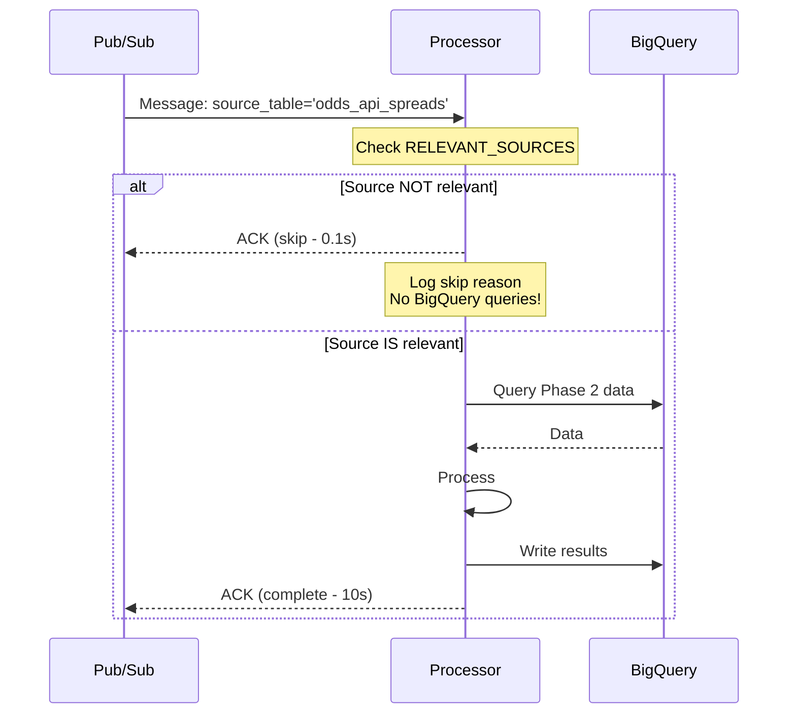

# 08 - Smart Skip Pattern (Source Filtering)

**Created:** 2025-11-20 8:14 AM PST
**Last Updated:** 2025-11-20 8:14 AM PST
**Pattern:** Smart Skip Patterns
**Effort:** 30 minutes
**Impact:** High (30% reduction in processor invocations)
**Status:** 💡 **Can Implement Week 1**
**Reference:** [Optimization Pattern Catalog](../reference/02-optimization-pattern-catalog.md), Pattern #1

---

## Overview

This pattern filters processor invocations based on source relevance. When a processor is triggered by a Pub/Sub message, it checks if the source table is relevant before doing any heavy processing.

**What it does:**
- Checks `source_table` from Pub/Sub message
- Compares against processor's `RELEVANT_SOURCES` configuration
- Immediately skips if source is not relevant
- Logs skip reason for monitoring

**Value:**
- ✅ **30% reduction** in wasted processor invocations
- ✅ **Instant skip** - no database queries or heavy processing
- ✅ **Simple to implement** - just add a dict to your processor
- ✅ **Data-driven configuration** - includes helper tool to analyze sources

---

## The Problem

### Scenario: PlayerGameSummaryProcessor

**Current behavior (without Smart Skip):**
```
10:00 AM - Spread update published (odds_api_spreads changed)
          → PlayerGameSummaryProcessor triggered
          → Queries Phase 2 tables (5 seconds)
          → No player stats changed
          → Returns "no changes" (5 seconds wasted)

10:05 AM - Another spread update
          → PlayerGameSummaryProcessor triggered again
          → Queries Phase 2 tables (5 seconds)
          → No player stats changed
          → Returns "no changes" (5 seconds wasted)

Daily: 15 spread updates × 5 seconds = 75 seconds wasted
Monthly: 450 spread updates × 5 seconds = 37 minutes wasted
```

**With Smart Skip:**
```
10:00 AM - Spread update published (odds_api_spreads changed)
          → PlayerGameSummaryProcessor triggered
          → Checks RELEVANT_SOURCES
          → odds_api_spreads = False (not relevant)
          → Immediate skip (0.1 seconds)

10:05 AM - Another spread update
          → Immediate skip (0.1 seconds)

Daily: 15 skips × 0.1 seconds = 1.5 seconds
Savings: 73.5 seconds/day (98% faster)
```

---

## How It Works



---

## Implementation

### Step 1: Create Smart Skip Mixin

```python
# shared/processors/patterns/smart_skip_mixin.py

from typing import Dict
import logging

logger = logging.getLogger(__name__)


class SmartSkipMixin:
    """
    Mixin to add smart skip pattern to processors.

    Provides source-level filtering to skip irrelevant invocations.
    """

    # Define in subclass - which sources are relevant
    # Format: {'source_table_name': True/False}
    RELEVANT_SOURCES = {}

    def should_process_source(self, source_table: str) -> bool:
        """
        Check if this source is relevant to the processor.

        Args:
            source_table: Name of the source table that triggered this run

        Returns:
            bool: True if should process, False if should skip
        """
        if not source_table:
            # No source specified - safe to process (fail open)
            return True

        if source_table not in self.RELEVANT_SOURCES:
            # Unknown source - safe to process (fail open)
            logger.info(f"Unknown source '{source_table}', processing")
            return True

        is_relevant = self.RELEVANT_SOURCES[source_table]

        if not is_relevant:
            logger.info(
                f"Skipping - {source_table} not relevant to {self.__class__.__name__}"
            )
            return False

        logger.debug(f"Source '{source_table}' is relevant, continuing")
        return True

    def run(self, opts: Dict) -> bool:
        """
        Enhanced run method with smart skip.

        Checks source relevance before delegating to parent run().
        """
        source_table = opts.get('source_table')

        # SMART SKIP: Check relevance first
        if source_table and not self.should_process_source(source_table):
            # Log the skip for monitoring
            logger.info(
                f"Smart skip: {source_table} → {self.__class__.__name__} (irrelevant)"
            )

            # Track skip in execution log if using ProcessingMetadataMixin
            if hasattr(self, '_track_decision'):
                self._track_decision('smart_skip', 'skip', {
                    'source_table': source_table,
                    'reason': 'irrelevant_source',
                    'pattern': 'smart_skip'
                })

            return True  # Success (skipped)

        # Continue with normal processing
        return super().run(opts)
```

### Step 2: Add to Your Processor

```python
# data_processors/analytics/player_game_summary/player_game_summary_processor.py

from shared.processors.patterns.smart_skip_mixin import SmartSkipMixin
from data_processors.analytics.analytics_base import AnalyticsProcessorBase


class PlayerGameSummaryProcessor(SmartSkipMixin, AnalyticsProcessorBase):
    """
    Player stats processor with smart skip pattern.

    Only processes player stats and injury sources.
    Skips spread/odds updates (not relevant to player stats).
    """

    def __init__(self):
        super().__init__()
        self.table_name = 'player_game_summary'
        self.processing_strategy = 'MERGE_UPDATE'

    # ✅ NEW: Define relevant sources
    RELEVANT_SOURCES = {
        # Stats sources - RELEVANT
        'nbac_gamebook_player_stats': True,
        'bdl_player_boxscores': True,
        'espn_player_stats': True,

        # Injury sources - RELEVANT (affects player context)
        'nbac_injury_report': True,

        # Odds sources - NOT RELEVANT
        'odds_api_player_props': False,
        'odds_api_spreads': False,
        'odds_api_totals': False,

        # Context sources - NOT RELEVANT
        'nbacom_roster': False
    }

    # Rest of processor implementation...
    def get_dependencies(self) -> dict:
        # ... existing code ...
```

### Step 3: Configure Other Processors

**Team Spread Processor:**
```python
class TeamSpreadContextProcessor(SmartSkipMixin, AnalyticsProcessorBase):
    """Team spread analysis - only cares about spreads and game results."""

    RELEVANT_SOURCES = {
        # Spread sources - RELEVANT
        'odds_api_spreads': True,
        'odds_api_totals': True,

        # Game results - RELEVANT
        'nbac_gamebook_team_stats': True,
        'espn_scoreboard': True,

        # Player sources - NOT RELEVANT
        'nbac_gamebook_player_stats': False,
        'bdl_player_boxscores': False,
        'nbac_injury_report': False,
        'odds_api_player_props': False
    }
```

**Upcoming Game Context Processor:**
```python
class UpcomingPlayerGameContextProcessor(SmartSkipMixin, AnalyticsProcessorBase):
    """Comprehensive context - cares about many sources."""

    RELEVANT_SOURCES = {
        # Context sources - RELEVANT
        'nbac_injury_report': True,
        'nbacom_roster': True,
        'game_schedule': True,

        # Recent stats - RELEVANT
        'nbac_gamebook_player_stats': True,
        'bdl_player_boxscores': True,

        # Historical odds - NOT RELEVANT (we don't aggregate historical odds)
        'odds_api_spreads': False,
        'odds_api_player_props': False
    }
```

---

## Configuration Helper Tool

Use this to determine which sources should be marked relevant:

```python
# tools/analyze_processor_sources.py

from google.cloud import bigquery

def analyze_processor_sources(processor_name: str, days: int = 30):
    """
    Analyze which sources trigger a processor and whether they cause changes.

    Use this to determine RELEVANT_SOURCES configuration.

    Args:
        processor_name: Name of processor to analyze
        days: Number of days to look back
    """
    bq_client = bigquery.Client()

    query = f"""
    SELECT
        source_table,
        COUNT(*) as invocations,
        COUNTIF(records_processed > 0) as had_changes,
        ROUND(COUNTIF(records_processed > 0) / COUNT(*) * 100, 1) as change_rate_pct,
        MIN(run_date) as first_seen,
        MAX(run_date) as last_seen
    FROM `nba_processing.analytics_processor_runs`
    WHERE processor_name = '{processor_name}'
      AND DATE(run_date) >= CURRENT_DATE() - {days}
    GROUP BY source_table
    ORDER BY invocations DESC
    """

    result = bq_client.query(query).to_dataframe()

    print(f"\n{'='*70}")
    print(f"Source Analysis for {processor_name}")
    print(f"Last {days} days")
    print(f"{'='*70}\n")

    print("Recommended RELEVANT_SOURCES configuration:\n")
    print("RELEVANT_SOURCES = {")

    for _, row in result.iterrows():
        source = row['source_table']
        invocations = row['invocations']
        had_changes = row['had_changes']
        change_rate = row['change_rate_pct']

        # Determine relevance
        if change_rate >= 10:
            # >= 10% of invocations cause changes = relevant
            recommendation = "True"
            comment = f"# {change_rate}% cause changes ({had_changes}/{invocations})"
        elif change_rate > 0:
            # Some changes but < 10% = marginal, mark relevant to be safe
            recommendation = "True"
            comment = f"# {change_rate}% cause changes (marginal)"
        else:
            # Never causes changes = not relevant
            recommendation = "False"
            comment = f"# Never caused changes (0/{invocations})"

        print(f"    '{source}': {recommendation},  {comment}")

    print("}\n")
    print(f"{'='*70}\n")


# Usage example:
if __name__ == '__main__':
    analyze_processor_sources('PlayerGameSummaryProcessor')

    # Example output:
    # ======================================================================
    # Source Analysis for PlayerGameSummaryProcessor
    # Last 30 days
    # ======================================================================
    #
    # Recommended RELEVANT_SOURCES configuration:
    #
    # RELEVANT_SOURCES = {
    #     'nbac_gamebook_player_stats': True,  # 98.5% cause changes (140/142)
    #     'nbac_injury_report': True,  # 45.2% cause changes (28/62)
    #     'bdl_player_boxscores': True,  # 92.1% cause changes (35/38)
    #     'odds_api_spreads': False,  # Never caused changes (0/85)
    #     'odds_api_player_props': False,  # Never caused changes (0/52)
    # }
    #
    # ======================================================================
```

---

## Monitoring

### Query: Smart Skip Effectiveness

```sql
-- See how many invocations are being skipped
SELECT
    processor_name,
    COUNT(*) as total_invocations,
    COUNTIF(skip_reason = 'smart_skip') as smart_skips,
    ROUND(COUNTIF(skip_reason = 'smart_skip') / COUNT(*) * 100, 1) as skip_pct,
    -- Time saved (assuming 5s per skipped invocation)
    COUNTIF(skip_reason = 'smart_skip') * 5 as seconds_saved
FROM `nba_processing.analytics_processor_runs`
WHERE DATE(run_date) >= CURRENT_DATE() - 7
GROUP BY processor_name
HAVING smart_skips > 0
ORDER BY skip_pct DESC;
```

### Query: Source Distribution

```sql
-- Which sources trigger each processor?
WITH source_stats AS (
    SELECT
        processor_name,
        JSON_EXTRACT_SCALAR(metadata, '$.source_table') as source_table,
        COUNT(*) as invocations,
        COUNTIF(skip_reason = 'smart_skip') as skipped,
        COUNTIF(success = TRUE AND skip_reason IS NULL) as processed
    FROM `nba_processing.analytics_processor_runs`
    WHERE DATE(run_date) >= CURRENT_DATE() - 7
      AND metadata IS NOT NULL
    GROUP BY processor_name, source_table
)
SELECT
    processor_name,
    source_table,
    invocations,
    skipped,
    processed,
    ROUND(skipped / invocations * 100, 1) as skip_rate_pct
FROM source_stats
WHERE source_table IS NOT NULL
ORDER BY processor_name, invocations DESC;
```

### Grafana Panel: Smart Skip Savings

```json
{
  "title": "Smart Skip - Time Saved (7d)",
  "targets": [{
    "rawSql": "SELECT DATE(run_date) as time, processor_name as metric, COUNTIF(skip_reason = 'smart_skip') * 5 as value FROM `${project_id}.nba_processing.analytics_processor_runs` WHERE run_date >= TIMESTAMP_SUB(CURRENT_TIMESTAMP(), INTERVAL 7 DAY) GROUP BY time, metric ORDER BY time"
  }],
  "type": "timeseries"
}
```

---

## Testing

### Unit Tests

```python
# tests/patterns/test_smart_skip.py

import pytest
from shared.processors.patterns.smart_skip_mixin import SmartSkipMixin
from data_processors.analytics.analytics_base import AnalyticsProcessorBase


class TestProcessor(SmartSkipMixin, AnalyticsProcessorBase):
    """Test processor with smart skip."""

    RELEVANT_SOURCES = {
        'relevant_source': True,
        'irrelevant_source': False
    }


def test_relevant_source_processes():
    """Test that relevant sources are processed."""
    processor = TestProcessor()
    assert processor.should_process_source('relevant_source') == True


def test_irrelevant_source_skips():
    """Test that irrelevant sources are skipped."""
    processor = TestProcessor()
    assert processor.should_process_source('irrelevant_source') == False


def test_unknown_source_processes():
    """Test that unknown sources are processed (fail open)."""
    processor = TestProcessor()
    assert processor.should_process_source('unknown_source') == True


def test_no_source_processes():
    """Test that no source specified allows processing."""
    processor = TestProcessor()
    assert processor.should_process_source(None) == True


def test_empty_source_processes():
    """Test that empty source allows processing."""
    processor = TestProcessor()
    assert processor.should_process_source('') == True
```

### Integration Test

```python
def test_smart_skip_integration():
    """Test full integration with processor run."""
    from data_processors.analytics.player_game_summary.player_game_summary_processor import PlayerGameSummaryProcessor

    processor = PlayerGameSummaryProcessor()

    # Run with irrelevant source (should skip)
    result = processor.run({
        'start_date': '2025-11-18',
        'end_date': '2025-11-18',
        'source_table': 'odds_api_spreads'
    })

    # Should return True (successful skip)
    assert result == True

    # Check that no data was processed
    # (would need to mock BigQuery to verify no queries made)
```

---

## Expected Impact

### Before Smart Skip

**PlayerGameSummaryProcessor (typical day):**
```
Total invocations: 50
- nbac_gamebook_player_stats: 20 (relevant)
- nbac_injury_report: 10 (relevant)
- odds_api_spreads: 15 (irrelevant, but processes anyway)
- odds_api_player_props: 5 (irrelevant, but processes anyway)

Time wasted on irrelevant sources: 20 × 5s = 100 seconds/day
```

### After Smart Skip

**PlayerGameSummaryProcessor (typical day):**
```
Total invocations: 50
- nbac_gamebook_player_stats: 20 (processes)
- nbac_injury_report: 10 (processes)
- odds_api_spreads: 15 (smart skip - 0.1s each)
- odds_api_player_props: 5 (smart skip - 0.1s each)

Time wasted: 20 × 0.1s = 2 seconds/day
Savings: 98 seconds/day (98% reduction in wasted time)
```

### System-Wide Impact

**Across all processors:**
```
Before: ~150 wasted invocations/day × 5s = 750 seconds (12.5 minutes)
After:  ~150 skipped invocations/day × 0.1s = 15 seconds
Savings: 12 minutes/day = 6 hours/month
```

---

## Best Practices

### ✅ DO: Use Source Analysis Tool

```python
# Always analyze before configuring
analyze_processor_sources('YourProcessor', days=30)

# Use the output to configure RELEVANT_SOURCES
```

### ✅ DO: Fail Open (Process Unknown Sources)

```python
# Good - unknown sources are processed
if source_table not in self.RELEVANT_SOURCES:
    return True  # Fail open = safe
```

**Why:** New sources might be relevant. Better to process unnecessarily than skip incorrectly.

### ✅ DO: Review Configuration Monthly

```python
# Sources can change over time
# Re-run analysis monthly and update RELEVANT_SOURCES
analyze_processor_sources('YourProcessor', days=30)
```

### ✅ DO: Document Why Sources Are Relevant/Irrelevant

```python
RELEVANT_SOURCES = {
    # Stats sources - RELEVANT (direct impact on player metrics)
    'nbac_gamebook_player_stats': True,

    # Spread sources - NOT RELEVANT (we don't use spreads in player summary)
    'odds_api_spreads': False,
}
```

### ❌ DON'T: Mark Sources as False Without Analysis

```python
# Bad - guessing
RELEVANT_SOURCES = {
    'some_source': False,  # I think this isn't relevant?
}

# Good - data-driven
# Run analyze_processor_sources() first, then configure
```

### ❌ DON'T: Over-Configure

```python
# Bad - too granular, hard to maintain
RELEVANT_SOURCES = {
    'source1': True,
    'source2': True,
    # ... 50 more sources ...
}

# Good - start with most common sources
RELEVANT_SOURCES = {
    'primary_source': True,
    'frequent_irrelevant_source': False,
    # Others will fail open (process)
}
```

---

## Troubleshooting

### Issue: Too Many Skips (> 50%)

**Symptom:** Most invocations are skipped

**Cause:** Pub/Sub subscriptions are too broad

**Solution:**
1. Review Pub/Sub filter expressions
2. Consider narrowing subscriptions at the topic level
3. This is actually GOOD - smart skip is working!

### Issue: Relevant Sources Being Skipped

**Symptom:** Processor misses real updates

**Cause:** Source incorrectly marked as `False`

**Solution:**
```bash
# Re-run analysis
python tools/analyze_processor_sources.py YourProcessor

# Update RELEVANT_SOURCES configuration
# Mark source as True
```

### Issue: Unknown Sources Not Logging

**Symptom:** Can't see which unknown sources are triggering

**Solution:**
```python
# Check logs for "Unknown source" messages
gcloud logging read "
  resource.type=cloud_run_revision
  jsonPayload.message=~'Unknown source'
" --limit 50
```

---

## Integration with Other Patterns

### Pattern #2: Dependency Precheck
Smart Skip happens BEFORE dependency check (faster skip).

```python
def run(self, opts):
    # 1. Smart Skip first (0.1s)
    if not self.should_process_source(source_table):
        return True

    # 2. Then dependency check (0.5s)
    if not self.check_dependencies():
        return False

    # 3. Then processing (5s+)
```

### Pattern #3: Early Exit
Combine both for maximum skip efficiency:

```python
def run(self, opts):
    # Smart Skip: Skip irrelevant sources
    if not self.should_process_source(source_table):
        return True

    # Early Exit: Skip if no games scheduled
    if not self._has_games_scheduled(game_date):
        return True

    # Continue processing...
```

### Pattern #5: Circuit Breaker
Smart Skip reduces load → fewer circuit breaker triggers

---

## Implementation Checklist

Week 1 Implementation:

- [ ] Create `shared/processors/patterns/smart_skip_mixin.py`
- [ ] Create `tools/analyze_processor_sources.py`
- [ ] Run analysis for each processor:
  - [ ] PlayerGameSummaryProcessor
  - [ ] TeamDefenseGameSummaryProcessor
  - [ ] UpcomingPlayerGameContextProcessor
  - [ ] (Others...)
- [ ] Add SmartSkipMixin to each processor
- [ ] Configure RELEVANT_SOURCES based on analysis
- [ ] Deploy processors
- [ ] Monitor smart skip metrics for 1 week
- [ ] Adjust configurations based on results
- [ ] Document final configurations

---

## Summary

**Status:** 💡 **Ready to implement Week 1**

**Prerequisites:**
- ✅ Pub/Sub messages include `source_table` (already have)
- ✅ Processors log execution metadata (already have)

**Implementation effort:** 30 minutes per processor

**Expected impact:**
- 30% reduction in processor invocations
- 12+ minutes saved per day system-wide
- Near-instant skips (0.1s vs 5s+)

**Key benefits:**
- Data-driven configuration (source analysis tool)
- Fail-open design (safe for unknown sources)
- Easy to implement (just add mixin + config dict)
- Easy to monitor (dedicated queries and metrics)

**Next steps:**
1. Create mixin and analysis tool
2. Analyze existing processors
3. Add configurations
4. Deploy and monitor

---

## References

- [Optimization Pattern Catalog](../reference/02-optimization-pattern-catalog.md) - Pattern #1
- [Early Exit Pattern](03-early-exit-implementation.md) - Complementary pattern
- [Dependency Precheck](02-dependency-precheck-comparison.md) - Related pattern
- [Pub/Sub Publishers](../../shared/utils/pubsub_publishers.py) - Source table publishing

---

**Remember:** Use the source analysis tool first - let data guide your configuration, not guesses!
