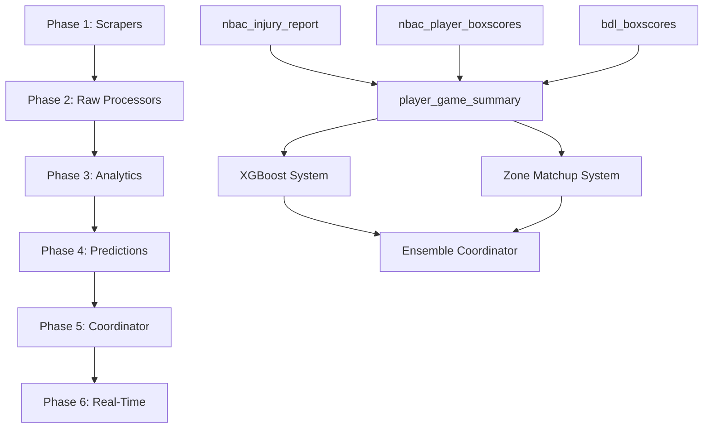

# NBA Props Platform: Dependency Checking System
**Master Document**

**File:** `docs/dependency-checks/00-overview.md`
**Created:** 2025-11-21
**Last Updated:** 2025-11-25
**Version:** 1.2
**Purpose:** Master reference for all dependency checking patterns
**Status:** Current

> **Note:** Some items marked "TBD" in this document have been implemented since initial writing.
> See [SYSTEM_STATUS.md](../SYSTEM_STATUS.md) for current implementation status.

---

## Table of Contents

1. [Overview](#overview)
2. [System Architecture](#system-architecture)
3. [Dependency Checking Principles](#dependency-checking-principles)
4. [Phase-Specific Documentation](#phase-specific-documentation)
5. [Cross-Phase Dependencies](#cross-phase-dependencies)
6. [Standardized Patterns](#standardized-patterns)
7. [Monitoring & Alerting](#monitoring--alerting)
8. [Adding New Dependencies](#adding-new-dependencies)

---

## Overview

This document serves as the **master reference** for all dependency checking across the NBA Props Platform. Dependency checking ensures data quality, completeness, and timeliness at every processing stage.

### What is Dependency Checking?

Dependency checking validates that:
1. **Required data sources are available** (existence checks)
2. **Data is sufficiently complete** (completeness thresholds)
3. **Data is sufficiently recent** (freshness checks)
4. **Data quality meets standards** (validation checks)

### Why Dependency Checking Matters

**Without dependency checks:**
- Incomplete predictions published to users ❌
- Cascade failures across phases ❌
- Silent data quality degradation ❌

**With dependency checks:**
- Graceful degradation (fallback sources) ✅
- Clear visibility into data pipeline health ✅
- User-facing confidence scores reflect data completeness ✅

---

## System Architecture

```
┌─────────────┐
│   Phase 1   │  Scrapers (GCS JSON files)
└──────┬──────┘
       │
       ▼
┌─────────────┐
│   Phase 2   │  Raw Processors (22 processors)
│             │  ├─ Dependency: Check GCS file existence
│             │  ├─ Smart Idempotency: Skip unchanged data
│             │  └─ Output: nba_raw.* tables
└──────┬──────┘
       │
       ▼
┌─────────────┐
│   Phase 3   │  Analytics Processors (5 processors)
│             │  ├─ Primary Dependencies: 2-6 Phase 2 tables each
│             │  ├─ Historical Data: Lookback 10-20 games per player (TBD)
│             │  ├─ Tracks: source_*_last_updated, rows_found, completeness_pct, hash
│             │  ├─ Handles: Partial data, missing sources, stale data
│             │  └─ Output: nba_analytics.* tables
└──────┬──────┘
       │
       ▼
┌─────────────┐
│   Phase 4   │  Precompute Processors (5 processors)
│             │  ├─ Primary Dependencies: Phase 3 analytics tables
│             │  ├─ MAY CHECK Phase 2: Quality verification, root cause (TBD)
│             │  ├─ Historical Data: REQUIRES 10-20 games per player/team
│             │  ├─ Backfill Detection: Checks for historical data updates
│             │  ├─ Confidence Scoring: Adjusts based on upstream completeness
│             │  └─ Output: nba_precompute.*, nba_predictions.ml_feature_store_v2
└──────┬──────┘
       │
       ▼
┌─────────────┐
│   Phase 5   │  Prediction Systems (6 systems) + Coordinator
│             │  ├─ Primary Dependencies: Phase 4 ML features + cache
│             │  ├─ MAY CHECK Phase 3: Ensemble weighting (TBD)
│             │  ├─ MAY CHECK Phase 2: Root cause analysis (TBD)
│             │  ├─ Historical Data: 30-day prediction accuracy tracking
│             │  ├─ Ensemble Logic: Weight by confidence + historical accuracy
│             │  ├─ Minimum Quorum: ≥3 systems required
│             │  └─ Output: nba_predictions.* (final user-facing)
└──────┬──────┘
       │
       ▼
┌─────────────┐
│   Phase 6   │  Publishing Service (future)
│             │  ├─ Dependencies: Phase 5 predictions (current day only)
│             │  ├─ Output Format: Firestore + JSON API
│             │  └─ Publishes: Final predictions for today's games
└─────────────┘
```

**Key Notes**:
- **Multi-Phase Dependencies**: Phases 4 & 5 may check earlier phases (Phase 2/3) for quality verification and root cause analysis
- **Historical Data**: Phase 4+ requires historical data (10-20 games), not just current game data
- **TBD**: Exact implementation of multi-phase checks and historical patterns still being finalized

---

## Dependency Check Patterns

### Two Types of Dependencies

The pipeline uses two fundamentally different dependency checking patterns depending on the time relationship between input and output data.

#### Pattern 1: Point-in-Time Dependencies (Hash-Based)

**Use when**: Output record depends on a single input record or multiple records from the SAME point in time.

**Examples**:
- `player_game_summary` ← `nbac_gamebook` (same game)
- `upcoming_player_game_context` ← multiple sources (same upcoming game)
- `team_defense_game_summary` ← `team_boxscore` (same game)

**Method**: Compare `source_data_hash` from Phase 2 to stored hash in Phase 3/4/5

**Code Pattern**:
```python
def check_dependencies(self, game_id):
    existing = self.get_existing_record(game_id)
    source_hash = self.get_source_data_hash(game_id)

    if existing['source_gamebook_data_hash'] != source_hash:
        return True  # Reprocess - source changed
    return False  # Skip - unchanged
```

**Benefits**:
- ✅ Precise - know exactly which source changed
- ✅ Prevents cascades from metadata updates
- ✅ Low query cost (single hash comparison)

**Database Fields** (4 per dependency):
```sql
source_{prefix}_data_hash STRING,
source_{prefix}_last_updated TIMESTAMP,
source_{prefix}_rows_found INT64,
source_{prefix}_completeness_pct NUMERIC(5,2)
```

---

#### Pattern 2: Historical Range Dependencies (Timestamp-Based)

**Use when**: Output record depends on MULTIPLE dates of historical data (sliding windows).

**Examples**:
- `player_composite_factors` ← last 30 days of `player_game_summary`
- `ml_feature_store` ← last 10 games per player
- Rolling averages, trend calculations

**Method**: Compare `MAX(source.processed_at)` in date range to `our.processed_at`

**Code Pattern**:
```python
def check_dependencies(self, player, as_of_date):
    existing = self.get_existing_record(player, as_of_date)
    required_dates = self.get_last_n_days(as_of_date, 30)

    source_max_timestamp = self.get_max_processed_at_in_range(
        player, required_dates
    )

    if source_max_timestamp > existing['processed_at']:
        return True  # Reprocess - at least one source day updated
    return False  # Skip - all source days unchanged
```

**Benefits**:
- ✅ Simple - no complex hash generation
- ✅ Works for any window size (L5, L10, L30)
- ✅ Detects backfill scenarios

**Limitations**:
- ⚠️ Less precise - can't tell which specific day changed
- ⚠️ More queries - range check vs single hash

**Database Fields**: None needed (use existing `processed_at`)

**Why No Hash?**: Sliding window changes every day even if individual days unchanged.

```
Day 1: L30 = Dec 16 - Jan 15 → hash_A
Day 2: L30 = Dec 17 - Jan 16 → hash_B (different range!)
```

---

### Which Pattern to Use?

| Scenario | Pattern | Reason |
|----------|---------|--------|
| Phase 2 → Phase 3 | Point-in-Time | Same game dependencies |
| Phase 3 → Phase 4 (daily cache) | Point-in-Time | Same day aggregation |
| Phase 3 → Phase 4 (composite) | Historical Range | L30 day calculations |
| Phase 4 → Phase 5 | Point-in-Time | Same day ML features |

**See**: [Dependency Checking Strategy](../implementation/04-dependency-checking-strategy.md) for detailed implementation

---

## Smart Idempotency & Cascade Prevention

### The Cascade Problem

Without smart idempotency, metadata-only changes trigger unnecessary downstream processing:

```
Injury report scraped 4x/day (no status changes)
→ Phase 2 writes 4x, updates processed_at 4x
→ Phase 3 sees "fresh" data, processes 450 players 4x
→ Phase 4 sees "fresh" data, processes 450 players 4x
→ Phase 5 generates predictions 4x
= 3,600 wasted operations (75% avoidable)
```

### Solution: Selective Field Hashing

Phase 2 processors hash **only the fields downstream processors care about**.

**Key Principles**:
1. **Fail Open** - If hash check fails, process anyway (safety first)
2. **Selective Fields** - Only hash fields that trigger downstream logic changes
3. **Exclude Metadata** - Don't hash: `processed_at`, `scraped_at`, `source_url`
4. **Exclude Noise** - Don't hash fields that change frequently but don't affect predictions

### Example: Injury Report

**Fields That Trigger Dependencies** (included in hash):
```python
HASH_FIELDS = [
    'player_lookup',
    'injury_status',      # "Out" → "Questionable" MATTERS
    'reason',             # "Ankle" → "Knee" MATTERS
    'game_date'
]
```

**Fields That Don't Trigger Dependencies** (excluded from hash):
```python
EXCLUDED = [
    'scrape_time',        # When scraped doesn't matter
    'report_hour',        # 10am vs 2pm doesn't matter
    'source_file_path',   # GCS path doesn't matter
    'confidence_score'    # Parsing quality improves over time
]
```

**Result**:
```python
# This change DOES trigger cascade:
Old: injury_status='Probable'  → New: injury_status='Out'
Hash changes → Phase 3 reprocesses

# This change does NOT trigger cascade:
Old: scrape_time='10:00 AM'    → New: scrape_time='2:00 PM'
Hash unchanged → Phase 3 skips
```

### Example: Player Props Lines

**Problem**: Odds change 10-20x per game, but predictions only care about line movement.

**Solution**: Hash the line value, not the odds.

```python
HASH_FIELDS = [
    'player_lookup',
    'points_line',        # 25.5 → 26.5 MATTERS (line moved)
]

EXCLUDED = [
    'over_price',         # -110 → -115 doesn't matter (juice)
    'under_price'         # Odds change constantly
]
```

**Result**: 90% reduction in Phase 5 prediction updates (only when line moves, not odds).

### Impact Metrics

After implementing smart idempotency on 5 high-frequency processors:

- **Injury Reports**: 75% skip rate (3/4 scrapes have no changes)
- **Player Props**: 85% skip rate (line movements are rare)
- **Overall Cascade Reduction**: 70%+ fewer Phase 3/4/5 executions

**See**: [Phase 2 Processor Hash Strategy](../reference/phase2-processor-hash-strategy.md) for field-by-field analysis

---

## Dependency Checking Principles

### 1. **Fail Gracefully, Not Silently**

```python
# ❌ Bad: Silent failure
if data is None:
    return []  # No one knows this failed

# ✅ Good: Explicit logging + notification
if data is None:
    logger.error("Critical dependency missing: player_boxscores")
    notify_error(
        title="Dependency Missing",
        message="player_boxscores table empty",
        details={'processor': 'player_game_summary'}
    )
    return []
```

### 2. **Track Completeness, Not Just Existence**

```python
# ❌ Bad: Only checks if data exists
if len(rows) > 0:
    proceed()

# ✅ Good: Checks completeness threshold
expected_players = 450  # Typical game has ~450 active players
actual_players = len(rows)
completeness_pct = (actual_players / expected_players) * 100

if completeness_pct < 70:
    logger.warning(f"Low completeness: {completeness_pct:.1f}%")
    # Continue with partial data but flag in confidence score
```

### 3. **Store Dependency Metadata**

Every Phase 3+ record stores dependency metadata:

```sql
-- Example: player_game_summary tracks 6 Phase 2 sources
source_nbac_last_updated TIMESTAMP,     -- When was source last updated?
source_nbac_rows_found INT64,           -- How many rows found?
source_nbac_completeness_pct NUMERIC,   -- What % complete?
source_nbac_hash STRING                 -- Smart idempotency hash
```

This enables:
- ✅ Root cause analysis when predictions fail
- ✅ Confidence scoring based on data quality
- ✅ Historical tracking of data pipeline health

### 4. **Use Standardized Thresholds**

| Threshold Type | Phase 2 | Phase 3 | Phase 4 | Phase 5 |
|----------------|---------|---------|---------|---------|
| **Critical** (abort) | < 30% | < 50% | < 60% | < 70% |
| **Warning** (continue with flag) | 30-70% | 50-80% | 60-85% | 70-90% |
| **Healthy** | > 70% | > 80% | > 85% | > 90% |

These thresholds cascade:
- Phase 2 can tolerate more missing data (has fallbacks)
- Phase 5 requires highest quality (user-facing)

---

## Phase-Specific Documentation

Each phase has a dedicated document with detailed dependency specifications:

### Phase 2: Raw Processors (Data Ingestion)
📄 **[Phase 2 Dependency Checks](./01-raw-processors.md)**

- **22 Processors**: BDL, ESPN, NBA.com, OddsAPI, BettingPros, BigDataBall, Basketball Reference
- **Primary Dependency**: GCS file existence from Phase 1 scrapers
- **Smart Idempotency**: Skip unchanged data to prevent unnecessary cascades
- **Output**: `nba_raw.*` tables

### Phase 3: Analytics Processors (Feature Engineering)
📄 **[Phase 3 Dependency Checks](./02-analytics-processors.md)**

- **5 Processors**: player_game_summary, upcoming_player_game_context, team_offense_summary, team_defense_summary, upcoming_team_game_context
- **Dependencies**: 2-6 Phase 2 tables each
- **Tracking**: 4 metadata fields per dependency (last_updated, rows_found, completeness_pct, hash)
- **Fallback Logic**: Primary → Fallback sources
- **Output**: `nba_analytics.*` tables

### Phase 4: Precompute Processors (ML Feature Caching)
📄 **[Phase 4 Dependency Checks](./03-precompute-processors.md)**

- **5 Processors**: player_daily_cache, player_composite_factors, player_shot_zone_analysis, team_defense_zone_analysis, ml_feature_store_v2
- **Primary Dependencies**: Phase 3 analytics tables (2-4 per processor)
- **MAY CHECK Phase 2**: Quality verification, confidence scoring adjustments (TBD - implementation being finalized)
- **Historical Requirements**: REQUIRES 10-20 games of historical data per player/team
- **Backfill Detection**: Monitors for historical data updates that need reprocessing
- **Caching Strategy**: Daily precompute for fast real-time lookups
- **ML Features**: Combines into 25-feature vectors with quality scoring
- **Output**: `nba_precompute.*` and `nba_predictions.ml_feature_store_v2`

### Phase 5: Prediction Systems (ML Inference & Ensemble)
📄 **[Phase 5 Dependency Checks](./04-predictions-coordinator.md)**

- **6 Systems**: XGBoost V1, Zone Matchup V1, Similarity Balanced V1, Ensemble V1, Moving Average Baseline, (Future: LSTM)
- **Primary Dependencies**: Phase 4 ML feature store + player daily cache
- **MAY CHECK Phase 3**: Ensemble weighting adjustments (TBD - implementation being finalized)
- **MAY CHECK Phase 2**: Root cause analysis when predictions fail (TBD - implementation being finalized)
- **Historical Requirements**: 30-day prediction accuracy tracking for dynamic weighting
- **Confidence Scoring**: Adjusts based on feature completeness and system agreement
- **Minimum Quorum**: Requires ≥3 prediction systems for ensemble
- **Output**: `nba_predictions.*` tables (final user-facing predictions)

### Phase 6: Publishing Service (Future)
📄 **[Phase 6 Dependency Checks](./05-publishing-api.md)**

- **Status**: Planned
- **Dependencies**: Phase 5 predictions for current day only (simple dependency check)
- **Processing**: Publishes today's final predictions to user-facing systems
- **Output**: Firestore + JSON API for web app
- **No Historical Data**: Only publishes current day predictions

---

## Cross-Phase Dependencies

### Historical Backfill Dependency Checking

**Critical**: Phase 3 onward must check for **historical backfilled data**, not just today's data.

⚠️ **STATUS**: Core concept established, exact implementation patterns being finalized (TBD)

**Why this matters:**
- Phase 2 processors may run historical backfills to fill data gaps
- Phase 3+ must detect and process these historical records
- Dependency checks must look back to specific game dates, not just "latest" records
- Exact lookback windows and detection mechanisms still being determined

**Implementation Pattern:**

```python
# ❌ BAD: Only checks for today's data
def check_dependencies(self, game_date: str = today()) -> Dict:
    query = f"SELECT * FROM phase2_table WHERE game_date = '{today()}'"

# ✅ GOOD: Checks for specific game date being processed
def check_dependencies(self, game_date: str) -> Dict:
    """
    Check dependencies for a SPECIFIC game date (supports historical backfill).

    Args:
        game_date: The game date to check (e.g., "2024-01-15")
    """
    query = f"SELECT * FROM phase2_table WHERE game_date = '{game_date}'"
```

**Example Scenario:**
1. **Day 1**: Phase 2 runs for game on 2024-01-15, but `nbac_injury_report` scraper fails
2. **Day 5**: Operations team backfills injury report for 2024-01-15
3. **Phase 3 Behavior**:
   - ❌ **Wrong**: Only checks today's date, misses backfilled data from 2024-01-15
   - ✅ **Correct**: Checks for all games with incomplete Phase 2 data, detects 2024-01-15 is now complete, processes it

**Query Pattern for Historical Awareness:**

```sql
-- Find games that need processing (have Phase 2 data but no Phase 3 data)
SELECT DISTINCT p2.game_date, p2.game_id
FROM `nba_raw.phase2_table` p2
LEFT JOIN `nba_analytics.phase3_table` p3
  ON p2.game_id = p3.game_id
  AND p2.game_date = p3.game_date
WHERE p3.game_id IS NULL  -- Phase 3 record doesn't exist yet
  AND p2.game_date >= DATE_SUB(CURRENT_DATE(), INTERVAL 30 DAY)  -- Look back 30 days
ORDER BY p2.game_date ASC
```

### Multi-Phase Dependency Checking (Phase 4 & 5)

**Important**: Phase 4 and 5 processors **may check all the way back to Phase 2**, not just the immediate previous phase.

⚠️ **STATUS**: Implementation patterns still being finalized (TBD)

**Why this may happen:**
1. **Data Quality Verification**: Ensure upstream raw data is complete
2. **Confidence Scoring**: Use raw data completeness to adjust confidence scores
3. **Feature Engineering**: Some ML models may use Phase 2 data directly (TBD)
4. **Root Cause Analysis**: When predictions fail, trace back to source data

**Dependency Patterns by Phase:**

| Phase | Primary Dependencies | May Also Check | Status |
|-------|---------------------|----------------|--------|
| Phase 3 | Phase 2 only | N/A | ✅ Implemented |
| Phase 4 | Phase 3 analytics | Phase 2 (quality verification) | ⚠️ TBD |
| Phase 5 | Phase 4 ML features | Phase 3 (weights), Phase 2 (root cause) | ⚠️ TBD |

**Note**: The exact scenarios and patterns for when Phase 4/5 check Phase 2/3 are being determined based on operational needs.

**Example: Phase 4 Checking Phase 2 Directly** *(TBD - Proposed Pattern)*

```python
class XGBoostPredictionSystem:
    def check_dependencies(self, game_id: str) -> Dict:
        """
        XGBoost checks both Phase 3 (primary) and Phase 2 (quality verification).

        NOTE: This pattern is proposed but not yet implemented.
        Exact implementation TBD based on operational requirements.
        """
        # Primary dependency: Phase 3 analytics
        phase3_data = self.get_phase3_data(game_id)

        # OPTIONAL: Verify Phase 2 completeness for confidence scoring
        # (May be implemented in future for quality verification)
        phase2_injury_data = self.get_phase2_injury_data(game_id)
        phase2_boxscore_data = self.get_phase2_boxscore_data(game_id)

        # Adjust confidence based on Phase 2 completeness
        if not phase2_injury_data:
            confidence_multiplier *= 0.9  # Reduce confidence by 10%

        return {
            'phase3_complete': bool(phase3_data),
            'phase2_injury_available': bool(phase2_injury_data),
            'phase2_boxscore_available': bool(phase2_boxscore_data),
            'confidence_multiplier': confidence_multiplier
        }
```

**Example: Phase 5 Checking Phase 2 for Root Cause Analysis** *(TBD - Proposed Pattern)*

```python
class PredictionsCoordinator:
    def diagnose_prediction_failure(self, game_id: str, player: str) -> Dict:
        """
        When ensemble prediction fails, trace back to Phase 2 to find root cause.

        NOTE: This pattern is proposed but not yet implemented.
        May be implemented for debugging/diagnostics in future.
        """
        # Check Phase 4 predictions
        phase4_predictions = self.get_phase4_predictions(game_id, player)

        if not phase4_predictions or len(phase4_predictions) < 3:
            # Insufficient predictions - check Phase 3
            phase3_analytics = self.get_phase3_analytics(game_id, player)

            if not phase3_analytics:
                # Phase 3 missing - check Phase 2 raw data
                phase2_sources = {
                    'injury_report': self.check_phase2_injury_report(game_id),
                    'boxscores': self.check_phase2_boxscores(game_id),
                    'player_props': self.check_phase2_player_props(game_id)
                }

                # Identify which Phase 2 source is missing
                return {
                    'failure_level': 'phase_2',
                    'root_cause': [k for k, v in phase2_sources.items() if not v],
                    'action': 'Check Phase 1 scrapers or run Phase 2 backfill'
                }

        return {'status': 'healthy'}
```

### Cascade Effects

Changes in upstream phases cascade downstream:

```
Phase 2 Missing Data
    ↓
Phase 3 Low Completeness
    ↓
Phase 4 Reduced Confidence
    ↓
Phase 5 Lower Ensemble Score
    ↓
User Sees "Low Confidence" Prediction
```

**Example**: If `nbac_injury_report` (Phase 2) is empty:
1. Phase 3 `player_game_summary` marks source as unavailable (0% complete)
2. Phase 4 XGBoost prediction confidence drops (missing injury feature)
3. Phase 5 ensemble weights XGBoost lower
4. User sees prediction with "Medium Confidence" instead of "High Confidence"

### Dependency Graph



---

## Standardized Patterns

### Pattern 1: Dependency Check Function Template

Every processor/service should implement:

```python
def check_dependencies(self) -> Dict[str, Any]:
    """
    Check all dependencies and return status report.

    Returns:
        {
            'all_met': bool,           # Are all critical dependencies met?
            'sources': {
                'source_name': {
                    'available': bool,
                    'rows_found': int,
                    'completeness_pct': float,
                    'last_updated': str,
                    'status': 'healthy|warning|critical',
                    'hash': str  # Smart idempotency hash
                }
            },
            'overall_completeness': float,
            'can_proceed': bool,       # Can processing continue?
            'warnings': List[str],
            'errors': List[str]
        }
    """
```

### Pattern 2: Completeness Calculation

```python
def calculate_completeness(
    actual_count: int,
    expected_count: int,
    threshold_critical: float = 0.5,
    threshold_warning: float = 0.8
) -> Tuple[float, str]:
    """
    Calculate completeness percentage and status.

    Returns:
        (completeness_pct, status)
        status ∈ {'healthy', 'warning', 'critical'}
    """
    if expected_count == 0:
        return 0.0, 'critical'

    completeness_pct = (actual_count / expected_count) * 100

    if completeness_pct >= threshold_warning * 100:
        return completeness_pct, 'healthy'
    elif completeness_pct >= threshold_critical * 100:
        return completeness_pct, 'warning'
    else:
        return completeness_pct, 'critical'
```

### Pattern 3: Partial Data Handling

```python
# Example: Phase 3 processor with optional fallback source

primary_data = self.query_source('nbac_player_boxscores')
if not primary_data or len(primary_data) < threshold:
    logger.warning("Primary source insufficient, trying fallback")
    fallback_data = self.query_source('bdl_boxscores')

    if fallback_data:
        data = fallback_data
        self.source_used = 'fallback'
    else:
        logger.error("Both primary and fallback sources failed")
        data = []
        self.source_used = 'none'
else:
    data = primary_data
    self.source_used = 'primary'

# Store which source was used for debugging
record['source_used'] = self.source_used
record['source_completeness_pct'] = calculate_completeness(...)
```

### Pattern 4: Logging Dependency Failures

```python
def log_dependency_failure(
    processor_name: str,
    dependency_name: str,
    failure_type: str,  # 'missing'|'incomplete'|'stale'
    details: Dict[str, Any]
) -> None:
    """
    Standardized logging for dependency failures.
    """
    logger.error(
        f"[{processor_name}] Dependency failure: {dependency_name}",
        extra={
            'processor': processor_name,
            'dependency': dependency_name,
            'failure_type': failure_type,
            **details
        }
    )

    # Also send notification for monitoring
    notify_error(
        title=f"{processor_name}: Dependency Failure",
        message=f"{dependency_name} - {failure_type}",
        details=details,
        processor_name=processor_name
    )
```

---

## Monitoring & Alerting

### Metrics to Track

1. **Dependency Availability Rate** (per source, per phase)
   - Target: > 95%
   - Query: Count checks where `available = true` / total checks

2. **Average Completeness** (per source, per phase)
   - Target: > 85%
   - Query: AVG(completeness_pct) WHERE status != 'critical'

3. **Cascade Impact** (how often missing Phase 2 affects Phase 5)
   - Track: Phase 2 failure → Phase 5 confidence drop
   - Query: JOIN across phases on game_id

4. **Fallback Usage Rate** (how often primary source fails)
   - Target: < 10%
   - Query: Count where source_used = 'fallback'

### Sample Monitoring Query

```sql
-- Daily dependency health report
SELECT
    DATE(processed_at) as report_date,

    -- Phase 2: Raw data availability
    COUNTIF(source_nbac_rows_found > 0) / COUNT(*) as phase2_availability_rate,
    AVG(source_nbac_completeness_pct) as phase2_avg_completeness,

    -- Phase 3: Analytics quality
    AVG(overall_completeness_pct) as phase3_avg_completeness,

    -- Fallback usage
    COUNTIF(source_used = 'fallback') / COUNT(*) as fallback_usage_rate,

    -- Count by status
    COUNTIF(status = 'healthy') as healthy_count,
    COUNTIF(status = 'warning') as warning_count,
    COUNTIF(status = 'critical') as critical_count

FROM `nba_analytics.player_game_summary`
WHERE DATE(processed_at) = CURRENT_DATE()
GROUP BY report_date
```

### Alerting Thresholds

| Metric | Warning | Critical |
|--------|---------|----------|
| Dependency availability | < 90% | < 80% |
| Avg completeness | < 80% | < 70% |
| Fallback usage rate | > 15% | > 25% |
| Critical status count | > 50 | > 100 |

---

## Adding New Dependencies

When adding a new dependency to any processor:

### Step 1: Update Processor Code

1. Add dependency check logic
2. Add completeness calculation
3. Add fallback handling (if applicable)
4. Add logging for failures

### Step 2: Update Database Schema

For Phase 3+ processors, add tracking fields:

```sql
-- If adding new source "new_source" to existing processor
ALTER TABLE nba_analytics.processor_name
ADD COLUMN IF NOT EXISTS source_newsource_last_updated TIMESTAMP,
ADD COLUMN IF NOT EXISTS source_newsource_rows_found INT64,
ADD COLUMN IF NOT EXISTS source_newsource_completeness_pct NUMERIC(5,2),
ADD COLUMN IF NOT EXISTS source_newsource_hash STRING;
```

### Step 3: Update Documentation

Update the relevant phase-specific document:

```markdown
## New Dependency: source_name

**Added**: 2025-XX-XX
**Processor**: processor_name
**Priority**: Primary|Fallback
**Completeness Threshold**: XX%
**Expected Row Count**: ~XXX

### Dependency Check Logic
[Explain how it's checked]

### Partial Data Handling
[Explain what happens if incomplete]

### Logging
[Show log messages and notifications]
```

### Step 4: Update Monitoring

Add new metrics to monitoring dashboards:
- Availability rate for new source
- Completeness distribution
- Fallback usage (if applicable)

---

## Document Maintenance

### Ownership

- **Master Document**: Data Engineering Team
- **Phase 2 Doc**: Raw Processing Team
- **Phase 3 Doc**: Analytics Team
- **Phase 4-5 Docs**: ML/Predictions Team
- **Phase 6 Doc**: Real-Time Team (future)

### Update Triggers

Update this documentation when:
- ✅ New processor added
- ✅ New dependency added/removed
- ✅ Threshold changed
- ✅ Fallback logic changed
- ✅ Monitoring query updated

### Review Cadence

- **Weekly**: Review critical dependency failures
- **Monthly**: Review completeness trends
- **Quarterly**: Review threshold effectiveness

---

## Dependency Failure Patterns

### Common Dependency Error Messages

| Error Message | Meaning | Dependency Issue |
|--------------|---------|------------------|
| "Missing dependency: {source}" | Required upstream data not found | Phase needs Phase-1 data that doesn't exist |
| "Insufficient data for player" | Historical dependency not met | Phase 4 needs 10+ games, only found 3 |
| "No features found for game_date" | Phase 4 dependency missing | Phase 5 needs Phase 4 ML features |
| "Phase 3 dependency not met" | Upstream phase incomplete | Phase 4 checked, Phase 3 data doesn't exist |
| "Insufficient feature quality" | Partial dependency data | Phase 4 data exists but incomplete, using Phase 3 fallback |

### Dependency Failure Cascade

```
Phase 2 dependency fails (no GCS file)
    ↓
Phase 3 sees missing Phase 2 data
    ↓
Phase 3 dependency check fails
    ↓
Phase 4 sees missing Phase 3 data
    ↓
Phase 4 dependency check fails
    ↓
Phase 5 cannot generate predictions
```

**Prevention**: Each phase checks dependencies before processing and fails gracefully

### Dependency Chain Verification

**To verify full dependency chain is healthy**:

```sql
-- Phase 2: Check dependency on Phase 1 (GCS files processed)
SELECT COUNT(*) as phase2_rows
FROM `nba_raw.bdl_player_boxscores`
WHERE game_date = CURRENT_DATE() - 1;

-- Phase 3: Check dependency on Phase 2
SELECT COUNT(*) as phase3_rows
FROM `nba_analytics.player_game_summary`
WHERE game_date = CURRENT_DATE() - 1;

-- Phase 4: Check dependency on Phase 3
SELECT COUNT(*) as phase4_rows
FROM `nba_predictions.ml_feature_store_v2`
WHERE game_date = CURRENT_DATE();
```

**Expected**: Each phase should have similar row counts (Phase 2 → 3 → 4 all ~200-450 players)

---

## Appendix

### Glossary

- **Dependency**: Upstream data source required for processing
- **Completeness**: Percentage of expected data present
- **Fallback Source**: Alternative data source when primary fails
- **Smart Idempotency**: Skip processing when upstream data unchanged
- **Cascade**: Downstream impact of upstream failure

### Related Documentation

- [Smart Idempotency Implementation](../implementation/03-smart-idempotency-implementation-guide.md)
- [Phase 2 Data Models](DATA_MODELS.md)
- [Phase 3 Analytics Processing](../phase3/README.md)
- [Prediction Systems Architecture](../predictions/architecture/01-parallelization-strategy.md)

---

**Last Updated**: 2025-11-21
**Next Review**: 2025-12-21
**Version**: 1.0
