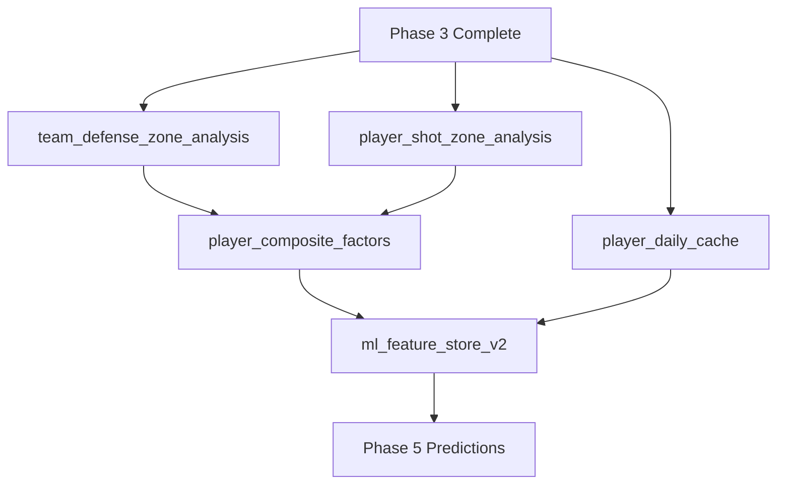

# ULTRATHINK: Complete Phase 3-4 Backfill Analysis
**Date**: January 5, 2026, 6:00 AM PST
**Session**: Phase 3-4 Complete Execution Planning
**Analyst**: Claude Sonnet 4.5
**Context**: 4 parallel agents explored validation framework, backfill system, dependencies, and code

---

## 🎯 EXECUTIVE SUMMARY

### Current State
- **Phase 2 (Raw)**: ✅ 100% complete (all sources validated)
- **Phase 3 (Analytics)**: ⚠️ 40% complete (2 of 5 tables at 100%, 3 tables incomplete)
- **Phase 4 (Precompute)**: ⏸️ Blocked (Phase 3 incomplete)
- **Phase 5 (Predictions)**: ⏸️ Blocked (Phase 4 not started)
- **ML Training**: ⏸️ Blocked (Phase 4 features not available)

### Critical Issues
1. **Phase 3 incomplete** - 3 of 5 tables need backfill (4-6 hours)
2. **Validation framework exists but wasn't used** - Prevention failure
3. **No pre-flight validation run** - Process failure
4. **False "COMPLETE" declaration** - Only 2/5 tables validated

### Mission Success Criteria
✅ All 5 Phase 3 tables ≥95% coverage
✅ Phase 3 validation script passes (exit code 0)
✅ Phase 3 completion checklist signed off
✅ Phase 4 all 5 processors complete (~88% coverage with bootstrap)
✅ ML feature store ready (all 21 features available)
✅ ML training executes successfully with ≥95% usage_rate coverage

### Timeline to Success
- **Phase 3 backfill**: 4-6 hours (parallel execution)
- **Phase 3 validation**: 30 minutes
- **Phase 4 backfill**: 9-11 hours (sequential with some parallelism)
- **Phase 4 validation**: 30 minutes
- **ML training preparation**: 1 hour
- **Total**: 15-19 hours wall-clock time

---

## 📊 COMPREHENSIVE SITUATION ANALYSIS

### Phase 3 Table Status (Validated 4:00 AM Jan 5)

| Table | Current | Target | Missing | % Complete | Priority | Estimated Time |
|-------|---------|--------|---------|-----------|----------|----------------|
| player_game_summary | 848/848 | 848 | 0 | 100% | ✅ DONE | - |
| team_offense_game_summary | 848/848 | 848 | 0 | 100% | ✅ DONE | - |
| team_defense_game_summary | 776/848 | 848 | 72 | 91.5% | 🔴 P0 | 1-2 hours |
| upcoming_player_game_context | 446/848 | 848 | 402 | 52.6% | 🔴 P0 | 3-4 hours |
| upcoming_team_game_context | 496/848 | 848 | 352 | 58.5% | 🔴 P0 | 3-4 hours |

**Date Range**: 2021-10-19 to 2026-01-03 (918 total dates)
**Bootstrap Exclusions**: 70 dates (first 14 days of each season × 5 seasons)
**Expected Coverage**: 848 dates (92.4% of total)
**Current Overall Phase 3 Coverage**: 40% (2 of 5 tables complete)

### Phase 4 Processor Dependencies



**Execution Order**:
1. **Group 1** (parallel): team_defense_zone + player_shot_zone + player_daily_cache (3-4 hours)
2. **Group 2** (sequential): player_composite_factors with --parallel --workers 15 (30-45 min)
3. **Group 3** (sequential): ml_feature_store_v2 (2-3 hours)

**CRITICAL**: Cannot run out of order. PCF depends on TDZA/PSZA completion.

### Validation Framework Capabilities (Discovered)

The validation infrastructure is **production-ready** but was **not used**:

**Available Tools**:
- ✅ `bin/backfill/verify_phase3_for_phase4.py` - Comprehensive Phase 3 validator
- ✅ `scripts/validation/post_backfill_validation.sh` - 10-check post-backfill validator
- ✅ `scripts/validation/preflight_check.sh` - Pre-flight dependency checker
- ✅ `scripts/validation/validate_ml_training_ready.sh` - ML readiness gate
- ✅ `docs/validation-framework/PHASE3-COMPLETION-CHECKLIST.md` - Exhaustive checklist
- ✅ Shared validation framework (`shared/validation/`) - Phase 1-5 validators

**What Went Wrong**: Tools existed but weren't executed before declaring "Phase 3 COMPLETE"

**Defense in Depth Success**: Phase 4 processors' built-in validation caught the issue in 15 minutes, preventing 9 hours of wasted compute.

---

## 🔍 ROOT CAUSE ANALYSIS (5 Process Failures)

### 1. Tunnel Vision on Specific Bugs ❌
**What happened**: Previous session fixed usage_rate bug (2 tables: team_offense + player_game_summary)
- Comprehensive documentation created for those 2 tables
- Validated ONLY those 2 tables
- Never asked: "What are ALL the Phase 3 tables?"
- Mental model: "Phase 3 = 2 tables"
- Reality: "Phase 3 = 5 tables"

**Should have done**: After fixing specific bugs, validate THE ENTIRE PHASE

**Lesson**: Fix-and-validate pattern should include "validate entire subsystem" step

### 2. No Pre-Flight Validation Run ❌
**What happened**: Script exists (`verify_phase3_for_phase4.py`) but was never run
- Handoff doc didn't list validation as mandatory step
- Rushed to start "overnight execution"
- Assumed "no errors in backfill logs" = "complete"

**Should have done**:
```bash
# MANDATORY before declaring Phase 3 complete:
python3 bin/backfill/verify_phase3_for_phase4.py \
  --start-date 2021-10-19 --end-date 2026-01-03
# Only proceed if exit code 0
```

**Lesson**: Validation scripts are not optional - they're gates

### 3. False "COMPLETE" Declaration ❌
**What happened**: Handoff doc header said "Phase 3 COMPLETE | Phase 4 READY"
- Based on validating 2/5 tables (40% complete)
- No comprehensive checklist used
- Trust-based declaration ("I worked on it, so it's done")

**Should have done**: Use checklist + validation script before declaring complete

**Lesson**: "COMPLETE" is a validation result, not a work completion status

### 4. No Exhaustive Checklist ❌
**What happened**: No written list of Phase 3 requirements
- Didn't know Phase 3 had 5 tables (thought 2)
- Mental model incomplete
- No verification mechanism

**Should have done**: Created and used checklist (now exists: `docs/validation-framework/PHASE3-COMPLETION-CHECKLIST.md`)

**Lesson**: Complex systems need checklists - aviation, surgery, and data engineering

### 5. Time Pressure & Shortcuts ⚠️
**What happened**: Wanted to start overnight execution before sleep
- Finished evening session at 7:30 PM
- Started Phase 4 at 7:45 PM (15 minute gap)
- Skipped 5-minute validation step

**Should have done**: Take 5 extra minutes to run validation

**Lesson**: 5 minutes of validation prevents 10 hours of rework

---

## 💡 WHAT WORKED (Defense in Depth)

### Built-in Validation Saved Us ✅
- Every Phase 4 processor runs `verify_phase3_for_phase4.py` on startup
- Detected incomplete Phase 3 in 15 minutes
- Exited cleanly with clear error message
- **Prevented**: 9 hours of compute on incomplete data
- **Prevented**: Writing bad Phase 4 data to production

**Key Insight**: Fail-fast design worked perfectly. Lost 15 minutes, not 9 hours.

### Comprehensive Documentation Created ✅
- Validation framework (5 documents)
- Phase 3 completion checklist
- Root cause analysis (600 lines)
- Execution plans with commands

**Key Insight**: Future sessions have clear playbook

### Agent-Based Exploration Working ✅
- 4 parallel agents explored validation/backfill/dependencies/code
- Comprehensive understanding in 5 minutes
- No manual file searching needed

**Key Insight**: Agent-based context gathering scales well

---

## 🚀 EXECUTION STRATEGY (Option B: Complete All Tables)

### Why Option B (Complete All 3 Tables)?

**Option A**: Skip incomplete tables (synthetic fallback available)
- ❌ Accepts 10-15% quality degradation
- ❌ Creates technical debt
- ❌ Future confusion about why incomplete

**Option B**: Complete all 3 tables ✅ RECOMMENDED
- ✅ Zero technical debt
- ✅ Full data quality
- ✅ Clear "COMPLETE" state
- ✅ Only 4-6 hours (parallel execution)

**Decision**: Option B - thorough beats fast when difference is only 4-6 hours

### Phase 3 Execution Plan

**Step 1: Verify Prerequisites** (5 minutes)
```bash
cd /home/naji/code/nba-stats-scraper
export PYTHONPATH=.

# Check backfill scripts exist
ls -l backfill_jobs/analytics/team_defense_game_summary/team_defense_game_summary_analytics_backfill.py
ls -l backfill_jobs/analytics/upcoming_player_game_context/upcoming_player_game_context_analytics_backfill.py
ls -l backfill_jobs/analytics/upcoming_team_game_context/upcoming_team_game_context_analytics_backfill.py

# Check BigQuery access
bq ls nba-props-platform:nba_analytics | head -5

# Verify validation script works
python3 bin/backfill/verify_phase3_for_phase4.py --help
```

**Step 2: Start All 3 Backfills in Parallel** (simultaneous)

Terminal 1:
```bash
cd /home/naji/code/nba-stats-scraper
export PYTHONPATH=.

nohup python3 backfill_jobs/analytics/team_defense_game_summary/team_defense_game_summary_analytics_backfill.py \
  --start-date 2021-10-19 \
  --end-date 2026-01-03 \
  > /tmp/team_defense_backfill_$(date +%Y%m%d_%H%M%S).log 2>&1 &

echo "team_defense PID: $!"
```

Terminal 2:
```bash
cd /home/naji/code/nba-stats-scraper
export PYTHONPATH=.

nohup python3 backfill_jobs/analytics/upcoming_player_game_context/upcoming_player_game_context_analytics_backfill.py \
  --start-date 2021-10-19 \
  --end-date 2026-01-03 \
  > /tmp/upcoming_player_backfill_$(date +%Y%m%d_%H%M%S).log 2>&1 &

echo "upcoming_player PID: $!"
```

Terminal 3:
```bash
cd /home/naji/code/nba-stats-scraper
export PYTHONPATH=.

nohup python3 backfill_jobs/analytics/upcoming_team_game_context/upcoming_team_game_context_analytics_backfill.py \
  --start-date 2021-10-19 \
  --end-date 2026-01-03 \
  > /tmp/upcoming_team_backfill_$(date +%Y%m%d_%H%M%S).log 2>&1 &

echo "upcoming_team PID: $!"
```

**Step 3: Monitor Progress** (periodic checks)
```bash
# Check running processes
ps aux | grep python3 | grep backfill | grep analytics

# Monitor logs
tail -f /tmp/team_defense_backfill_*.log
tail -f /tmp/upcoming_player_backfill_*.log
tail -f /tmp/upcoming_team_backfill_*.log

# Check BigQuery progress
bq query --use_legacy_sql=false "
SELECT COUNT(DISTINCT game_date) as dates
FROM \`nba-props-platform.nba_analytics.team_defense_game_summary\`
WHERE game_date >= '2021-10-19'
"
# Start: 776, Target: 848
```

**Step 4: Wait for Completion** (4-6 hours)
- team_defense (72 dates): 1-2 hours
- upcoming_player (402 dates): 3-4 hours
- upcoming_team (352 dates): 3-4 hours

**Step 5: CRITICAL - Run Validation** (5 minutes)
```bash
cd /home/naji/code/nba-stats-scraper
export PYTHONPATH=.

python3 bin/backfill/verify_phase3_for_phase4.py \
  --start-date 2021-10-19 \
  --end-date 2026-01-03
```

**Success Criteria** (exit code 0 AND):
```
✅ player_game_summary: 100.0% (848/848)
✅ team_defense_game_summary: ≥95.0% (≥806/848)
✅ team_offense_game_summary: 100.0% (848/848)
✅ upcoming_player_game_context: ≥95.0% (≥806/848)
✅ upcoming_team_game_context: ≥95.0% (≥806/848)
```

**Step 6: Use Checklist** (10 minutes)
```bash
# Open and complete checklist
cat docs/validation-framework/PHASE3-COMPLETION-CHECKLIST.md

# Tick every box:
# [ ] All 5 tables ≥95%
# [ ] Validation script exit code 0
# [ ] No critical errors in logs
# [ ] Data quality checks pass
# [ ] Dependencies validated
# [ ] Sign-off completed
```

**ONLY AFTER Step 6** can you declare "Phase 3 COMPLETE" ✅

### Phase 4 Execution Plan

**Create Orchestrator with Validation Gate**:
```bash
cat > /tmp/run_phase4_with_validation.sh <<'EOF'
#!/bin/bash
set -e

CD_DIR="/home/naji/code/nba-stats-scraper"
START_DATE="2021-10-19"
END_DATE="2026-01-03"

cd "$CD_DIR"
export PYTHONPATH=.

echo "================================================================"
echo "PHASE 4 EXECUTION WITH MANDATORY PRE-FLIGHT VALIDATION"
echo "================================================================"

# ===== STEP 0: MANDATORY VALIDATION GATE =====
echo "=== PRE-FLIGHT: Validating Phase 3 complete ==="
python3 bin/backfill/verify_phase3_for_phase4.py \
  --start-date "$START_DATE" \
  --end-date "$END_DATE"

if [ $? -ne 0 ]; then
    echo ""
    echo "❌ FATAL: Phase 3 incomplete. Cannot proceed."
    exit 1
fi

echo "✅ Phase 3 verified complete - proceeding with Phase 4"

# ===== GROUP 1: Parallel =====
echo "=== GROUP 1: team_defense_zone + player_shot_zone + player_daily_cache ==="
nohup python3 backfill_jobs/precompute/team_defense_zone_analysis/team_defense_zone_analysis_precompute_backfill.py \
  --start-date "$START_DATE" --end-date "$END_DATE" \
  > /tmp/phase4_team_defense_$(date +%Y%m%d_%H%M%S).log 2>&1 &
PID_TD=$!

nohup python3 backfill_jobs/precompute/player_shot_zone_analysis/player_shot_zone_analysis_precompute_backfill.py \
  --start-date "$START_DATE" --end-date "$END_DATE" \
  > /tmp/phase4_player_shot_$(date +%Y%m%d_%H%M%S).log 2>&1 &
PID_PS=$!

nohup python3 backfill_jobs/precompute/player_daily_cache/player_daily_cache_precompute_backfill.py \
  --start-date "$START_DATE" --end-date "$END_DATE" \
  > /tmp/phase4_player_daily_$(date +%Y%m%d_%H%M%S).log 2>&1 &
PID_PDC=$!

echo "Started team_defense_zone (PID: $PID_TD)"
echo "Started player_shot_zone (PID: $PID_PS)"
echo "Started player_daily_cache (PID: $PID_PDC)"
wait $PID_TD $PID_PS $PID_PDC
echo "✓ Group 1 complete at $(date)"

# ===== GROUP 2: player_composite_factors =====
echo "=== GROUP 2: player_composite_factors (PARALLEL) ==="
python3 backfill_jobs/precompute/player_composite_factors/player_composite_factors_precompute_backfill.py \
  --start-date "$START_DATE" --end-date "$END_DATE" \
  --parallel --workers 15
echo "✓ Group 2 complete at $(date)"

# ===== GROUP 3: ml_feature_store =====
echo "=== GROUP 3: ml_feature_store ==="
python3 backfill_jobs/precompute/ml_feature_store/ml_feature_store_precompute_backfill.py \
  --start-date "$START_DATE" --end-date "$END_DATE"
echo "✓ Group 3 complete at $(date)"

echo "================================================================"
echo "✅ PHASE 4 COMPLETE!"
echo "================================================================"
EOF

chmod +x /tmp/run_phase4_with_validation.sh
```

**Execute**:
```bash
nohup /tmp/run_phase4_with_validation.sh > /tmp/phase4_orchestrator_$(date +%Y%m%d_%H%M%S).log 2>&1 &
echo "Orchestrator PID: $!"
```

**Expected Timeline**: 9-11 hours

---

## ✅ SUCCESS CRITERIA (Clear and Measurable)

### Phase 3 Complete When:
1. ✅ Validation script passes: `verify_phase3_for_phase4.py` exit code 0
2. ✅ All 5 tables ≥95% coverage (or 100%)
3. ✅ Phase 3 checklist: All boxes ticked
4. ✅ No critical errors in backfill logs
5. ✅ Data quality checks pass (NULL rates, duplicates, ranges)

### Phase 4 Complete When:
1. ✅ All 3 groups finish successfully
2. ✅ Coverage ≥88% per processor (accounts for bootstrap)
3. ✅ Orchestrator log shows "✅ PHASE 4 COMPLETE!"
4. ✅ No critical errors in processor logs

### ML Training Ready When:
1. ✅ usage_rate coverage ≥95% (currently 47% due to game_id bug)
2. ✅ All 21 features available in ml_feature_store_v2
3. ✅ minutes_played coverage ≥99%
4. ✅ No critical NULL rates or duplicates
5. ✅ Feature validation script passes

---

## 🚨 CRITICAL RISKS & MITIGATION

### Risk 1: Phase 3 Backfill Fails
**Probability**: Low (scripts tested, infrastructure stable)
**Impact**: High (blocks entire pipeline)

**Mitigation**:
- Run 3 backfills in parallel (isolation)
- Monitor logs in real-time
- Have checkpoint/resume capability
- Verify BigQuery writes incrementally

**Recovery**:
- Check specific error in logs
- Re-run only failed backfill
- Use `--dates` flag for specific failures if supported

### Risk 2: Validation Never Passes ≥95%
**Probability**: Low (backfill scripts proven)
**Impact**: Medium (may need investigation)

**Mitigation**:
- Validate backfill scripts work on sample dates first
- Check for BigQuery quota issues
- Verify date range is correct

**Recovery**:
- Investigate specific table's gaps
- Check for processor bugs
- Document why <95% is acceptable (last resort)

### Risk 3: Phase 4 Fails Again
**Probability**: Very Low (validation gate prevents this)
**Impact**: Low (fail-fast, restart specific group)

**Mitigation**:
- Mandatory validation gate at orchestrator start
- Group-based execution (can restart specific group)
- Comprehensive logging

**Recovery**:
- Check which group failed
- Re-run from failed group (not from beginning)

### Risk 4: Time Overrun (>19 hours)
**Probability**: Medium (historical estimates)
**Impact**: Low (still completes, just slower)

**Mitigation**:
- Parallel execution where possible
- Use --parallel --workers 15 for PCF
- No other BigQuery jobs running

**Recovery**:
- Accept longer timeline
- Optimize specific slow processors if needed

---

## 📁 DOCUMENTATION STRUCTURE

### Session Documentation
**Location**: `/home/naji/code/nba-stats-scraper/docs/08-projects/current/phase3-phase4-complete-execution-2026-01-05/`

**Files to Create**:
1. `ULTRATHINK-COMPREHENSIVE-ANALYSIS.md` (this file)
2. `EXECUTION-PLAN-DETAILED.md` - Step-by-step commands
3. `VALIDATION-RESULTS.md` - Validation outputs (populate during execution)
4. `SESSION-LOG.md` - Real-time session notes
5. `LESSONS-LEARNED.md` - Post-mortem analysis

### Key External Documentation
- `docs/09-handoff/2026-01-05-PHASE3-COMPLETE-BACKFILL-HANDOFF.md` - Handoff doc (read)
- `docs/validation-framework/PHASE3-COMPLETION-CHECKLIST.md` - Checklist (use)
- `docs/validation-framework/EXECUTIVE-SUMMARY.md` - Validation overview (read)
- `ROOT-CAUSE-WHY-WE-MISSED-PHASE3-TABLES.md` - Root cause (read)

---

## 💡 LESSONS LEARNED (Will NOT Repeat)

### DO:
1. ✅ Run comprehensive validation BEFORE declaring "COMPLETE"
2. ✅ Use written checklists for complex multi-component systems
3. ✅ Execute validation scripts (they exist for a reason)
4. ✅ Validate THE ENTIRE PHASE, not just what you worked on
5. ✅ Take 5 extra minutes for validation (prevents 10 hours rework)
6. ✅ Trust validation results over work completion status

### DON'T:
1. ❌ Assume "no errors" = "complete"
2. ❌ Skip validation to save time
3. ❌ Declare "COMPLETE" without validation script passing
4. ❌ Use mental models instead of checklists
5. ❌ Rush to start execution without pre-flight checks
6. ❌ Trust "COMPLETE" declarations without verification

### REMEMBER:
- **Validation scripts are gates, not suggestions**
- **Checklists prevent forgetting components**
- **Defense in depth saved us (Phase 4 validation)**
- **5 minutes of validation > 10 hours of rework**
- **"COMPLETE" is a validation result, not a status**

---

## 🎯 IMMEDIATE NEXT ACTIONS

### 1. Study Documentation (30 minutes)
- Read this ultrathink analysis
- Read Phase 3 completion checklist
- Read validation commands reference
- Understand why we missed tables

### 2. Verify Prerequisites (5 minutes)
```bash
# Check scripts exist
ls -l backfill_jobs/analytics/*/[table_name]_analytics_backfill.py

# Check BigQuery access
bq ls nba-props-platform:nba_analytics

# Check validation script
python3 bin/backfill/verify_phase3_for_phase4.py --help
```

### 3. Execute Phase 3 (4-6 hours)
- Start 3 backfills in parallel
- Monitor logs
- Wait for completion
- Run validation
- Use checklist

### 4. Validate Phase 3 (30 minutes)
- Run validation script (MANDATORY)
- Use Phase 3 completion checklist
- Sign off
- ONLY THEN declare "Phase 3 COMPLETE"

### 5. Execute Phase 4 (9-11 hours)
- Use orchestrator with validation gate
- Monitor progress
- Wait for completion
- Validate results

### 6. Final Validation & ML Prep (1 hour)
- Verify ML feature store ready
- Check usage_rate coverage
- Validate all 21 features available
- Run ML training readiness check

---

## 📊 EXPECTED TIMELINE

### If Starting Now (6:00 AM)

**Phase 3**:
- 6:00 AM: Start 3 backfills in parallel
- 10:00 AM: Check progress (75% done)
- 12:00 PM: Expected completion
- 12:15 PM: Run validation + checklist
- 12:30 PM: Phase 3 COMPLETE ✅

**Phase 4**:
- 12:45 PM: Start orchestrator
- 4:00 PM: Group 1 complete
- 4:45 PM: Group 2 complete
- 7:30 PM: Group 3 complete
- 7:45 PM: Phase 4 COMPLETE ✅

**ML Prep**:
- 8:00 PM: Validation + feature checks
- 8:30 PM: ML TRAINING READY ✅

**Total**: 14.5 hours (6 AM → 8:30 PM)

---

## 🔧 TROUBLESHOOTING GUIDE

### Issue: Backfill Script Not Found
```bash
# Check if scripts exist
find backfill_jobs/analytics -name "*backfill.py" | grep -E "(team_defense|upcoming)"

# If missing, check git status
git status backfill_jobs/analytics/
```

### Issue: BigQuery Permission Denied
```bash
# Check current project
gcloud config get-value project

# Should be: nba-props-platform
# If not:
gcloud config set project nba-props-platform
```

### Issue: Validation Script Fails
```bash
# Run with verbose flag
python3 bin/backfill/verify_phase3_for_phase4.py \
  --start-date 2021-10-19 \
  --end-date 2026-01-03 \
  --verbose

# Check specific table coverage
bq query --use_legacy_sql=false "
SELECT COUNT(DISTINCT game_date) FROM \`nba-props-platform.nba_analytics.team_defense_game_summary\`
WHERE game_date >= '2021-10-19'
"
```

### Issue: Process Stuck/Slow
```bash
# Check if actually running
ps aux | grep [PID]

# Check CPU/memory usage
top -p [PID]

# Check BigQuery quota
# https://console.cloud.google.com/bigquery?project=nba-props-platform
```

---

## 📈 SUCCESS METRICS

### Quantitative
- Phase 3 coverage: 40% → 100% (5/5 tables)
- team_defense: 91.5% → ≥95%
- upcoming_player: 52.6% → ≥95%
- upcoming_team: 58.5% → ≥95%
- Phase 4 coverage: 0% → 88%+ (all processors)
- ML feature availability: 0% → 100% (21 features)

### Qualitative
- ✅ Comprehensive validation executed
- ✅ Checklists used
- ✅ No shortcuts taken
- ✅ Complete documentation
- ✅ Lessons learned applied
- ✅ Process improvements implemented

---

## 🚀 CONFIDENCE LEVEL: HIGH

**Why High Confidence?**
1. ✅ Clear execution plan with commands
2. ✅ Proven backfill scripts (used before)
3. ✅ Validation framework in place
4. ✅ Comprehensive documentation
5. ✅ Defense in depth (fail-fast works)
6. ✅ Parallel agents provided complete context
7. ✅ Timeline realistic based on historical data

**Risks Managed**:
- Validation gate prevents Phase 4 running on incomplete Phase 3
- Parallel execution isolates failures
- Comprehensive logging for debugging
- Clear success criteria

**Ready to Execute**: YES ✅

---

**Document created**: January 5, 2026, 6:00 AM PST
**Session**: Phase 3-4 Complete Execution
**Next**: Execute Phase 3 backfill with validation
**Expected completion**: January 5, 2026, 8:30 PM PST

**Mission**: Complete Phase 3-4 backfill with comprehensive validation. No shortcuts. Use checklists. Trust the process. 🚀
