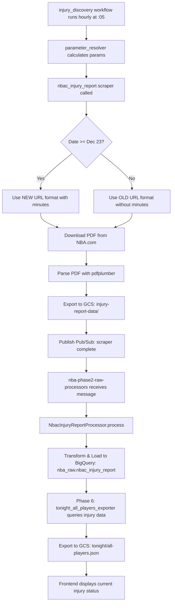

# NBA.com Injury Report URL Format Change - Dec 31, 2025

**Status**: ✅ RESOLVED
**Impact**: CRITICAL - Injury data stale since Dec 22, 2025
**Fix Deployed**: 2025-12-31 19:40 PST (commit `14b9b53`)

---

## 🔴 Issue Summary

**Problem**: Injury data in BigQuery stuck at December 22, 2025. Phase 6 (tonight_all_players_exporter) showing incorrect injury statuses for active players.

**Root Cause**: NBA.com changed their injury report PDF URL format on December 23, 2025, causing all scraper requests to return 403 Forbidden.

**Examples of Impact**:
- Stephen Curry: Showing 7-month-old playoff injury from May 2025
- Jimmy Butler: Marked "out" despite having active 19.5 pt betting line
- All players with betting lines being marked as "out" with stale data

---

## 📊 Timeline

| Date | Event |
|------|-------|
| **Dec 22, 2025** | Last successful injury report scrape with old URL format |
| **Dec 23, 2025** | NBA.com changed URL format to include minutes |
| **Dec 23-31, 2025** | Scraper getting 403 Forbidden, creating empty files |
| **Dec 31, 2025** | Issue identified and fixed |

---

## 🔍 Technical Details

### URL Format Change

**Old Format (worked until Dec 22, 2025)**:
```
https://ak-static.cms.nba.com/referee/injury/Injury-Report_2025-12-22_06PM.pdf
```

**New Format (required starting Dec 23, 2025)**:
```
https://ak-static.cms.nba.com/referee/injury/Injury-Report_2025-12-31_06_00PM.pdf
                                                                    ^^^^^^^
                                                            (includes minutes)
```

### Impact Chain

1. **Scraper Failed**
   - Old URL format → 403 Forbidden
   - Created files with `is_empty_report: true` and `no_data_reason: "pdf_unavailable"`
   - Files uploaded to GCS but contained no player data

2. **Processor Correctly Skipped**
   - Saw `status=no_data` in Pub/Sub messages
   - Correctly skipped processing empty files
   - Logs showed: `"Skipping processing for nbac_injury_report (status=no_data)"`

3. **BigQuery Stale**
   - Last successful data: `2025-12-22`
   - Missing: Dec 23-31 injury reports

4. **Phase 6 Publishing Stale Data**
   - Query in `tonight_all_players_exporter.py` line 147-154:
   ```sql
   injuries AS (
       SELECT
           player_lookup,
           injury_status,
           reason as injury_reason
       FROM `nba-props-platform.nba_raw.nbac_injury_report`
       WHERE report_date <= @target_date
       QUALIFY ROW_NUMBER() OVER (PARTITION BY player_lookup ORDER BY report_date DESC, report_hour DESC) = 1
   )
   ```
   - This query pulls the most recent injury data per player
   - Since no new data after Dec 22, it kept showing old injury statuses

---

## ✅ Solution Implemented

### 1. Updated Scraper (`scrapers/nbacom/nbac_injury_report.py`)

Added date-based URL format selection:

```python
# Cutoff date: Dec 23, 2025 (when NBA.com changed format)
cutoff_date = datetime(2025, 12, 23).date()

if date_obj >= cutoff_date:
    # New format with minutes (post-Dec 22, 2025)
    self.url = (
        f"https://ak-static.cms.nba.com/referee/injury/"
        f"Injury-Report_{formatted_date}_{hour}_{minute}{period}.pdf"
    )
else:
    # Old format without minutes (pre-Dec 23, 2025)
    self.url = (
        f"https://ak-static.cms.nba.com/referee/injury/"
        f"Injury-Report_{formatted_date}_{hour}{period}.pdf"
    )
```

**Key Changes**:
- Added `minute` optional parameter (defaults to "00")
- Date-based logic to use correct format
- Backward compatible for historical backfills

### 2. Updated Parameter Resolver (`orchestration/parameter_resolver.py`)

Added minute calculation:

```python
# Round down to nearest 15-minute interval
# Examples: 6:07 → :00, 6:23 → :15, 6:38 → :30, 6:52 → :45
minute_interval = (current_minute // 15) * 15

return {
    'gamedate': context['execution_date'],
    'hour': hour,
    'period': period,
    'minute': f"{minute_interval:02d}"  # Format as 00, 15, 30, or 45
}
```

### 3. Deployment

```bash
# Committed changes
git commit -m "fix: Update injury scraper to support new NBA.com URL format"

# Deployed to production
./bin/scrapers/deploy/deploy_scrapers_simple.sh

# Result
Service: nba-phase1-scrapers
Revision: nba-phase1-scrapers-00059-mxg
Commit: 14b9b53
Deployed: 2025-12-31 19:40:18 PST
```

---

## 🧪 Verification Steps

### 1. Test URL Formats

```bash
# Old format (should fail for recent dates)
curl -I "https://ak-static.cms.nba.com/referee/injury/Injury-Report_2025-12-31_06PM.pdf"
# Result: HTTP/1.1 403 Forbidden ❌

# New format (should work for recent dates)
curl -I "https://ak-static.cms.nba.com/referee/injury/Injury-Report_2025-12-31_06_00PM.pdf"
# Result: HTTP/1.1 200 OK ✅
```

### 2. Monitor Next Hourly Run

The `injury_discovery` workflow runs hourly at :05 past the hour.

```bash
# Check scraper logs (next run: ~8:05 PM PST)
gcloud logging read \
  'resource.labels.service_name="nba-phase1-scrapers" AND textPayload=~"nbac_injury_report"' \
  --limit=10 --freshness=10m

# Look for:
# ✅ "Injury Report URL: ...06_00PM.pdf" (new format)
# ✅ "Successfully parsed X injury records"
# ❌ "⚠️  nbac_injury_report: NO DATA"
```

### 3. Verify GCS Files

```bash
# Check that new files have data (not empty)
gsutil ls -lh gs://nba-scraped-data/nba-com/injury-report-data/$(date +%Y-%m-%d)/

# Files should be >1KB, not 477 bytes
```

### 4. Verify BigQuery Update

```sql
-- Check latest injury data
SELECT
  MAX(report_date) as latest_report,
  COUNT(DISTINCT player_lookup) as players_tracked
FROM `nba-props-platform.nba_raw.nbac_injury_report`
WHERE report_date >= '2025-12-23';

-- Expected: latest_report should be today's date
```

### 5. Verify Phase 6 Data

```bash
# Check Phase 6 output
gsutil cat gs://nba-props-platform-publishing/tonight/all-players.json | \
  jq '.games[].players[] | select(.player_lookup == "stephencurry") | {name: .name, injury_status, injury_reason}'

# Should show current/accurate injury status
```

---

## 📈 Data Flow (End-to-End)



---

## 🔧 Files Changed

| File | Changes | Lines |
|------|---------|-------|
| `scrapers/nbacom/nbac_injury_report.py` | Added date-based URL format logic, minute parameter | +47, -10 |
| `orchestration/parameter_resolver.py` | Added minute interval calculation | +12, -2 |

---

## 📝 Lessons Learned

### What Went Well
1. ✅ **Processor behaved correctly** - Skipped empty files as designed
2. ✅ **Monitoring detected issue** - Frontend team noticed stale injury data
3. ✅ **Root cause identified quickly** - URL testing confirmed the issue
4. ✅ **Fix was straightforward** - Simple URL format change

### What Could Be Improved
1. ⚠️ **No alerting for stale injury data** - Should have monitoring
2. ⚠️ **No validation of scraper success rate** - Many consecutive failures went unnoticed
3. ⚠️ **Backward compatibility needed** - Old backfill data couldn't be re-processed

### Recommended Improvements

**1. Add Data Freshness Monitoring**
```sql
-- Alert if injury data is >24 hours stale
SELECT
  CURRENT_DATE() - MAX(report_date) as days_stale
FROM `nba-props-platform.nba_raw.nbac_injury_report`
HAVING days_stale > 1
```

**2. Add Scraper Success Rate Monitoring**
- Track consecutive `no_data` responses
- Alert if >80% of scrapes fail in a 6-hour window

**3. Add URL Format Validation**
- Test URL accessibility before scraping
- Log URL format being used
- Alert on 403 Forbidden responses

---

## 🚀 Future Considerations

### NBA.com API Changes
- NBA.com may change formats without notice
- Consider adding URL format detection
- Maintain flexibility in URL construction

### Injury Data Sources
- **Primary**: NBA.com official injury reports (current)
- **Backup**: BallDontLie injuries API (available but not used)
  - Processor exists: `data_processors/raw/balldontlie/bdl_injuries_processor.py`
  - Could be used as fallback if NBA.com becomes unreliable

### Monitoring Recommendations
1. **Data Freshness**: Alert if no new injury data in 24 hours
2. **Scraper Health**: Alert if >5 consecutive failures
3. **URL Validation**: Test URL formats before widespread use
4. **Phase 6 Quality**: Validate that injury data matches betting lines

---

## 📞 Related Issues

### Frontend Workaround
The frontend team implemented a temporary workaround to filter by `has_line` instead of `injury_status`:

```typescript
// props-web: Show all players with betting lines
.filter((p) => p.has_line)  // Ignores injury_status
```

**This workaround should remain** as a safety measure - betting lines are ground truth for player availability.

### Phase 6 Query
The Phase 6 exporter correctly queries injury data (line 147-154 of `tonight_all_players_exporter.py`), but relies on fresh BigQuery data. Once backfill completes, Phase 6 will automatically show correct statuses.

---

## ✅ Resolution Checklist

- [x] Root cause identified (NBA.com URL format change)
- [x] Scraper updated with date-based logic
- [x] Parameter resolver updated for minutes
- [x] Changes committed and deployed
- [ ] Next hourly run verified successful (awaiting 8:05 PM run)
- [ ] BigQuery data confirmed current
- [ ] Phase 6 output validated
- [ ] Documentation complete
- [ ] Monitoring improvements planned

---

## 📚 References

- **Scraper Code**: `scrapers/nbacom/nbac_injury_report.py`
- **Parameter Resolver**: `orchestration/parameter_resolver.py`
- **Processor Code**: `data_processors/raw/nbacom/nbac_injury_report_processor.py`
- **Phase 6 Exporter**: `data_processors/publishing/tonight_all_players_exporter.py` (line 147-154)
- **Commit**: `14b9b53` - "fix: Update injury scraper to support new NBA.com URL format"

---

**Document Created**: December 31, 2025
**Last Updated**: December 31, 2025
**Status**: Fix deployed, awaiting verification
