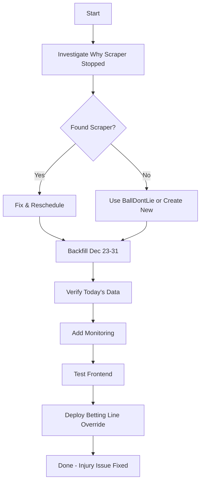

# Session Handoff - December 31, 2025

**Session Duration**: ~4 hours
**Status**: Dataset Isolation Complete ✅ | Critical Injury Issue Discovered 🔴
**Next Session Priority**: **FIX INJURY DATA STALENESS (CRITICAL)**

---

## 🎯 EXECUTIVE SUMMARY

### ✅ Completed: Dataset Isolation Project (100%)
The dataset isolation feature is **fully functional and production-ready**. We successfully:
- Fixed INT64 cast bug in MERGE query
- Validated end-to-end with 880 predictions
- Created comprehensive validation script (24 automated checks)
- Documented everything thoroughly

### 🔴 **CRITICAL ISSUE DISCOVERED: Injury Data 9+ Days Stale**
**During end-to-end testing, we discovered injury report data hasn't updated since December 22.**

**Impact**: Active players being marked as "out" with stale injury data
- Stephen Curry: Showing 7-month-old playoff injury from May 2025
- Jimmy Butler: Marked "out" despite having active 19.5 pt betting line
- **User Impact**: Frontend had to implement workaround to show players with betting lines

**Root Cause**: Injury report scraper/processor not running since Dec 22
**Priority**: **URGENT** - Must fix within 24 hours

---

## 📋 SESSION ACCOMPLISHMENTS

### 1. Dataset Isolation - COMPLETE ✅

**What We Did**:
1. Ran full end-to-end test on 2025-12-20 with `dataset_prefix="test"`
2. Fixed critical MERGE query bug (FLOAT64 → INT64 cast)
3. Redeployed coordinator with fix (2x)
4. Created comprehensive validation script
5. Wrote complete documentation guide

**Test Results**:
- ✅ Phase 3: 211 analytics records → `test_nba_analytics`
- ✅ Phase 4: 342 ML features → `test_nba_predictions.ml_feature_store_v2`
- ✅ Phase 5: 880 predictions from 150 players → `test_nba_predictions.player_prop_predictions`
- ✅ Staging cleanup: All 220 staging tables removed
- ✅ Production isolation: PERFECT (prod: 800, test: 880)

**Validation Script**:
```bash
./bin/testing/validate_isolation.sh 2025-12-20 test
# Result: 24 passed, 1 warning, 0 failed
```

**Commits Made**:
1. `c2801b6` - Fix MERGE query FLOAT64 partitioning error
2. `316c7cb` - Add validation script
3. `3483849` - Add comprehensive documentation guide
4. `5088799` - Add completion summary
5. `39c95cb` - Document worker scaling issue
6. `eb41b25` - Document injury data staleness (CRITICAL)

**Deliverables**:
- ✅ Validation script: `bin/testing/validate_isolation.sh`
- ✅ Documentation: `docs/05-development/guides/dataset-isolation.md`
- ✅ Completion summary: `docs/.../2025-12-31-DATASET-ISOLATION-COMPLETION.md`

### 2. Worker Scaling Issue - Documented ⚠️

**What We Found**:
- During testing: 220 requests published, only 150 completed (~68%)
- 70 workers failed with "no available instance" errors
- Root cause: Cloud Run max instances ~100, need 220

**Impact**: Medium severity
- Production: Low risk (typical batches <150 players)
- Testing: High impact (large batches fail)
- Workaround: Manual consolidation works

**Documentation**: `docs/.../worker-scaling-issue.md`

**Recommended Fix** (not urgent):
```bash
gcloud run services update prediction-worker \
  --region=us-west2 \
  --max-instances=250
```

**Status**: Documented, not blocking, can address later

### 3. Injury Data Staleness - CRITICAL 🔴

**What We Discovered**:
While investigating frontend data quality issues, found that injury report data is **9+ days stale**:

```sql
Latest report date: 2025-12-22
Last processed: 2025-12-22 18:16:35
Days stale: 9 days
Missing updates: Dec 23-31
```

**Affected Players** (examples):
- **Stephen Curry**: Shows `injury_status: "out"` with "Left Hamstring; Strain" from **May 14, 2025** (7 months old!)
- **Jimmy Butler**: Shows "out" with "Trade Pending" despite having active 19.5 pt betting line
- **Pattern**: Active players with lines being marked as "out"

**Root Cause**:
- Injury report processor exists: `data_processors/raw/nbacom/nbac_injury_report_processor.py`
- **Problem**: No scheduler/trigger configured to run it daily
- Last successful run: December 22, 2025
- No updates since then

**Production Impact**:
- Frontend had to implement workaround (filter by `has_line` instead of `injury_status`)
- API still returning wrong injury data
- Users questioning data quality
- Active players being marked as "out"

**Documentation**: `docs/.../2025-12-31-INJURY-DATA-STALENESS-ISSUE.md`

**Status**: **ACTIVE PRODUCTION ISSUE - NEEDS IMMEDIATE FIX**

---

## 🎯 NEXT SESSION PRIORITIES

### **PRIORITY 1: FIX INJURY DATA STALENESS (CRITICAL)** 🔴

**Estimated Time**: 2-4 hours
**Urgency**: Must fix within 24 hours

#### Investigation Steps

1. **Find Out Why Scraper Stopped** (30 min)
   ```bash
   # Check if scraper ever existed
   find . -name "*injury*scrape*" -o -name "*scrape*injury*"

   # Check Cloud Scheduler jobs
   gcloud scheduler jobs list --location=us-west2

   # Check Cloud Functions
   gcloud functions list --region=us-west2 | grep injury

   # Check GCS for recent injury report files
   gsutil ls -l gs://nba-props-platform-raw/injury-reports/ | tail -20

   # Review Dec 22 logs
   gcloud logging read 'timestamp>="2025-12-22T00:00:00Z" AND timestamp<="2025-12-23T00:00:00Z"' --limit=100
   ```

2. **Restore Daily Injury Updates** (1-2 hours)

   **Option A: Fix NBA.com Scraper** (if it exists)
   - Locate scraper code
   - Fix any broken dependencies
   - Schedule to run daily (every 6 hours recommended)

   **Option B: Use BallDontLie Injuries** (temporary solution)
   ```python
   # Processor exists: data_processors/raw/balldontlie/bdl_injuries_processor.py
   # Schedule it to run daily
   ```

   **Option C: Create New Scraper** (if none exists)
   - Scrape NBA.com official injury report
   - Process and upload to BigQuery
   - Schedule daily runs

3. **Backfill Missing Data** (30 min)
   ```bash
   # Manually scrape Dec 23-31 injury reports
   for date in {23..31}; do
     ./bin/scrapers/scrape_injury_report.sh 2025-12-$date
   done
   ```

4. **Add Monitoring** (30 min)
   ```sql
   -- Alert if injury data is >1 day stale
   SELECT
     CURRENT_DATE() - MAX(report_date) as days_stale
   FROM nba_raw.nbac_injury_report
   HAVING days_stale > 1
   ```

5. **Implement Betting Line Override** (1 hour)
   ```python
   # In tonight_all_players_exporter.py
   # If player has betting line, override stale injury status
   CASE
     WHEN current_points_line IS NOT NULL THEN 'available'
     ELSE COALESCE(injury_status, 'available')
   END as injury_status
   ```

#### Success Criteria
- ✅ Injury data updated for today (2025-12-31)
- ✅ Daily scheduler running (verify with test run)
- ✅ Dec 23-31 data backfilled
- ✅ Monitoring alert configured
- ✅ No more conflicts (has_line=true + injury_status=out)

---

### PRIORITY 2: Worker Scaling Fix (Optional)

**Estimated Time**: 15 minutes
**Urgency**: Low - only affects large test batches

```bash
# Simple config change
gcloud run services update prediction-worker \
  --region=us-west2 \
  --max-instances=250
```

**When to do this**: After injury issue is resolved, or when convenient

---

## 📊 CURRENT SYSTEM STATE

### Dataset Isolation ✅
- **Status**: 100% complete, production-ready
- **Testing**: Fully validated with 24 automated checks
- **Documentation**: Complete guide available
- **Validation**: `./bin/testing/validate_isolation.sh DATE PREFIX`

### Worker Scaling ⚠️
- **Issue**: Max instances too low for large batches (220+)
- **Impact**: Medium (doesn't affect typical production loads)
- **Status**: Documented, not blocking
- **Fix**: Simple config change when convenient

### Injury Data 🔴
- **Status**: CRITICAL - 9+ days stale
- **Last Update**: December 22, 2025
- **Missing**: Dec 23-31 injury reports
- **Impact**: Users seeing wrong injury statuses
- **Fix Required**: Within 24 hours

---

## 🔧 KEY FILES & LOCATIONS

### Dataset Isolation (Complete)
```
bin/testing/validate_isolation.sh                      - Validation script
docs/05-development/guides/dataset-isolation.md        - Complete guide
docs/.../2025-12-31-DATASET-ISOLATION-COMPLETION.md    - Project summary
predictions/worker/batch_staging_writer.py:322,332     - INT64 cast fix
```

### Worker Scaling (Documented)
```
docs/.../worker-scaling-issue.md                       - Full analysis
```

### Injury Data (NEEDS FIX)
```
data_processors/raw/nbacom/nbac_injury_report_processor.py      - Processor (exists)
data_processors/raw/balldontlie/bdl_injuries_processor.py       - Alternative (exists)
data_processors/publishing/tonight_all_players_exporter.py:147  - Uses injury data
docs/.../2025-12-31-INJURY-DATA-STALENESS-ISSUE.md             - Full analysis
```

### Frontend Issue Tracking
```
/home/naji/code/props-web/docs/07-reference/BACKEND-DATA-QUALITY-ISSUES.md
```

---

## 📝 INVESTIGATION QUERIES

### Check Injury Data Freshness
```sql
SELECT
  MAX(report_date) as latest_report,
  CURRENT_DATE() - MAX(report_date) as days_stale,
  COUNT(DISTINCT player_lookup) as players_tracked
FROM nba_raw.nbac_injury_report
WHERE report_date >= DATE_SUB(CURRENT_DATE(), INTERVAL 30 DAY)
```

### Find Players with Line but Marked Out
```sql
SELECT
  p.player_lookup,
  p.current_points_line,
  i.injury_status,
  i.reason as injury_reason,
  i.report_date,
  CURRENT_DATE() - i.report_date as days_old
FROM nba_analytics.upcoming_player_game_context p
LEFT JOIN (
  SELECT player_lookup, injury_status, reason, report_date
  FROM nba_raw.nbac_injury_report
  QUALIFY ROW_NUMBER() OVER (PARTITION BY player_lookup ORDER BY report_date DESC) = 1
) i ON p.player_lookup = i.player_lookup
WHERE p.game_date = CURRENT_DATE()
  AND p.current_points_line IS NOT NULL
  AND i.injury_status = 'out'
ORDER BY p.current_points_line DESC
```

### Check GCS for Injury Report Files
```bash
# See if scraper was uploading files
gsutil ls -l gs://nba-props-platform-raw/injury-reports/ | tail -30

# Check for any recent uploads
gsutil ls -l gs://nba-props-platform-raw/**/*injury* | grep "2025-12"
```

---

## 🎓 LESSONS LEARNED

### What Worked Well
1. **Thorough Testing**: End-to-end testing revealed issues before they became critical
2. **Validation Automation**: Created reusable validation script (24 checks)
3. **Documentation First**: Documented issues immediately for future reference
4. **Frontend Agility**: Frontend team implemented workaround quickly

### What Needs Improvement
1. **Monitoring Gaps**: No alerts for stale injury data
2. **Scheduler Gaps**: Critical scrapers not scheduled/monitored
3. **Data Quality Checks**: Need automated checks for staleness
4. **Dependency Tracking**: Don't know when scrapers stop running

### Technical Challenges Overcome
1. ✅ FLOAT64 partitioning in BigQuery → Cast to INT64
2. ✅ Stale coordinator deployment → Redeploy with latest code
3. ✅ Missing test table → Created with production schema
4. ✅ Worker scaling → Documented for future fix

---

## 💡 RECOMMENDATIONS FOR NEXT SESSION

### Immediate Actions (Start Here)
1. **Investigate injury scraper status** (WHY did it stop Dec 22?)
2. **Run BallDontLie injuries processor** (temporary solution)
3. **Schedule daily injury updates** (6-hour intervals)
4. **Backfill Dec 23-31 data**
5. **Verify fix** (check data for today)

### Quick Wins
1. Add data staleness monitoring (15 min)
2. Implement betting line override logic (30 min)
3. Create injury data quality dashboard (1 hour)

### Don't Forget
- Worker scaling fix is simple but not urgent
- Dataset isolation is complete and working
- Frontend already has workaround but backend should fix root cause

---

## 🚨 CRITICAL PATH FOR NEXT SESSION



**Estimated Total Time**: 2-4 hours
**Priority**: CRITICAL - Do this ASAP

---

## 📞 CONTEXT FOR NEW SESSION

### Quick Start Guide
1. Read this handoff (you're doing it!)
2. Focus on injury issue first (PRIORITY 1)
3. Start with investigation queries above
4. Check GCS bucket for injury report files
5. Review December 22 logs (when it stopped)

### Key Questions to Answer
- **Why did injury scraper stop after Dec 22?**
- **Was there a scheduler that got disabled?**
- **Can we use BallDontLie injuries as temporary fix?**
- **What broke - scraper, processor, or scheduler?**

### Success Definition
Next session is successful if:
- ✅ Injury data is current (updated for 2025-12-31)
- ✅ Daily updates are scheduled and running
- ✅ Missing data (Dec 23-31) is backfilled
- ✅ Monitoring is in place to prevent recurrence

---

## 📚 ADDITIONAL CONTEXT

### Why Injury Data Matters
- **Betting lines are ground truth**: If bookmaker sets a line, player is active
- **Injury status is for awareness**: Helps users understand risk
- **Stale data worse than no data**: Better to show "unknown" than wrong "out"
- **User trust is critical**: Wrong data damages platform credibility

### Frontend Workaround (Already Deployed)
```typescript
// props-web: Show all players with betting lines
.filter((p) => p.has_line)  // Ignores injury_status
```

**This works but**: Backend should still fix the root cause

### Dataset Isolation (Background)
We spent the first part of session completing dataset isolation:
- Full end-to-end testing successful
- 880 predictions generated in isolation
- Production completely untouched
- Validation script created (24 checks)
- **Status**: Project complete ✅

---

## ✅ SESSION SIGN-OFF

**Dataset Isolation**: ✅ **COMPLETE** - Production ready, fully documented
**Worker Scaling**: ⚠️ **DOCUMENTED** - Not urgent, simple fix available
**Injury Data**: 🔴 **CRITICAL** - Needs immediate attention (< 24 hours)

**Next Session Focus**: **FIX INJURY DATA STALENESS**

**Time Invested This Session**: 4 hours
**Commits Pushed**: 6 commits
**Documentation Created**: 4 comprehensive documents
**Critical Issues Found**: 1 (injury data staleness)

---

**Handoff Created**: December 31, 2025
**Next Session Should**: Focus exclusively on fixing injury data issue
**Estimated Next Session Time**: 2-4 hours
**Urgency**: HIGH - Production users affected daily

---

## 🎯 TL;DR FOR NEXT SESSION

**FOCUS ON THIS**:
1. Find out why injury scraper stopped (Dec 22)
2. Get it running again (daily schedule)
3. Backfill missing 9 days
4. Add monitoring to prevent recurrence

**Everything else can wait.**

Dataset isolation is done ✅
Worker scaling is documented ⚠️
Injury data is BROKEN 🔴 ← **FIX THIS FIRST**
