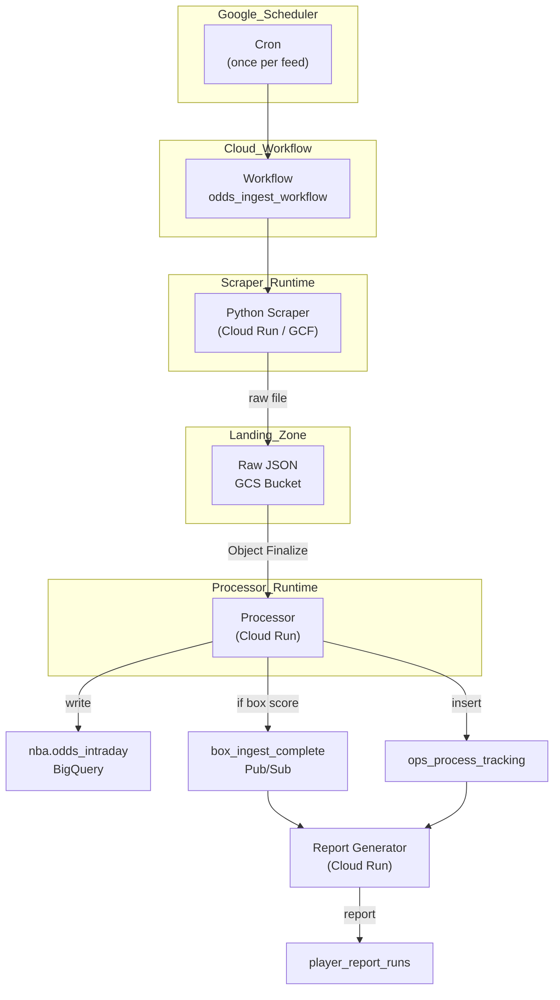
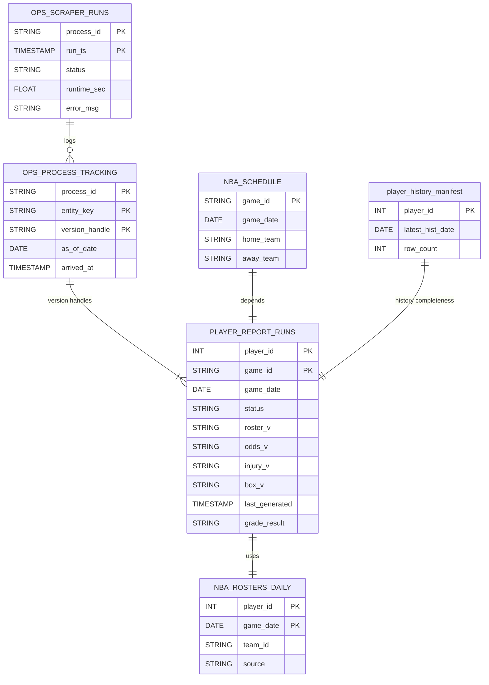
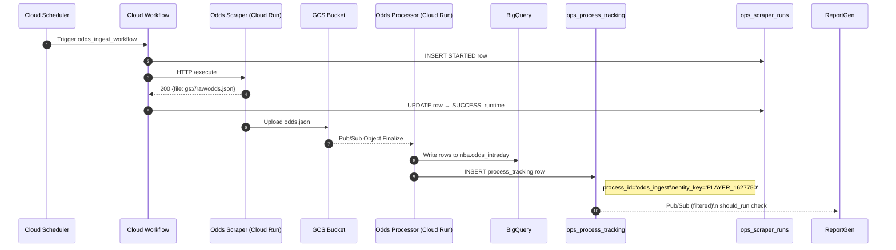

### Architecture

```mermaid
flowchart TD
    %% ------------- CLUSTERS -------------
    subgraph Google_Scheduler
        SCHED["Cron<br>(once per feed)"]
    end

    subgraph Cloud_Workflow
        WF["Workflow<br>odds_ingest_workflow"]
    end

    subgraph Scraper_Runtime
        SCR["Python Scraper<br>(Cloud Run / GCF)"]
    end

    subgraph Landing_Zone
        GCS["Raw JSON<br>GCS Bucket"]
    end

    subgraph Processor_Runtime
        PROC["Processor<br>(Cloud Run)"]
    end
    %% ------------- STAND‑ALONE NODES -------------
    BQ["nba.odds_intraday<br>BigQuery"]
    PT["ops_process_tracking"]
    PUBBOX["box_ingest_complete<br>Pub/Sub"]
    REPORTGEN["Report Generator<br>(Cloud Run)"]
    PR["player_report_runs"]

    %% ------------- EDGES -------------
    SCHED --> WF
    WF --> SCR
    SCR -->|raw file| GCS
    GCS -- "Object Finalize" --> PROC
    PROC -->|write| BQ
    PROC -->|insert| PT
    PROC -->|if box score| PUBBOX
    PUBBOX --> REPORTGEN
    PT --> REPORTGEN
    REPORTGEN -->|report| PR
```

```mermaid
erDiagram
    OPS_SCRAPER_RUNS ||--o{ OPS_PROCESS_TRACKING : logs
    OPS_PROCESS_TRACKING ||--|{ PLAYER_REPORT_RUNS : "version handles"
    PLAYER_REPORT_RUNS ||--|| NBA_ROSTERS_DAILY : uses
    NBA_SCHEDULE ||--|| PLAYER_REPORT_RUNS : depends
    player_history_manifest ||--|| PLAYER_REPORT_RUNS : "history completeness"

    OPS_SCRAPER_RUNS {
        STRING process_id PK
        TIMESTAMP run_ts PK
        STRING status
        FLOAT runtime_sec
        STRING error_msg
    }

    OPS_PROCESS_TRACKING {
        STRING process_id PK
        STRING entity_key PK
        STRING version_handle PK
        DATE as_of_date
        TIMESTAMP arrived_at
    }

    PLAYER_REPORT_RUNS {
        INT player_id PK
        STRING game_id PK
        DATE game_date
        STRING status
        STRING roster_v
        STRING odds_v
        STRING injury_v
        STRING box_v
        TIMESTAMP last_generated
        STRING grade_result
    }

    NBA_ROSTERS_DAILY {
        INT player_id PK
        DATE game_date PK
        STRING team_id
        STRING source
    }

    NBA_SCHEDULE {
        STRING game_id PK
        DATE game_date
        STRING home_team
        STRING away_team
    }

    player_history_manifest {
        INT player_id PK
        DATE latest_hist_date
        INT row_count
    }
```

```mermaid
sequenceDiagram
    autonumber
    participant Sched  as Cloud Scheduler
    participant WF     as Cloud Workflow
    participant Scr    as Odds Scraper (Cloud Run)
    participant GCS    as GCS Bucket
    participant Proc   as Odds Processor (Cloud Run)
    participant BQ     as BigQuery
    participant PT     as ops_process_tracking
    participant SR     as ops_scraper_runs

    Sched->>WF: Trigger odds_ingest_workflow
    WF->>SR: INSERT STARTED row
    WF->>Scr: HTTP /execute
    Scr-->>WF: 200 {file: gs://raw/odds.json}
    WF->>SR: UPDATE row → SUCCESS, runtime
    Scr->>GCS: Upload odds.json
    GCS-->>Proc: Pub/Sub Object Finalize
    Proc->>BQ: Write rows to nba.odds_intraday
    Proc->>PT: INSERT process_tracking row
    note right of PT: process_id='odds_ingest'\nentity_key='PLAYER_1627750'
    PT-->>+ReportGen: Pub/Sub (filtered)\n should_run check
```

