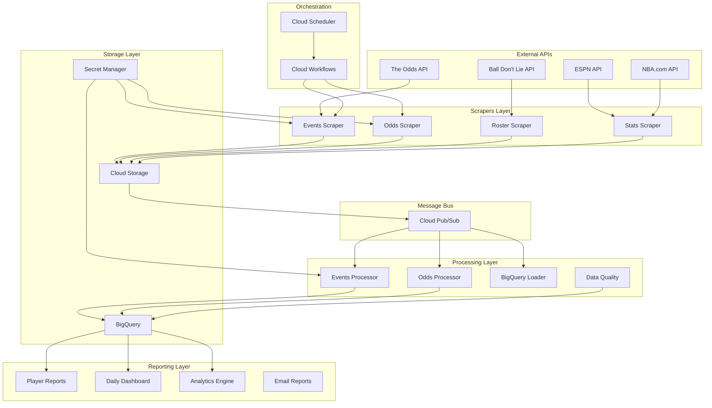

# NBA Platform Service Architecture

## Overview

The NBA analytics platform is built as a **microservices architecture** with three main services that work together through **event-driven communication** using Cloud Pub/Sub and shared storage.

## High-Level Architecture



## Service Responsibilities

### 🕷️ **Scrapers Service**
**Purpose**: Collect raw data from external APIs and websites

**Core Functions**:
- **Events Collection**: NBA games, schedules, results
- **Odds Collection**: Player prop odds, betting lines
- **Roster Management**: Team rosters, player info
- **Stats Scraping**: Box scores, player statistics

**Technologies**:
- **Flask** for HTTP endpoints
- **Requests/AsyncIO** for API calls
- **Playwright** for browser automation
- **Cloud Storage** for raw data storage

**Entry Points**:
```bash
# Historical events (out of season)
docker run nba-scrapers events-hist --serve

# Current odds (in season)  
docker run nba-scrapers odds-current --serve

# Team rosters
docker run nba-scrapers rosters --serve

# Ball Don't Lie stats
docker run nba-scrapers bdl-games --serve
```

### ⚙️ **Processors Service**
**Purpose**: Transform raw data into analytics-ready datasets

**Core Functions**:
- **Data Validation**: Schema validation, data quality checks
- **ETL Pipelines**: Clean, normalize, and enrich data
- **Feature Engineering**: Calculate advanced metrics
- **BigQuery Loading**: Structured data storage

**Technologies**:
- **Pandas/NumPy** for data manipulation
- **Pydantic** for data validation
- **Apache Beam** for large-scale processing
- **BigQuery** for data warehousing

**Entry Points**:
```bash
# Process scraped events
docker run nba-processors events --serve

# Process odds data
docker run nba-processors odds --serve

# Data quality checks
docker run nba-processors data-quality --serve

# ETL pipeline
docker run nba-processors etl-pipeline --batch
```

### 📊 **Report Generator Service**
**Purpose**: Generate analytics reports and visualizations

**Core Functions**:
- **Player Reports**: Individual player analysis
- **Daily Summaries**: Game recaps and predictions
- **Prop Analysis**: Betting odds analysis
- **Dashboard Generation**: Web-based analytics

**Technologies**:
- **Jinja2** for templating
- **Plotly/Matplotlib** for visualizations
- **WeasyPrint** for PDF generation
- **SendGrid** for email delivery

**Entry Points**:
```bash
# Generate player reports
docker run nba-reportgen player-reports --serve

# Daily summary reports
docker run nba-reportgen daily-summary --serve

# Prop betting analysis
docker run nba-reportgen prop-analysis --serve

# Email report delivery
docker run nba-reportgen email-reports --serve
```

## Data Flow Architecture

### 📊 **End-to-End Data Pipeline**

#### 1. **Data Ingestion** (Scrapers → Cloud Storage)
```python
# Scraper saves raw data
{
    "timestamp": "2025-01-15T08:00:00Z",
    "scraper": "odds_api_events",
    "run_id": "abc123",
    "data": {...},  # Raw API response
    "metadata": {
        "api_calls": 3,
        "records_count": 12,
        "execution_time": 2.3
    }
}

# Stored in: gs://nba-data-raw/events/2025/01/15/abc123.json
```

#### 2. **Event Publishing** (Storage → Pub/Sub)
```python
# Pub/Sub message triggered by Cloud Function
{
    "message": {
        "data": base64.encode({
            "event_type": "data_scraped",
            "service": "scrapers",
            "scraper": "odds_api_events", 
            "run_id": "abc123",
            "gcs_path": "gs://nba-data-raw/events/2025/01/15/abc123.json",
            "record_count": 12,
            "timestamp": "2025-01-15T08:00:00Z"
        }),
        "attributes": {
            "event_type": "data_scraped",
            "service": "scrapers"
        }
    }
}
```

#### 3. **Data Processing** (Processors)
```python
# Processor reads from Pub/Sub and processes data
def process_events_data(message):
    # Download raw data from GCS
    raw_data = download_from_gcs(message.gcs_path)
    
    # Validate and transform
    validated_events = validate_events_schema(raw_data)
    enriched_events = enrich_with_team_data(validated_events)
    
    # Load to BigQuery
    load_to_bigquery(enriched_events, 'nba_analytics.events')
    
    # Publish completion event
    publish_message('data_processed', {
        'table': 'events',
        'records': len(enriched_events),
        'run_id': message.run_id
    })
```

#### 4. **Report Generation** (Report Generators)
```python
# Triggered by processed data events
def generate_player_reports(message):
    # Query processed data from BigQuery
    player_stats = query_bigquery('''
        SELECT * FROM nba_analytics.player_stats 
        WHERE date = @date
    ''', date=message.date)
    
    # Generate reports
    for player in players_with_props_today():
        report = generate_player_report(player, player_stats)
        save_report(report, f'gs://nba-reports/{player.id}.pdf')
        
    # Send email summaries
    send_daily_email_summary(date=message.date)
```

## Communication Patterns

### 🔄 **Event-Driven Architecture**

#### Primary Communication: Pub/Sub
```python
# Topic structure
nba-data-events          # Raw data scraped
nba-processing-events    # Data processing requests  
nba-report-events        # Report generation requests
nba-error-events         # Error handling and alerts
```

#### Message Schema
```python
# Standard message format
{
    "event_type": "data_scraped|data_processed|report_generated|error",
    "service": "scrapers|processors|reportgen",
    "component": "odds_api_events|events_processor|player_reports",
    "run_id": "unique_correlation_id",
    "timestamp": "2025-01-15T08:00:00Z",
    "data": {...},  # Event-specific payload
    "metadata": {
        "version": "1.0",
        "retry_count": 0,
        "priority": "normal|high"
    }
}
```

### 🔄 **Synchronous Communication: HTTP**

#### Health Checks
```bash
# All services expose health endpoints
GET /health
{
    "status": "healthy",
    "service": "scrapers",
    "component": "odds_api_events",
    "version": "1.2.3",
    "timestamp": "2025-01-15T08:00:00Z"
}
```

#### Admin Operations
```bash
# Direct service control (authenticated)
POST /admin/trigger-scrape
POST /admin/reprocess-data  
POST /admin/regenerate-reports
```

## Shared Resources

### 🗄️ **Data Storage**

#### Cloud Storage Buckets
```
nba-data-raw/              # Raw scraped data
├── events/2025/01/15/     # Events by date
├── odds/2025/01/15/       # Odds by date  
├── rosters/2025/01/15/    # Rosters by date
└── stats/2025/01/15/      # Stats by date

nba-data-processed/        # Processed/validated data
├── events/                # Clean events data
├── player_stats/          # Aggregated player stats
└── predictions/           # ML model outputs

nba-reports/               # Generated reports
├── daily/2025/01/15/      # Daily reports
├── players/               # Player-specific reports
└── analysis/              # Ad-hoc analysis
```

#### BigQuery Datasets
```sql
-- nba_analytics dataset
nba_analytics.events              -- Game events and schedules
nba_analytics.odds                -- Betting odds and lines
nba_analytics.player_stats        -- Player performance data
nba_analytics.team_stats          -- Team performance data
nba_analytics.predictions         -- Model predictions
nba_analytics.data_quality        -- Quality monitoring

-- nba_raw dataset (staging)
nba_raw.events_staging            -- Raw events before validation
nba_raw.odds_staging              -- Raw odds before validation
```

### 🔐 **Shared Configuration**

#### Environment Variables
```bash
# Common across all services
PROJECT_ID=nba-analytics-prod
ENVIRONMENT=production
REGION=us-central1
LOG_LEVEL=INFO

# Storage configuration
RAW_DATA_BUCKET=nba-data-raw
PROCESSED_DATA_BUCKET=nba-data-processed
REPORTS_BUCKET=nba-reports

# BigQuery configuration  
BQ_DATASET=nba_analytics
BQ_RAW_DATASET=nba_raw

# Pub/Sub configuration
PUBSUB_DATA_TOPIC=nba-data-events
PUBSUB_PROCESSING_TOPIC=nba-processing-events
PUBSUB_REPORTS_TOPIC=nba-report-events
```

#### Shared Utilities
```python
# shared/utils/ - Common utilities across services
├── bigquery_client.py     # BigQuery operations
├── storage_client.py      # Cloud Storage operations  
├── pubsub_client.py       # Pub/Sub operations
├── logging_utils.py       # Structured logging
├── metrics_utils.py       # Custom metrics
└── auth_utils.py          # Authentication helpers
```

## Service Dependencies

### 🔗 **Dependency Graph**
```
Cloud Scheduler → Cloud Workflows → Scrapers
                                       ↓
Cloud Storage ← Raw Data ← Scrapers → Pub/Sub
                                       ↓
BigQuery ← Processed Data ← Processors ← Pub/Sub
                                       ↓
Reports Storage ← Reports ← Report Gen ← Pub/Sub
```

### 🚨 **Failure Handling**

#### Circuit Breaker Pattern
```python
# scrapers/utils/circuit_breaker.py
class APICircuitBreaker:
    def __init__(self, failure_threshold=5, timeout=60):
        self.failure_count = 0
        self.failure_threshold = failure_threshold
        self.timeout = timeout
        self.last_failure_time = None
        self.state = 'CLOSED'  # CLOSED, OPEN, HALF_OPEN

    def call_api(self, api_function, *args, **kwargs):
        if self.state == 'OPEN':
            if time.time() - self.last_failure_time > self.timeout:
                self.state = 'HALF_OPEN'
            else:
                raise CircuitBreakerOpenException()
        
        try:
            result = api_function(*args, **kwargs)
            self.reset()
            return result
        except Exception as e:
            self.record_failure()
            raise e
```

#### Retry Strategies
```python
# Different retry strategies per service type
SCRAPER_RETRY_CONFIG = {
    'max_retries': 3,
    'backoff_factor': 2,
    'retry_statuses': [429, 500, 502, 503, 504]
}

PROCESSOR_RETRY_CONFIG = {
    'max_retries': 5,
    'backoff_factor': 1.5,
    'retry_on_exceptions': [BigQueryError, StorageError]
}

REPORTGEN_RETRY_CONFIG = {
    'max_retries': 2,
    'backoff_factor': 1,
    'retry_on_exceptions': [TemplateError, EmailError]
}
```

## Performance Considerations

### ⚡ **Scaling Patterns**

#### Scrapers (I/O Bound)
- **Horizontal scaling** based on request volume
- **Connection pooling** for API calls
- **Rate limiting** to respect API quotas
- **Async operations** for concurrent scraping

#### Processors (CPU Bound)
- **Vertical scaling** for compute-intensive tasks
- **Batch processing** for efficiency
- **Queue-based scaling** based on Pub/Sub metrics
- **Parallel processing** with multiprocessing

#### Report Generators (Mixed)
- **On-demand scaling** for report requests
- **Template caching** for faster generation
- **Background processing** for large reports
- **CDN distribution** for static assets

### 📊 **Monitoring and Metrics**

#### Custom Metrics
```python
# Service-level metrics
- scraper_api_calls_total
- scraper_success_rate
- processor_records_processed_total
- processor_processing_time_seconds
- reportgen_reports_generated_total
- reportgen_generation_time_seconds

# Business metrics
- daily_games_scraped
- prop_bets_analyzed
- player_reports_generated
- prediction_accuracy_rate
```

#### Health Checks
```python
# Multi-level health checks
/health                    # Basic service health
/health/deep              # Including dependencies
/health/ready             # Readiness for traffic
/metrics                  # Prometheus metrics
```

## Security Architecture

### 🔐 **Authentication & Authorization**

#### Service-to-Service Auth
```python
# IAM service accounts with minimal permissions
nba-scraper-sa@project.iam       # Storage write, Secret read
nba-processor-sa@project.iam     # Storage read/write, BigQuery write
nba-reportgen-sa@project.iam     # BigQuery read, Storage write
```

#### API Security
```python
# API key management via Secret Manager
- odds-api-key              # The Odds API
- ball-dont-lie-api-key     # Ball Don't Lie API  
- sendgrid-api-key          # Email delivery
- slack-webhook-url         # Alerts and notifications
```

### 🛡️ **Network Security**
- **VPC-native** Cloud Run services
- **Private** service-to-service communication
- **Firewall rules** for external API access only
- **Identity-aware proxy** for admin interfaces

---

**Next Steps:**
1. Review [Docker Strategy](docker-strategy.md)
2. Set up [Development Workflow](development-workflow.md)
3. Deploy using [Cloud Run Guide](cloud-run-deployment.md)

