# NBA Data Flow: Backfill vs Daily Operations

```mermaid
graph TB
    subgraph "🔄 BACKFILL OPERATIONS (Historical Data)"
        A[NBA Gamebook PDFs<br/>📄 Box Scores<br/>2021-2024] --> B[Extract Actual Results]
        B --> C[Historical Box Score Data<br/>📊 What Actually Happened]
        C --> D[Player Performance<br/>• Points scored<br/>• Full statistics<br/>• Game context]
        C --> E[Player Status<br/>• Active players<br/>• DNP reasons<br/>• Injury details]
    end

    subgraph "🔮 DAILY OPERATIONS (Forecasting)"
        F[Current Injury Reports<br/>🏥 Who's hurt today] --> I[Forecast Engine]
        G[Daily Rosters<br/>👥 Who's available today] --> I
        H[Historical Patterns<br/>📈 Performance trends] --> I
        I --> J[Forecasted Box Score<br/>🎯 What Will Happen]
        J --> K[Predicted Performance<br/>• Expected points<br/>• Prop bet values<br/>• Usage projections]
        J --> L[Predicted Status<br/>• Who will play<br/>• DNP probability<br/>• Load management]
    end

    subgraph "🎲 PROP BETTING ANALYSIS"
        D --> M[Historical Analysis<br/>📊 Player trends<br/>Team patterns<br/>Matchup history]
        E --> M
        K --> N[Prop Bet Strategy<br/>🎯 Over/Under lines<br/>Value identification<br/>Risk assessment]
        L --> N
        M --> O[Betting Decisions<br/>💰 Position sizing<br/>Line shopping<br/>Bankroll management]
        N --> O
    end

    classDef historical fill:#e1f5fe,stroke:#0277bd,stroke-width:2px
    classDef forecasting fill:#f3e5f5,stroke:#7b1fa2,stroke-width:2px
    classDef analysis fill:#e8f5e8,stroke:#2e7d32,stroke-width:2px
    classDef boxscore fill:#fff3e0,stroke:#ef6c00,stroke-width:3px

    class A,B,C,D,E historical
    class F,G,H,I,J,K,L forecasting
    class M,N,O analysis
    class C,J boxscore
```

## Key Concepts

### 📊 **Box Score = Central Data Structure**

| Direction | Purpose | Box Score Role |
|-----------|---------|----------------|
| **Backfill** | Historical analysis | **Extract from** actual box scores |
| **Daily Ops** | Future predictions | **Forecast future** box scores |

### 🔄 **Backfill Workflow**
1. **NBA Gamebook PDFs** → Extract what actually happened
2. **No roster/injury scraping needed** → Box score contains all status info
3. **Rich historical dataset** → 4 years of complete player data

### 🔮 **Daily Operations Workflow** 
1. **Current injury reports** → Who's hurt right now?
2. **Daily rosters** → Who's available today?
3. **Forecast engine** → Predict the upcoming box score
4. **Expected outcomes** → Player performance + availability

### 🎯 **The Genius of This Approach**
- **Single data model** (box score) for both historical and predictive analysis
- **Comprehensive historical context** from actual game results
- **Real-time forecasting** using current player status
- **Perfect for prop betting** - historical trends + current conditions

---

## Data Sources Summary

### Historical (Backfill)
- ✅ **NBA Gamebook PDFs** - Complete game data
- ✅ **All player statuses** - Active, DNP, inactive with reasons
- ✅ **Complete statistics** - 16+ stats per player

### Predictive (Daily)
- 🔮 **Injury reports** - Current player health status
- 🔮 **Daily rosters** - Available players for upcoming games
- 🔮 **Historical patterns** - Trend analysis from backfill data

### Output (Both)
- 📊 **Box score format** - Standardized player performance data
- 🎯 **Prop betting ready** - Points, rebounds, assists, etc.
- 📈 **Analysis ready** - Historical trends + future predictions
