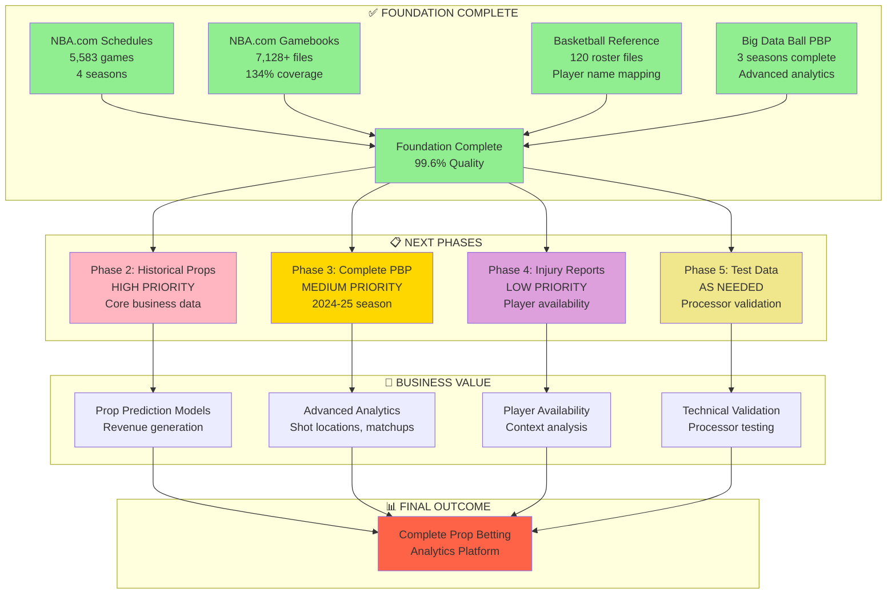
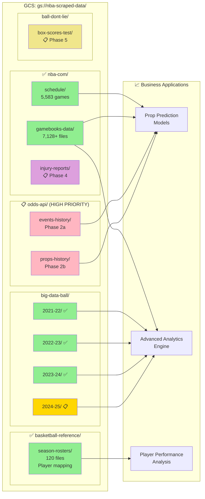
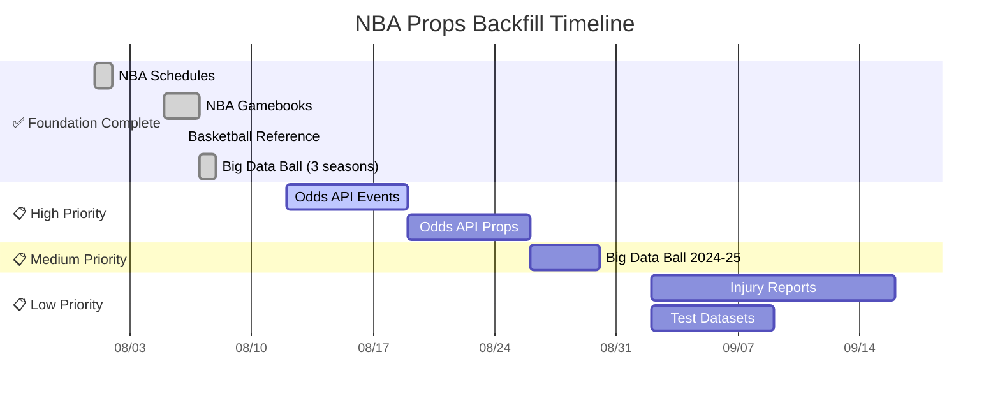
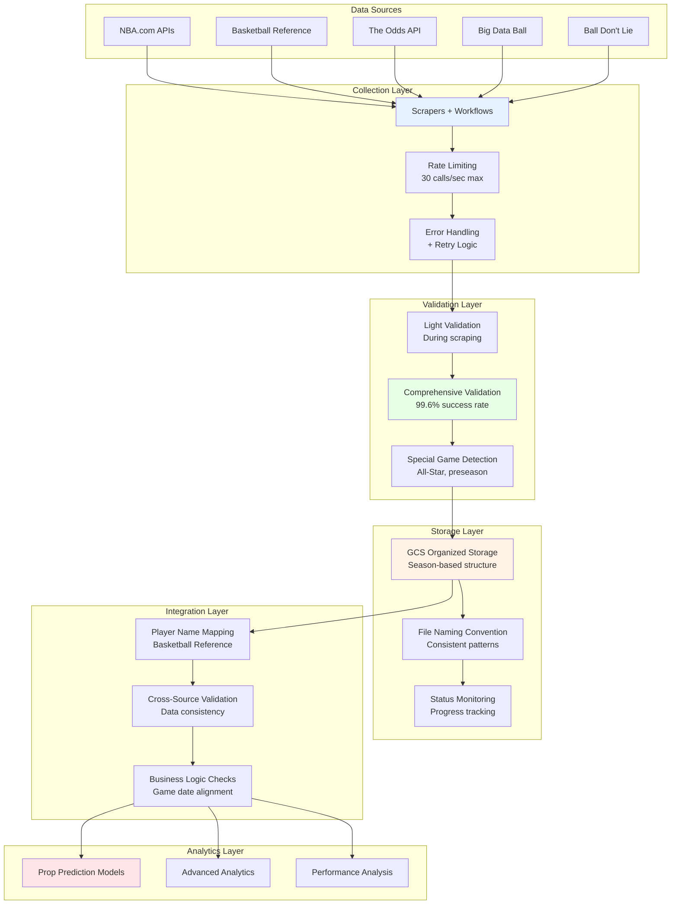
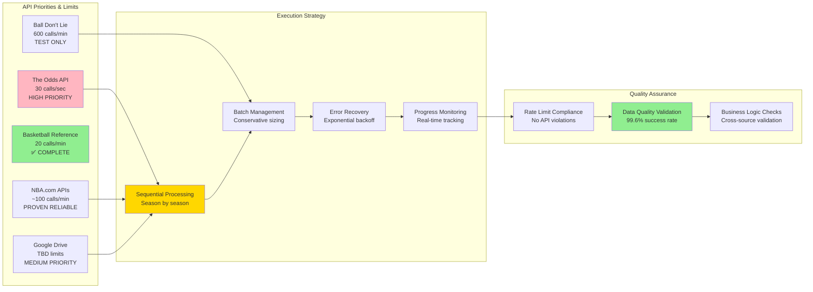
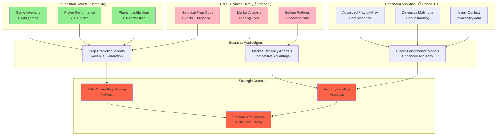

# NBA Props Platform - Backfill Visual Architecture Guide

**Date:** August 9, 2025  
**Purpose:** Visual overview of NBA data backfill status, architecture, and roadmap

---

## 1. 📊 Current Status & Roadmap

---

## 2. 🏗️ Data Architecture & GCS Structure

---

## 3. ⏱️ Phase Timeline & Dependencies

---

## 4. 🔄 Technical Dependencies & Data Flow

---

## 5. 📡 API Rate Limiting Strategy

---

## 6. 💼 Business Value Progression

---

## 🎯 Key Takeaways

### **Current Position**
- ✅ **Foundation Complete:** 99.6% data quality across 12,831+ files
- ✅ **Proven Patterns:** Workflow architecture validated at scale  
- ✅ **Technical Excellence:** Comprehensive validation and monitoring systems

### **Next Phase Focus**
- 📈 **Core Business Priority:** Historical prop betting data (The Odds API)
- ⚡ **High API Capacity:** 30 calls/second enables efficient collection
- 🔄 **Proven Implementation:** Apply successful schedule collection patterns

### **Strategic Value**
- 💰 **Revenue Foundation:** Historical props + performance = prediction models
- 🎯 **Competitive Advantage:** Industry-leading data quality and depth
- 📈 **Scalable Platform:** Architecture ready for multi-sport expansion

**Bottom Line:** Foundation complete, core business data next, 4-6 weeks to complete analytics-ready platform.