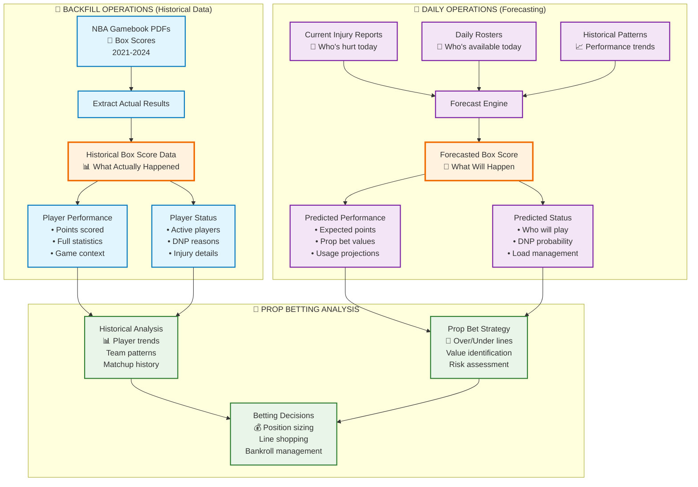

# NBA Data Flow: Backfill vs Daily Operations

## Key Concepts

### 📊 **Box Score = Central Data Structure**

| Direction | Purpose | Box Score Role |
|-----------|---------|----------------|
| **Backfill** | Historical analysis | **Extract from** actual box scores |
| **Daily Ops** | Future predictions | **Forecast future** box scores |

### 🔄 **Backfill Workflow**
1. **NBA Gamebook PDFs** → Extract what actually happened
2. **No roster/injury scraping needed** → Box score contains all status info
3. **Rich historical dataset** → 4 years of complete player data

### 🔮 **Daily Operations Workflow** 
1. **Current injury reports** → Who's hurt right now?
2. **Daily rosters** → Who's available today?
3. **Forecast engine** → Predict the upcoming box score
4. **Expected outcomes** → Player performance + availability

### 🎯 **The Genius of This Approach**
- **Single data model** (box score) for both historical and predictive analysis
- **Comprehensive historical context** from actual game results
- **Real-time forecasting** using current player status
- **Perfect for prop betting** - historical trends + current conditions

---

## Data Sources Summary

### Historical (Backfill)
- ✅ **NBA Gamebook PDFs** - Complete game data
- ✅ **All player statuses** - Active, DNP, inactive with reasons
- ✅ **Complete statistics** - 16+ stats per player

### Predictive (Daily)
- 🔮 **Injury reports** - Current player health status
- 🔮 **Daily rosters** - Available players for upcoming games
- 🔮 **Historical patterns** - Trend analysis from backfill data

### Output (Both)
- 📊 **Box score format** - Standardized player performance data
- 🎯 **Prop betting ready** - Points, rebounds, assists, etc.
- 📈 **Analysis ready** - Historical trends + future predictions
