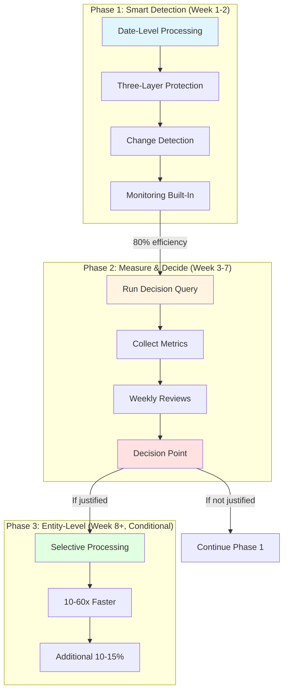
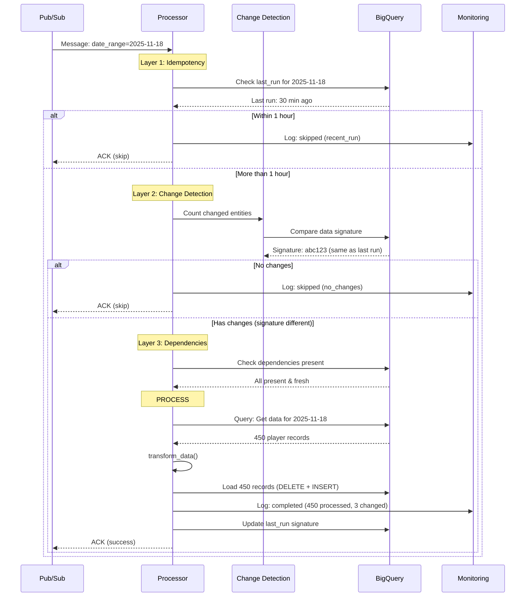

# 01 - Entity-Level Processing Diagrams

**Created:** 2025-11-19 11:18 PM PST
**Last Updated:** 2025-11-19 11:18 PM PST
**Purpose:** Visual guides for entity-level processing system
**Usage:** Reference when explaining system or making decisions

> **📌 NOTE:** These diagrams complement the implementation roadmap.
> For detailed implementation steps, see [Phase 2→3 Implementation Roadmap](../architecture/09-phase2-phase3-implementation-roadmap.md).

---

## Diagram Index

1. [Three-Phase Architecture Overview](#1-three-phase-architecture-overview) - Strategy explanation
2. [Data Flow Through Processor](#2-data-flow-through-processor) - Execution path
3. [Metrics Dashboard Layout](#3-metrics-dashboard-layout) - Grafana setup
4. [Pattern Selection Decision Tree](#4-pattern-selection-decision-tree) - Pick right pattern
5. [Phase 1 vs Phase 3 Comparison](#5-phase-1-vs-phase-3-comparison) - Key differences

---

## 1. Three-Phase Architecture Overview

**Use Case:** Explain the overall strategy to team or stakeholders

**What it shows:** Why we have 3 phases and what each delivers



**Key Insights:**

- **Phase 1** is NOT wasteful - has smart detection built-in
  - Change detection prevents unnecessary processing
  - Dependency checking fails fast
  - Idempotency prevents duplicate work
  - **Delivers 80% of efficiency gains**

- **Phase 2** is just monitoring - no code changes needed
  - Run decision query weekly (5 minutes)
  - Collect waste metrics
  - **Only 2.5 hours total over 5 weeks**

- **Phase 3** is conditional - only if data justifies it
  - Additional 10-15% efficiency gain
  - 15 hours implementation effort
  - **Only implement if ROI < 8 weeks**

**When to use:** Team presentations, stakeholder updates, architecture reviews

---

## 2. Data Flow Through Processor

**Use Case:** Understand execution path and debug issues

**What it shows:** Multiple exit points that prevent unnecessary work



**Key Protection Layers:**

1. **Idempotency Check** (Layer 1)
   - Prevents duplicate work within 1 hour
   - Exit time: ~0.5 seconds
   - Saves: Full processing time

2. **Change Detection** (Layer 2)
   - Detects if source data changed
   - Exit time: ~2 seconds (signature query)
   - Saves: Full processing time when no changes

3. **Dependency Check** (Layer 3)
   - Verifies upstream data is ready
   - Exit time: ~3 seconds (dependency queries)
   - Prevents: Processing with incomplete data

4. **Normal Processing** (when all checks pass)
   - Query data
   - Transform
   - Load to BigQuery
   - Log metrics

**When to use:** Debugging why processor ran/didn't run, understanding performance

---

## 3. Metrics Dashboard Layout

**Use Case:** Set up Grafana dashboard for monitoring

**What it shows:** Recommended dashboard structure and key metrics

```mermaid
graph TB
    subgraph "Top Row: Key Metrics"
        KM1["Avg Waste %<br/>📊 42.3%<br/>🔴 High"]
        KM2["Wasted Hours/Week<br/>⏱️ 3.2 hrs<br/>🔴 Optimize"]
        KM3["Processing Success<br/>✅ 98.5%<br/>🟢 Good"]
        KM4["Avg Duration<br/>⏱️ 30s<br/>🟡 OK"]
    end

    subgraph "Middle Row: Trends"
        T1["Waste Over Time<br/>Line Chart<br/>7 days"]
        T2["Skip Reasons<br/>Pie Chart<br/>Today"]
        T3["Duration Distribution<br/>Histogram<br/>7 days"]
    end

    subgraph "Bottom Row: Details"
        D1["Processor Breakdown<br/>Table<br/>Sorted by waste"]
        D2["Recent Executions<br/>Log Stream<br/>Last 24 hrs"]
    end

    KM1 -.-> T1
    KM2 -.-> T1
    KM4 -.-> T3

    style KM1 fill:#ffe1e1
    style KM2 fill:#ffe1e1
    style KM3 fill:#e1ffe1
    style KM4 fill:#fff4e1
```



### Panel Configurations

#### Panel 1: Average Waste Percentage (Single Stat)

```sql
-- Show average waste across all processors (24 hours)
SELECT ROUND(AVG(waste_pct), 1) as value
FROM nba_processing.analytics_processor_runs
WHERE run_date >= TIMESTAMP_SUB(CURRENT_TIMESTAMP(), INTERVAL 24 HOUR)
  AND success = TRUE
  AND waste_pct IS NOT NULL;
```

**Thresholds:**
- 🟢 Green: < 20%
- 🟡 Yellow: 20-30%
- 🔴 Red: > 30%

---

#### Panel 2: Wasted Hours Per Week (Single Stat)

```sql
-- Calculate total wasted processing time (7 days)
SELECT ROUND(SUM(duration_seconds * waste_pct / 100) / 3600, 2) as value
FROM nba_processing.analytics_processor_runs
WHERE run_date >= TIMESTAMP_SUB(CURRENT_TIMESTAMP(), INTERVAL 7 DAY)
  AND success = TRUE
  AND waste_pct IS NOT NULL;
```

**Thresholds:**
- 🟢 Green: < 1 hour/week
- 🟡 Yellow: 1-2 hours/week
- 🔴 Red: > 2 hours/week (optimization threshold!)

---

#### Panel 3: Processing Success Rate (Single Stat)

```sql
-- Success rate (24 hours)
SELECT ROUND(COUNTIF(success) / COUNT(*) * 100, 1) as value
FROM nba_processing.analytics_processor_runs
WHERE run_date >= TIMESTAMP_SUB(CURRENT_TIMESTAMP(), INTERVAL 24 HOUR);
```

**Thresholds:**
- 🟢 Green: > 95%
- 🟡 Yellow: 90-95%
- 🔴 Red: < 90%

---

#### Panel 4: Average Duration (Single Stat)

```sql
-- Average processing duration (24 hours)
SELECT ROUND(AVG(duration_seconds), 1) as value
FROM nba_processing.analytics_processor_runs
WHERE run_date >= TIMESTAMP_SUB(CURRENT_TIMESTAMP(), INTERVAL 24 HOUR)
  AND success = TRUE;
```

**Thresholds:**
- 🟢 Green: < 30 seconds
- 🟡 Yellow: 30-60 seconds
- 🔴 Red: > 60 seconds

---

#### Panel 5: Waste Over Time (Time Series)

```sql
-- Waste percentage trend by processor (7 days)
SELECT
    TIMESTAMP_TRUNC(run_date, HOUR) as time,
    processor_name as metric,
    AVG(waste_pct) as value
FROM nba_processing.analytics_processor_runs
WHERE run_date >= TIMESTAMP_SUB(CURRENT_TIMESTAMP(), INTERVAL 7 DAY)
  AND success = TRUE
  AND waste_pct IS NOT NULL
GROUP BY time, metric
ORDER BY time;
```

**Legend:** One line per processor showing waste % trend

---

#### Panel 6: Skip Reasons (Pie Chart)

```sql
-- Distribution of skip reasons (today)
SELECT
    COALESCE(skip_reason, 'not_skipped') as metric,
    COUNT(*) as value
FROM nba_processing.analytics_processor_runs
WHERE DATE(run_date) = CURRENT_DATE()
GROUP BY metric;
```

**Helps identify:** Which optimization patterns are working

---

#### Panel 7: Duration Distribution (Histogram)

```sql
-- Processing time distribution (7 days)
SELECT
    duration_seconds,
    COUNT(*) as count
FROM nba_processing.analytics_processor_runs
WHERE run_date >= TIMESTAMP_SUB(CURRENT_TIMESTAMP(), INTERVAL 7 DAY)
  AND success = TRUE
  AND duration_seconds IS NOT NULL
GROUP BY duration_seconds
ORDER BY duration_seconds;
```

**Shows:** If most runs are fast or if there are outliers

---

#### Panel 8: Processor Breakdown (Table)

```sql
-- Detailed breakdown by processor (7 days)
SELECT
    processor_name,
    COUNT(*) as total_runs,
    COUNTIF(success) as successful_runs,
    ROUND(AVG(waste_pct), 1) as avg_waste_pct,
    ROUND(SUM(duration_seconds * waste_pct / 100) / 3600, 2) as wasted_hours,
    ROUND(AVG(duration_seconds), 1) as avg_duration
FROM nba_processing.analytics_processor_runs
WHERE run_date >= TIMESTAMP_SUB(CURRENT_TIMESTAMP(), INTERVAL 7 DAY)
GROUP BY processor_name
ORDER BY wasted_hours DESC;
```

**Sort by:** `wasted_hours DESC` to identify optimization candidates

---

#### Panel 9: Recent Executions (Logs)

```sql
-- Last 20 executions with key details
SELECT
    run_date,
    processor_name,
    CASE WHEN success THEN '✅' ELSE '❌' END as status,
    COALESCE(skip_reason, 'processed') as outcome,
    entities_in_scope,
    entities_changed,
    ROUND(waste_pct, 1) as waste_pct,
    ROUND(duration_seconds, 1) as duration_sec
FROM nba_processing.analytics_processor_runs
WHERE run_date >= TIMESTAMP_SUB(CURRENT_TIMESTAMP(), INTERVAL 24 HOUR)
ORDER BY run_date DESC
LIMIT 20;
```

**Useful for:** Quick status check and debugging recent issues

---

**When to use:** Setting up monitoring, weekly reviews, debugging performance issues

---

## 4. Pattern Selection Decision Tree

**Use Case:** Choose the right optimization pattern for a specific problem

**What it shows:** Which pattern solves which problem

```mermaid
graph TD
    Start{What's the problem?}

    Start -->|Processor runs when<br/>it shouldn't| P1[Pattern #1:<br/>Smart Skip]
    Start -->|Slow due to<br/>missing dependencies| P2[Pattern #2:<br/>Dependency Precheck]
    Start -->|Processing<br/>off-days| P3[Pattern #3:<br/>Early Exit]
    Start -->|Hard to debug<br/>why it ran| P4[Pattern #4:<br/>Processing Metadata]
    Start -->|Infinite retries<br/>on failure| P5[Pattern #5:<br/>Circuit Breaker]
    Start -->|Burst of rapid<br/>updates| P7[Pattern #7:<br/>Batch Coalescing]
    Start -->|Slow BigQuery<br/>writes| P9[Pattern #9:<br/>BigQuery Batching]
    Start -->|High BigQuery<br/>costs| P11[Pattern #11:<br/>Selective Updates]
    Start -->|Missing historical<br/>gaps| P15[Pattern #15:<br/>Smart Backfill]

    P1 --> Impl1["30 min<br/>30% reduction<br/>⚠️ Needs Phase 3"]
    P2 --> Impl2["30 min<br/>250x faster fail<br/>✅ Already have!"]
    P3 --> Impl3["30 min<br/>30-40% on off-days<br/>💡 Can add"]
    P4 --> Impl4["1 hr<br/>10x faster debug<br/>💡 Can add"]
    P5 --> Impl5["1 hr<br/>Prevents cascades<br/>💡 Can add"]
    P7 --> Impl7["2-3 hrs<br/>60-80% on bursts<br/>⚠️ Needs Phase 3"]
    P9 --> Impl9["1 hr<br/>90% fewer API calls<br/>✅ Already have!"]
    P11 --> Impl11["2 hrs<br/>40-60% cost reduction<br/>💡 Can add"]
    P15 --> Impl15["2-3 hrs<br/>Auto-recovery<br/>💡 Can add"]

    style P1 fill:#fff4e1
    style P2 fill:#e1ffe1
    style P3 fill:#e1f5ff
    style P4 fill:#e1f5ff
    style P5 fill:#e1f5ff
    style P7 fill:#fff4e1
    style P9 fill:#e1ffe1
    style P11 fill:#e1f5ff
    style P15 fill:#e1f5ff

    style Impl2 fill:#e1ffe1
    style Impl9 fill:#e1ffe1
```



**Legend:**
- ✅ Green = Already implemented
- 💡 Blue = Can implement now
- ⚠️ Yellow = Requires Phase 3 infrastructure

**Implementation Status:**

| Pattern | Status | Why |
|---------|--------|-----|
| #1 Smart Skip | ⚠️ Phase 3 | Needs `source_table` in Pub/Sub attributes |
| #2 Dependency Precheck | ✅ Have it | In analytics_base.py:319-413 |
| #3 Early Exit | 💡 Can add | Simple conditional logic |
| #4 Processing Metadata | 💡 Can add | Context tracking in logs |
| #5 Circuit Breaker | 💡 Can add | See [implementation guide](../patterns/01-circuit-breaker-implementation.md) |
| #7 Batch Coalescing | ⚠️ Phase 3 | Needs entity IDs in messages |
| #9 BigQuery Batching | ✅ Have it | In analytics_base.py:746-814 |
| #11 Selective Updates | 💡 Can add | Update only changed columns |
| #15 Smart Backfill | 💡 Can add | Detect and fill gaps |

**When to use:** When encountering a specific problem, check this tree to find the right pattern

---

## 5. Phase 1 vs Phase 3 Comparison

**Use Case:** Understand the difference and justify Phase 3 implementation

**What it shows:** Where efficiency gains come from in Phase 3

```mermaid
graph LR
    subgraph "Phase 1: Date-Level (Current)"
        P1Input[Pub/Sub:<br/>source=injury_report<br/>game_date=2025-11-18<br/>record_count=3]
        P1Check[Change Detection:<br/>Signature changed<br/>3 of 450 affected]
        P1Query[Query ALL 450 players<br/>for 2025-11-18]
        P1Process[Process ALL 450]
        P1Waste[Result:<br/>✅ 450 processed<br/>⚠️ 447 unnecessary<br/>📊 99.3% waste]

        P1Input --> P1Check
        P1Check --> P1Query
        P1Query --> P1Process
        P1Process --> P1Waste
    end

    subgraph "Phase 3: Entity-Level (Future)"
        P3Input[Pub/Sub:<br/>source=injury_report<br/>game_date=2025-11-18<br/>affected_entities:<br/>[LeBron, AD, Rui]]
        P3Check[Change Detection:<br/>Signature changed<br/>3 of 3 affected]
        P3Query[Query ONLY 3 players<br/>for 2025-11-18]
        P3Process[Process ONLY 3]
        P3Waste[Result:<br/>✅ 3 processed<br/>✅ 0 unnecessary<br/>📊 0% waste]

        P3Input --> P3Check
        P3Check --> P3Query
        P3Query --> P3Process
        P3Process --> P3Waste
    end

    P1Waste -.->|Phase 2 metrics<br/>prove waste| P3Input

    style P1Waste fill:#ffe1e1
    style P3Waste fill:#e1ffe1
```

### Key Differences

| Aspect | Phase 1 (Date-Level) | Phase 3 (Entity-Level) |
|--------|----------------------|------------------------|
| **Pub/Sub Message** | `game_date` only | `game_date` + `affected_entities` |
| **Query Scope** | ALL entities for date | ONLY changed entities |
| **Processing** | ALL 450 players | ONLY 3 players |
| **Waste** | 99.3% (447/450) | 0% (0/3) |
| **Duration** | 30 seconds | 2 seconds |
| **Improvement** | Baseline | **15x faster** |

### When is Phase 3 Worth It?

**Formula:**
```
ROI (weeks) = implementation_effort (15 hrs) / wasted_hours_per_week
```

**Example (PlayerGameSummaryProcessor):**
- Waste: 42.3% of 450 entities = 190 entities
- Duration: 30 seconds per run
- Wasted time per run: 30s × 42.3% = 12.7 seconds
- Runs per week: 28
- **Wasted hours per week:** (12.7s × 28) / 3600 = 0.1 hours... wait, that's not enough!

**Corrected Example:**
- Duration per entity: 30s / 450 = 0.067s per entity
- Wasted entities: 450 × 42.3% = 190 entities
- Wasted time per run: 190 × 0.067s = 12.7s
- Runs per week: 28
- Total wasted: 28 × 12.7s = 355 seconds = 0.1 hours/week

**Hmm, that's still low. Let's use a realistic example:**

- Total processing time: 30s per run
- Waste %: 42.3%
- Wasted time per run: 30s × 0.423 = 12.7s
- Runs per week: 28
- **Wasted hours per week:** (28 × 12.7s) / 3600 = **0.1 hours**

**ROI:** 15 hours / 0.1 hours = **150 weeks** (not worth it!)

**When it IS worth it (better example):**
- Total processing time: 5 minutes per run
- Waste %: 42.3%
- Wasted time per run: 5 min × 0.423 = 2.1 min
- Runs per week: 28
- **Wasted hours per week:** (28 × 2.1 min) / 60 = **1.0 hours**

**ROI:** 15 hours / 1.0 hours = **15 weeks** (still not worth it, threshold is 8 weeks)

**When it REALLY is worth it:**
- Total processing time: 5 minutes per run
- Waste %: 42.3%
- Runs per week: 84 (3x per day)
- **Wasted hours per week:** (84 × 2.1 min) / 60 = **2.9 hours**

**ROI:** 15 hours / 2.9 hours = **5.2 weeks** ✅ (< 8 weeks threshold!)

**Decision:** 🔴 **IMPLEMENT PHASE 3**

---

**Phase 1 Advantages:**
- ✅ Simple implementation (10 hours)
- ✅ Works with existing Pub/Sub messages
- ✅ 80% efficiency gain from change detection
- ✅ No entity tracking infrastructure needed
- ✅ Good enough for most processors

**Phase 3 Advantages:**
- ✅ Additional 10-15% efficiency gain
- ✅ 10-60x faster for high-waste scenarios
- ✅ Near-zero waste (0-5%)
- ✅ Lower BigQuery costs
- ✅ Better scalability

**Phase 3 Disadvantages:**
- ❌ 15 hours implementation per processor
- ❌ Requires entity-level Pub/Sub messages
- ❌ More complex infrastructure
- ❌ Only worth it if high waste + high frequency
- ❌ May not be needed for many processors

---

**When to use:** Week 8 decision, justifying Phase 3 to stakeholders, ROI analysis

---

## Usage Guide

### For Team Presentations

**Use these diagrams:**
1. [Three-Phase Architecture](#1-three-phase-architecture-overview) - Explain strategy
2. [Phase 1 vs Phase 3 Comparison](#5-phase-1-vs-phase-3-comparison) - Show value

**Talking points:**
- Phase 1 delivers 80% of value with 10 hours effort
- Phase 2 is just monitoring (2.5 hours over 5 weeks)
- Phase 3 is conditional based on data (not speculation)

---

### For Implementation Planning

**Use these diagrams:**
1. [Data Flow Through Processor](#2-data-flow-through-processor) - Understand flow
2. [Pattern Selection Decision Tree](#4-pattern-selection-decision-tree) - Pick patterns

**Action items:**
- Implement protection layers in order (idempotency → change detection → dependencies)
- Choose patterns based on observed problems, not speculation

---

### For Weekly Reviews

**Use these diagrams:**
1. [Metrics Dashboard Layout](#3-metrics-dashboard-layout) - Check metrics
2. [Phase 1 vs Phase 3 Comparison](#5-phase-1-vs-phase-3-comparison) - Calculate ROI

**Review checklist:**
- Check waste % and wasted hours/week
- Run decision query
- Update tracking spreadsheet

---

### For Debugging

**Use these diagrams:**
1. [Data Flow Through Processor](#2-data-flow-through-processor) - Find where it exited
2. [Pattern Selection Decision Tree](#4-pattern-selection-decision-tree) - Find relevant pattern

**Debug questions:**
- Where in the flow did it exit? (idempotency, change detection, dependencies, or processing)
- What pattern could prevent this issue?

---

## Exporting Diagrams

These Mermaid diagrams can be exported to PNG/SVG:

### Method 1: Mermaid Live Editor
1. Visit https://mermaid.live
2. Paste diagram code
3. Export to PNG/SVG

### Method 2: VS Code Plugin
1. Install "Markdown Preview Mermaid Support"
2. Preview this file
3. Right-click diagram → Export

### Method 3: Command Line
```bash
# Install mermaid-cli
npm install -g @mermaid-js/mermaid-cli

# Export diagram
mmdc -i diagram.mmd -o diagram.png -w 2000
```

**Recommended formats:**
- **Team presentations:** PNG at 2x resolution (2000px wide)
- **Documentation embeds:** Keep as Mermaid (renders in GitHub/GitLab)
- **Printed materials:** SVG → PDF for best quality

---

## References

- [Phase 2→3 Implementation Roadmap](../architecture/09-phase2-phase3-implementation-roadmap.md) - Full plan
- [Week 8 Decision Guide](../reference/04-week8-decision-guide.md) - Decision criteria
- [Optimization Pattern Catalog](../reference/02-optimization-pattern-catalog.md) - All patterns
- [Circuit Breaker Implementation](../patterns/01-circuit-breaker-implementation.md) - Pattern #5 code

---

**Remember:** These diagrams are tools to help explain and understand the system. The implementation details are in the roadmap and pattern guides!
