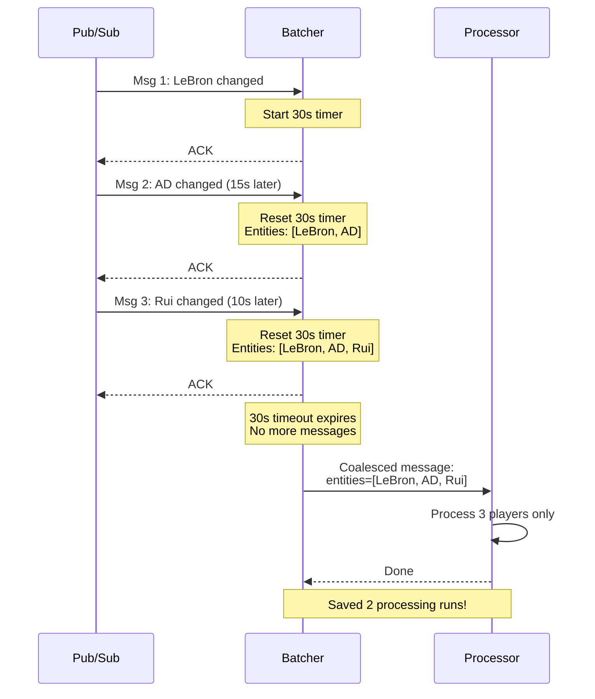
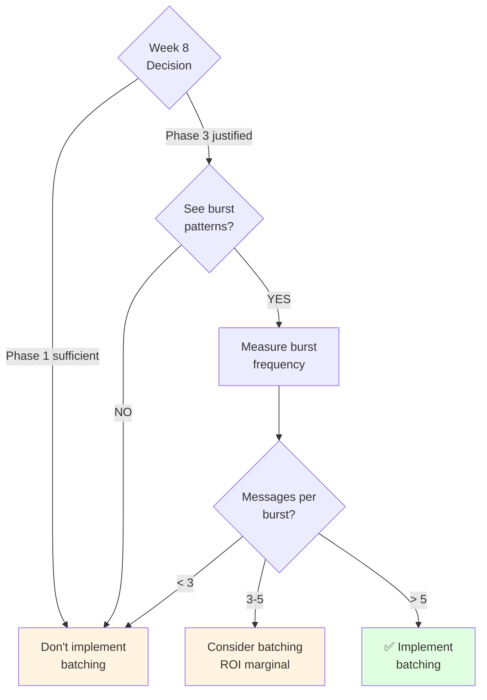

# 04 - Batch Coalescing Pattern (Phase 3 Reference)

**Created:** 2025-11-19 11:29 PM PST
**Last Updated:** 2025-11-19 11:29 PM PST
**Pattern:** Batch Coalescing
**Effort:** 2-3 hours
**Impact:** High (60-80% reduction during burst periods)
**Reference:** [Optimization Pattern Catalog](../reference/02-optimization-pattern-catalog.md), Pattern #7

> **⚠️ STATUS: Phase 3 Only - Cannot Implement Yet**
>
> **Why:** Requires `affected_entities` (player_ids, team_ids, game_ids) in Pub/Sub messages
>
> **Current limitation:** Our Pub/Sub only sends table-level events (source_table, game_date, record_count)
>
> **When to implement:** After Week 8 decision IF Phase 3 is justified
>
> **Purpose of this doc:** Reference material for future implementation

---

## Quick Summary

**What it does:**
Buffers rapid-fire updates (5 spread changes in 30 seconds) and processes them once with deduplicated entity list.

**Value when implemented:**
- 60-80% reduction during burst periods
- Fewer database queries
- Better resource utilization

**What's needed first:**
1. ✅ Week 8 decision shows Phase 3 is justified (ROI < 8 weeks)
2. ❌ Enhance Pub/Sub to include `affected_entities` in messages
3. ❌ Processors updated to handle entity filtering

---

## The Problem (When Phase 3 Arrives)

### Scenario: Injury Report Burst

**10:00:00 AM** - LeBron status: OUT
**10:00:15 AM** - AD status: QUESTIONABLE
**10:00:25 AM** - LeBron status: OUT → GTD
**10:00:35 AM** - Rui status: OUT
**10:00:50 AM** - LeBron status: GTD → PROBABLE

**Without Batching (5 separate runs):**
```
Run 1: Process all 450 players (LeBron changed)
Run 2: Process all 450 players (AD changed)
Run 3: Process all 450 players (LeBron changed again)
Run 4: Process all 450 players (Rui changed)
Run 5: Process all 450 players (LeBron changed again)

Total: 5 runs × 30 seconds = 2.5 minutes
Total: 2,250 player records processed
Actual changes: 3 players
Waste: 2,247 / 2,250 = 99.9%
```

**With Batching (1 coalesced run):**
```
Buffer for 30 seconds
Deduplicate entities: [LeBron, AD, Rui]
Run 1: Process 3 players only

Total: 1 run × 2 seconds = 2 seconds
Total: 3 player records processed
Actual changes: 3 players
Waste: 0%

Improvement: 98.7% faster (2s vs 2.5min)
```

---

## How It Works



**Key insight:** Wait for bursts to settle, then process all changes in one batch.

---

## Current Infrastructure Gap

### What We Have (Phase 2)

```python
# shared/utils/pubsub_publishers.py (current)
message_data = {
    'source_table': 'nbac_injury_report',
    'game_date': '2025-11-18',
    'record_count': 3,
    # ❌ No entity IDs!
}
```

### What We Need (Phase 3)

```python
# Enhanced Pub/Sub message (future)
message_data = {
    'source_table': 'nbac_injury_report',
    'game_date': '2025-11-18',
    'record_count': 3,
    # ✅ Entity IDs added!
    'affected_entities': {
        'players': ['lebron_james', 'anthony_davis', 'rui_hachimura'],
        'teams': ['LAL'],
        'games': ['game_123']
    }
}
```

---

## Implementation Preview (For Future)

### Step 1: Enhanced Pub/Sub Publisher

```python
# shared/utils/pubsub_publishers.py (future enhancement)

def publish_phase2_complete(
    source_table: str,
    game_date: str,
    record_count: int,
    affected_entities: Dict = None  # ← NEW
):
    """Publish Phase 2 completion with entity tracking."""

    message_data = {
        'source_table': source_table,
        'game_date': game_date,
        'record_count': record_count,
    }

    # Add entity tracking if Phase 3 enabled
    if affected_entities:
        message_data['affected_entities'] = affected_entities

    # Publish...
```

### Step 2: Message Batcher

```python
# shared/processors/patterns/message_batcher.py (future)

class MessageBatcher:
    """Buffer rapid-fire messages and batch by entity."""

    def __init__(self, window_seconds: int = 30):
        self.window_seconds = window_seconds
        self.buffers = defaultdict(lambda: {
            'entities': {'players': set(), 'teams': set(), 'games': set()},
            'timer': None
        })

    def add_message(self, message: Dict) -> bool:
        """Buffer message or process immediately."""
        affected = message.get('affected_entities')

        if not affected:
            # No entities - process immediately
            return False

        # Add to buffer
        buffer_key = f"{message['processor']}:{message['game_date']}"
        buffer = self.buffers[buffer_key]

        # Deduplicate entities
        for entity_type, entities in affected.items():
            buffer['entities'][entity_type].update(entities)

        # Reset timer (extends window)
        if buffer['timer']:
            buffer['timer'].cancel()

        buffer['timer'] = threading.Timer(
            self.window_seconds,
            self._flush_buffer,
            args=[buffer_key]
        )
        buffer['timer'].start()

        return True  # Buffered
```

### Step 3: Processor Enhancement

```python
# Processors need to handle entity filtering (future)

class PlayerGameSummaryProcessor(AnalyticsProcessorBase):

    def _build_data_query(self, start_date: str, end_date: str) -> str:
        """Build query with optional entity filtering."""

        query = f"""
        SELECT * FROM nba_raw.nbac_gamebook_player_stats
        WHERE game_date BETWEEN '{start_date}' AND '{end_date}'
        """

        # ✅ NEW: Filter to specific players if provided
        if 'player_ids' in self.opts and self.opts['player_ids']:
            player_list = "','".join(self.opts['player_ids'])
            query += f" AND player_id IN ('{player_list}')"

        return query
```

---

## When to Implement

Use this decision tree:



**Criteria:**
- ✅ Week 8 decision shows Phase 3 justified
- ✅ Observed burst patterns (5+ messages in 60 seconds)
- ✅ Bursts happen frequently (daily)
- ✅ ROI calculation shows value

**Don't implement if:**
- ❌ Phase 1 is sufficient (< 30% waste)
- ❌ No burst patterns observed
- ❌ Updates are spread out (> 2 min apart)

---

## Monitoring (When Implemented)

### Query: Batching Effectiveness

```sql
-- See how many messages were coalesced (future)
SELECT
    processor_name,
    game_date,
    JSON_EXTRACT_SCALAR(metadata, '$.coalesced_from') as messages_coalesced,
    entities_processed,
    -- Calculate runs avoided
    CAST(JSON_EXTRACT_SCALAR(metadata, '$.coalesced_from') AS INT64) - 1 as runs_avoided
FROM nba_processing.analytics_processor_runs
WHERE processing_mode = 'entity_level'
  AND JSON_EXTRACT_SCALAR(metadata, '$.change_type') = 'coalesced_batch'
  AND DATE(run_date) >= CURRENT_DATE() - 7
ORDER BY runs_avoided DESC;
```

### Query: Burst Period Detection

```sql
-- Identify when bursts happen (to configure window)
WITH message_timeline AS (
    SELECT
        processor_name,
        game_date,
        run_date,
        LAG(run_date) OVER (
            PARTITION BY processor_name, game_date
            ORDER BY run_date
        ) as prev_run_date
    FROM nba_processing.analytics_processor_runs
    WHERE DATE(run_date) >= CURRENT_DATE() - 7
)
SELECT
    processor_name,
    game_date,
    COUNT(*) as messages_in_burst,
    MIN(run_date) as burst_start,
    MAX(run_date) as burst_end,
    TIMESTAMP_DIFF(MAX(run_date), MIN(run_date), SECOND) as burst_duration_sec
FROM message_timeline
WHERE TIMESTAMP_DIFF(run_date, prev_run_date, SECOND) < 120  -- Within 2 min
GROUP BY processor_name, game_date, DATE(run_date)
HAVING COUNT(*) >= 3  -- At least 3 messages = burst
ORDER BY messages_in_burst DESC;
```

---

## Configuration Guide (Future)

### Choosing Batch Window

**Analyze message gaps first:**

| P75 Gap | Recommended Window | Rationale |
|---------|-------------------|-----------|
| < 10s | 30 seconds | Very rapid updates |
| 10-30s | 60 seconds | Moderate updates |
| > 30s | 90 seconds | Slower updates |

**Too short:** Many small batches (1-2 messages) - not effective
**Too long:** Delays processing unnecessarily

**Start with 30 seconds**, monitor, and adjust.

---

## Estimated Impact (When Implemented)

### Scenario: Injury Report Burst Day

**Typical day (no bursts):**
- 10 injury updates throughout day
- Spread 1-2 hours apart
- No batching benefit

**Burst day (trade deadline, game time decisions):**
- 25 injury updates in 10 minutes
- 5 bursts of 5 messages each
- Batching saves 20 processing runs (80%)

### ROI Calculation

**Without batching:**
- 25 runs × 30 seconds = 12.5 minutes

**With batching:**
- 5 runs × 2 seconds = 10 seconds

**Savings:** 12.4 minutes per burst day

**Implementation effort:** 2-3 hours

**Break-even:** ~10 burst days (typically 2-3 per month during season)

**Annual value:** 50-75 burst days × 12 minutes = 10-15 hours saved/year

---

## Prerequisites Checklist

Before implementing batching, ensure:

- [ ] Week 8 decision shows Phase 3 is justified
- [ ] Pub/Sub enhanced to include `affected_entities`
- [ ] Processors support entity filtering (`player_ids`, `team_ids`, `game_ids` opts)
- [ ] Change detection working (Week 1 implementation)
- [ ] Observed burst patterns in production (3+ messages in 60s)
- [ ] Calculated ROI shows value (> 5 burst days per month)

---

## Alternative: Pub/Sub Message Deduplication

Google Pub/Sub has built-in deduplication but it's NOT the same:

**Pub/Sub Deduplication:**
- ✅ Prevents exact duplicate messages
- ❌ Doesn't coalese different messages
- ❌ Doesn't deduplicate entities

**Our Batching:**
- ✅ Coalesces multiple different messages
- ✅ Deduplicates entities across messages
- ✅ Custom batching window

**Use both:** Pub/Sub deduplication prevents duplicates, our batching coalesces bursts.

---

## Integration with Other Patterns

### Pattern #1: Smart Skip
Batching reduces messages → fewer opportunities for smart skip to help. Complementary.

### Pattern #3: Early Exit
Early exit happens BEFORE batching consideration. Still valuable.

### Pattern #8: Processing Priority
Can combine batching with priority - process critical batches first.

---

## Summary

**Current Status:** ⚠️ Cannot implement yet (requires Phase 3 infrastructure)

**Value when ready:** 60-80% reduction during burst periods

**Prerequisites:**
1. Week 8 decision justifies Phase 3
2. Enhanced Pub/Sub with entity tracking
3. Processors support entity filtering

**When to implement:**
- After Week 8 IF Phase 3 justified
- IF burst patterns observed (5+ messages in 60s)
- IF bursts are frequent (2+ per month)

**Implementation effort:** 2-3 hours

**This document:** Reference for future implementation

---

## References

- [Optimization Pattern Catalog](../reference/02-optimization-pattern-catalog.md) - Pattern #7
- [Week 8 Decision Guide](../reference/04-week8-decision-guide.md) - When to do Phase 3
- [Phase 2→3 Roadmap](../architecture/09-phase2-phase3-implementation-roadmap.md) - Overall plan

---

**Remember:** This is for AFTER Week 8 decision. Don't implement prematurely!
