# 05 - Processing Priority Pattern (Phase 3 Reference)

**Created:** 2025-11-19 11:35 PM PST
**Last Updated:** 2025-11-19 11:35 PM PST
**Pattern:** Processing Priority Hints
**Effort:** 1-2 hours
**Impact:** High (critical for sports betting)
**Reference:** [Optimization Pattern Catalog](../reference/02-optimization-pattern-catalog.md), Pattern #8

> **⚠️ STATUS: Phase 3 Only - Limited Value Until Entity-Level Processing**
>
> **Why:** Priority routing most valuable with entity-level processing
>
> **Current limitation:** Table-level processing means all entities processed regardless of priority
>
> **When to implement:** After Week 8 decision IF Phase 3 is justified
>
> **Purpose of this doc:** Reference material for time-aware processing

---

## Quick Summary

**What it does:**
Assigns priorities to processing based on time-to-game and change type. LeBron ruled OUT 1 hour before game → CRITICAL priority, immediate processing.

**Value when implemented (Phase 3):**
- Critical updates: Process in 2 seconds (3 players)
- Low priority: Defer to off-peak hours
- Better resource utilization

**Current value (Phase 1):**
- Can calculate priority ✅
- Limited routing impact ⚠️ (still process all 450 players)

**What's needed first:**
1. ✅ Week 8 decision shows Phase 3 is justified
2. ❌ Entity-level processing (process specific players, not all)
3. ❌ Priority queue infrastructure (optional)

---

## The Problem (Sports Betting Context)

### Scenario: Game Day Injury Cascade

**6:00 PM** - Lakers @ Celtics at 7:30 PM (1.5 hours until tipoff)

**6:05 PM** - LeBron James: OUT → PROBABLE (injury status change)
```
Priority: CRITICAL (1.5hrs before game, injury)
User Impact: Betting lines shift immediately
Current Processing: 30 seconds (all 450 players)
With Priority + Entities: 2 seconds (LeBron only) ⚡
```

**6:10 PM** - Tomorrow's spread changes (24 hours out)
```
Priority: LOW (24hrs before game, odds)
User Impact: Minor, can wait
Current Processing: 30 seconds (all data)
With Priority: Deferred to off-peak, batched 🎯
```

**6:15 PM** - LeBron: PROBABLE → OUT (status worsens!)
```
Priority: CRITICAL (1.25hrs before game, injury)
User Impact: URGENT - affects all prop bets
Current Processing: 30 seconds (still slow!)
With Priority + Entities: 2 seconds (critical path) ⚡
```

**The issue:** All updates treated equally. Critical LeBron update queues behind tomorrow's low-priority spread changes.

---

## How It Works

### Priority Levels


| Priority | Trigger | Time to Game | Routing |
|----------|---------|--------------|---------|
| **CRITICAL** | Any update | < 1 hour | Process immediately, skip optimizations |
| **CRITICAL** | Injury | < 2 hours | Process immediately |
| **CRITICAL** | Lineup | < 2 hours | Process immediately |
| **HIGH** | Injury | < 6 hours | Standard processing, no batching |
| **HIGH** | Odds change | < 4 hours | Standard processing |
| **NORMAL** | Any | 6-24 hours | Standard, can batch |
| **LOW** | Any | > 24 hours | Defer to off-peak if possible |
| **BACKFILL** | Historical | N/A | Lowest priority, idle time only |

---

## Priority Calculation (Works Now)

This part works even in Phase 1:

### Implementation

```python
from enum import IntEnum
from datetime import datetime
from typing import Dict, Optional

class ProcessingPriority(IntEnum):
    """Priority levels (lower = higher priority)."""
    CRITICAL = 1    # < 1-2hrs before game
    HIGH = 2        # < 4-6hrs
    NORMAL = 3      # 6-24hrs
    LOW = 4         # > 24hrs
    BACKFILL = 5    # Historical

class PriorityCalculator:
    """Calculate priority based on context."""

    def get_priority(self, opts: Dict) -> ProcessingPriority:
        """Calculate priority from options."""
        game_date = opts['game_date']
        source_table = opts.get('source_table', '')
        is_backfill = opts.get('is_backfill', False)

        if is_backfill:
            return ProcessingPriority.BACKFILL

        # Calculate time to game
        hours_until = self._get_hours_until_game(game_date)

        if hours_until is None:
            return ProcessingPriority.LOW  # No games

        # Detect change type
        is_injury = 'injury' in source_table.lower()
        is_odds = 'odds' in source_table.lower() or 'spread' in source_table.lower()
        is_lineup = 'lineup' in source_table.lower()

        # CRITICAL: Injury < 2hrs or any update < 1hr
        if (is_injury and hours_until <= 2) or hours_until <= 1:
            return ProcessingPriority.CRITICAL

        # CRITICAL: Lineup changes < 2hrs
        if is_lineup and hours_until <= 2:
            return ProcessingPriority.CRITICAL

        # HIGH: Injury < 6hrs or odds < 4hrs
        if (is_injury and hours_until <= 6) or (is_odds and hours_until <= 4):
            return ProcessingPriority.HIGH

        # LOW: > 24hrs
        if hours_until > 24:
            return ProcessingPriority.LOW

        # NORMAL: Everything else
        return ProcessingPriority.NORMAL

    def _get_hours_until_game(self, game_date: str) -> Optional[float]:
        """Calculate hours until first game on this date."""
        query = f"""
        SELECT MIN(game_time) as first_game_time
        FROM `{self.project_id}.nba_raw.game_schedule`
        WHERE game_date = '{game_date}'
        """

        try:
            result = list(self.bq_client.query(query).result())
            if not result or result[0].first_game_time is None:
                return None

            first_game_time = result[0].first_game_time
            now = datetime.utcnow()
            hours_until = (first_game_time - now).total_seconds() / 3600

            return hours_until
        except Exception as e:
            logger.error(f"Error calculating hours until game: {e}")
            return None
```

**This works now** - can log priority even without entity-level processing.

---

## Routing by Priority (Phase 3 Value)

### Current Limitation (Phase 1)

```python
# Phase 1: Priority calculated but limited impact
def _process_critical(self, opts: Dict) -> bool:
    """CRITICAL priority."""
    logger.warning(f"🔴 CRITICAL processing")

    # Can reduce idempotency window
    self.IDEMPOTENCY_WINDOW = timedelta(minutes=5)  # Instead of 1 hour

    # Still process ALL 450 players (30 seconds) ⚠️
    return super().run(opts)
```

**Impact:** Slightly faster (skip some checks), but still slow because processing all entities.

### Phase 3 Value

```python
# Phase 3: Priority + Entity filtering = HUGE impact
def _process_critical(self, opts: Dict) -> bool:
    """CRITICAL priority with entity filtering."""
    logger.warning(f"🔴 CRITICAL processing")

    # Skip optimizations for speed
    self.IDEMPOTENCY_WINDOW = timedelta(minutes=5)

    # Process ONLY affected entities (from Pub/Sub message)
    # opts['player_ids'] = ['lebron_james']  # Just 1 player!

    # Process 1 player instead of 450 (2 seconds instead of 30) ⚡
    return super().run(opts)
```

**Impact:** 15x faster for critical updates!

---

## Example Scenarios

### Scenario 1: Pre-Game Injury (CRITICAL)

**Context:**
- Lakers @ Celtics at 7:30 PM
- Current time: 6:00 PM (1.5 hours to tipoff)
- LeBron James: OUT → PROBABLE

**Priority Calculation:**
```python
hours_until = 1.5
is_injury = True
priority = CRITICAL  # injury < 2hrs
```

**Phase 1 Routing:**
```
Process all 450 players
Duration: 30 seconds
Benefit: Reduced idempotency (minor)
```

**Phase 3 Routing:**
```
Process LeBron only
Duration: 2 seconds
Benefit: 93% faster ⚡
```

---

### Scenario 2: Tomorrow's Spread Change (LOW)

**Context:**
- Tomorrow's games at 7:00 PM
- Current time: 6:00 PM today (25 hours out)
- Spread: LAL -5.5 → -6.0

**Priority Calculation:**
```python
hours_until = 25
is_odds = True
priority = LOW  # > 24hrs
```

**Phase 1 Routing:**
```
Process now (30 seconds)
No deferral capability
```

**Phase 3 Routing:**
```
Defer to off-peak (2 AM)
Batch with other low-priority
Duration: 2 seconds (batched)
Benefit: Better resource utilization
```

---

### Scenario 3: Same-Day Morning Update (NORMAL)

**Context:**
- Tonight's games at 7:30 PM
- Current time: 10:00 AM (9.5 hours out)
- Injury report: AD questionable

**Priority Calculation:**
```python
hours_until = 9.5
is_injury = True
priority = NORMAL  # 6-24hrs, not urgent yet
```

**Routing:**
```
Standard processing
All optimizations enabled
Can participate in batching if burst occurs
```

---

## Priority Queue (Advanced - Optional)

For true priority-based processing, need queue infrastructure:

### Queue Table Schema

```sql
CREATE TABLE `nba_orchestration.processing_queue` (
  processor_name STRING NOT NULL,
  game_date DATE NOT NULL,
  priority INT64 NOT NULL,  -- 1=CRITICAL, 5=BACKFILL
  priority_name STRING,
  opts JSON,
  queued_at TIMESTAMP NOT NULL,
  status STRING,  -- 'pending', 'processing', 'completed', 'failed'
  started_at TIMESTAMP,
  completed_at TIMESTAMP
)
PARTITION BY DATE(queued_at)
CLUSTER BY priority, queued_at;
```

### Queue Manager

```python
class PriorityQueueManager:
    """Manage priority-based processing queue."""

    def enqueue(self, processor: str, opts: Dict, priority: ProcessingPriority):
        """Add work to queue."""
        queue_entry = {
            'processor_name': processor,
            'game_date': opts['game_date'],
            'priority': priority.value,
            'priority_name': priority.name,
            'opts': json.dumps(opts),
            'queued_at': datetime.utcnow().isoformat(),
            'status': 'pending'
        }

        self.bq_client.insert_rows_json(self.queue_table, [queue_entry])

    def get_next_work(self) -> Optional[Dict]:
        """Get highest priority work."""
        query = """
        SELECT *
        FROM `nba_orchestration.processing_queue`
        WHERE status = 'pending'
        ORDER BY priority ASC, queued_at ASC
        LIMIT 1
        """

        result = self.bq_client.query(query).to_dataframe()
        return result.iloc[0].to_dict() if not result.empty else None
```

**Note:** Queue infrastructure is optional. Priority routing can work without it.

---

## Monitoring (When Implemented)

### Query: Priority Distribution

```sql
-- See priority distribution over time
SELECT
    JSON_EXTRACT_SCALAR(metadata, '$.processing_priority') as priority,
    COUNT(*) as count,
    ROUND(AVG(duration_seconds), 1) as avg_duration,
    COUNTIF(success = FALSE) as failures
FROM nba_processing.analytics_processor_runs
WHERE DATE(run_date) >= CURRENT_DATE() - 7
  AND JSON_EXTRACT_SCALAR(metadata, '$.processing_priority') IS NOT NULL
GROUP BY priority
ORDER BY
    CASE priority
        WHEN 'CRITICAL' THEN 1
        WHEN 'HIGH' THEN 2
        WHEN 'NORMAL' THEN 3
        WHEN 'LOW' THEN 4
        WHEN 'BACKFILL' THEN 5
    END;
```

**Expected output:**

| Priority | Count | Avg Duration | Failures |
|----------|-------|--------------|----------|
| CRITICAL | 15 | 2.1s | 0 |
| HIGH | 45 | 5.3s | 1 |
| NORMAL | 120 | 25.2s | 3 |
| LOW | 80 | 22.8s | 2 |

---

### Query: Critical Processing Times

```sql
-- Verify critical updates are fast enough
SELECT
    processor_name,
    game_date,
    duration_seconds,
    JSON_EXTRACT_SCALAR(metadata, '$.priority_reason') as reason,
    TIMESTAMP_DIFF(run_date,
        (SELECT MIN(game_time) FROM nba_raw.game_schedule
         WHERE game_schedule.game_date = analytics_processor_runs.date_range_start),
        MINUTE) as minutes_before_game
FROM nba_processing.analytics_processor_runs
WHERE DATE(run_date) >= CURRENT_DATE() - 7
  AND JSON_EXTRACT_SCALAR(metadata, '$.processing_priority') = 'CRITICAL'
ORDER BY run_date DESC;
```

**Target:** CRITICAL updates should complete < 5 seconds when entity-level processing is active.

---

### Query: Priority vs Performance

```sql
-- Compare performance by priority
WITH priority_stats AS (
    SELECT
        JSON_EXTRACT_SCALAR(metadata, '$.processing_priority') as priority,
        duration_seconds,
        entities_processed,
        entities_changed,
        waste_pct
    FROM nba_processing.analytics_processor_runs
    WHERE DATE(run_date) >= CURRENT_DATE() - 7
      AND processing_mode = 'entity_level'  -- Phase 3 only
)
SELECT
    priority,
    COUNT(*) as runs,
    ROUND(AVG(duration_seconds), 1) as avg_duration,
    ROUND(AVG(entities_processed), 0) as avg_entities,
    ROUND(AVG(waste_pct), 1) as avg_waste
FROM priority_stats
GROUP BY priority
ORDER BY
    CASE priority
        WHEN 'CRITICAL' THEN 1
        WHEN 'HIGH' THEN 2
        WHEN 'NORMAL' THEN 3
        WHEN 'LOW' THEN 4
        WHEN 'BACKFILL' THEN 5
    END;
```

**Expected (Phase 3):**
- CRITICAL: 2s avg, 3 entities, 0% waste
- HIGH: 5s avg, 15 entities, 5% waste
- NORMAL: 20s avg, 150 entities, 30% waste

---

## When to Implement

Use this decision tree:

```mermaid
graph TD
    Start{Week 8<br/>Decision} -->|Phase 1 sufficient| Skip[Don't implement<br/>priority routing]
    Start -->|Phase 3 justified| Check1{Entity-level<br/>processing ready?}

    Check1 -->|NO| Skip
    Check1 -->|YES| Check2{Time-sensitive<br/>use case?}

    Check2 -->|NO| Skip
    Check2 -->|YES| Check3{Sports betting<br/>or live updates?}

    Check3 -->|NO| Maybe[Consider priority<br/>ROI marginal]
    Check3 -->|YES| Implement[✅ Implement<br/>priority routing]

    style Skip fill:#fff4e1
    style Maybe fill:#fff4e1
    style Implement fill:#e1ffe1
```



**Criteria:**
- ✅ Week 8 decision shows Phase 3 justified
- ✅ Entity-level processing implemented
- ✅ Time-sensitive use case (sports betting, live data)
- ✅ Critical updates need < 5 second SLA

**Don't implement if:**
- ❌ Phase 1 is sufficient
- ❌ No time-sensitive requirements
- ❌ All updates have similar urgency

---

## Prerequisites Checklist

Before implementing priority routing:

- [ ] Week 8 decision shows Phase 3 is justified
- [ ] Entity-level processing working (process specific players/teams)
- [ ] Time-sensitive use case identified (betting, live updates)
- [ ] `game_schedule` table has `game_time` column
- [ ] Pub/Sub messages include `source_table` attribute
- [ ] Priority calculation tested (use code from this doc)
- [ ] Monitoring queries ready

**Optional but valuable:**
- [ ] Priority queue table created
- [ ] Queue manager implemented
- [ ] Off-peak deferral logic
- [ ] Alerting for critical failures

---

## ROI Calculation

### Current State (Phase 1)

**CRITICAL injury 1hr before game:**
- Priority: CRITICAL
- Processing: All 450 players
- Duration: 30 seconds
- **Limited benefit** from priority

### Phase 3 State

**CRITICAL injury 1hr before game:**
- Priority: CRITICAL
- Processing: 3 affected players only
- Duration: 2 seconds
- **93% faster!** (30s → 2s)

**Implementation effort:** 1-2 hours

**Break-even:** ~10 critical updates

**Typical season:** 50-100 critical updates (injuries, lineup changes near game time)

**Annual value:** 100 critical updates × 28 seconds saved = **47 minutes saved**

**Plus:**
- Better user experience (fresh data faster)
- Competitive advantage (betting context)
- More efficient resource usage

---

## Integration with Other Patterns

### Pattern #7: Batch Coalescing
- **Complementary:** LOW priority can batch, CRITICAL cannot
- **Combined value:** CRITICAL = fast, LOW = efficient

### Pattern #3: Early Exit
- **Independent:** Early exit happens before priority calculation
- **Both useful:** Early exit saves more, priority optimizes what remains

### Pattern #5: Circuit Breaker
- **Coordinated:** CRITICAL updates may bypass circuit breaker
- **Or:** CRITICAL failures trigger immediate alerts

---

## Summary

**Current Status:** ⚠️ Limited value until Phase 3 (entity-level processing)

**Value when ready:**
- CRITICAL updates: 2 seconds (vs 30 seconds)
- Better resource allocation
- Time-aware processing for sports betting

**Prerequisites:**
1. Week 8 decision justifies Phase 3
2. Entity-level processing implemented
3. Time-sensitive use case

**Priority calculation:** ✅ Works now (can log for future)

**Routing value:** ⚠️ Requires Phase 3 for full impact

**When to implement:**
- After Week 8 IF Phase 3 justified
- IF time-sensitive use case exists
- IF critical updates need < 5s SLA

**Implementation effort:** 1-2 hours

**This document:** Reference for time-aware processing

---

## References

- [Optimization Pattern Catalog](../reference/02-optimization-pattern-catalog.md) - Pattern #8
- [Week 8 Decision Guide](../reference/04-week8-decision-guide.md) - When to do Phase 3
- [Batch Coalescing Pattern](04-batch-coalescing-reference.md) - Complementary pattern
- [Phase 2→3 Roadmap](../architecture/09-phase2-phase3-implementation-roadmap.md) - Overall plan

---

**Remember:** Priority routing is most valuable WITH entity-level processing. Don't implement prematurely!
