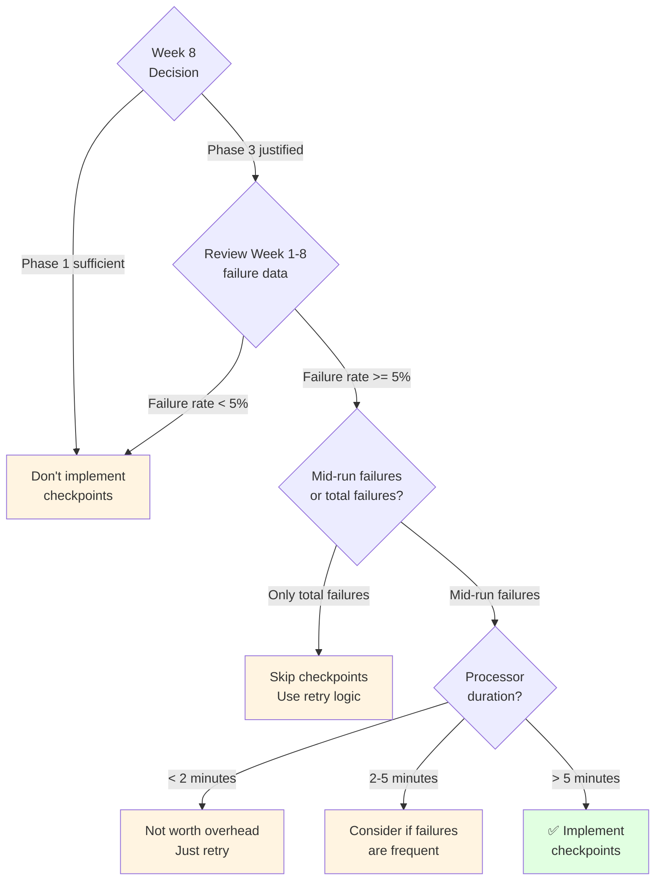

# 06 - Processing Checkpoints Pattern (Phase 3 Reference)

**Created:** 2025-11-20 12:15 AM PST
**Last Updated:** 2025-11-20 12:15 AM PST
**Pattern:** Processing Checkpoints
**Effort:** 1 hour
**Impact:** High (15-20% savings on retries) - IF failures are frequent
**Reference:** [Optimization Pattern Catalog](../reference/02-optimization-pattern-catalog.md), Pattern #6

> **⚠️ STATUS: Phase 3 Reference - Wait for Data**
>
> **Why wait:**
> 1. Requires entity-level processing (not implemented yet)
> 2. Current processors are fast (~25-30 seconds) - mid-run failures unlikely
> 3. No evidence yet that mid-run failures are common
> 4. Adds significant complexity - needs strong ROI justification
>
> **When to implement:**
> - After Week 8 IF Phase 3 justified
> - IF Week 1-8 monitoring shows frequent mid-run failures
> - For long-running processors (> 5 minutes)
> - For ML model training (future Phase 5)
>
> **Purpose of this doc:** Reference material for future implementation

---

## Quick Summary

**What it does:**
Saves progress periodically during processing so failures can resume from last checkpoint instead of starting over.

**Value when implemented:**
- 15-20% savings on retries
- Critical for long-running processors (ML training, backfills)
- Reduces duplicate work after transient failures

**What's needed first:**
1. ✅ Week 8 decision shows Phase 3 is justified
2. ✅ Week 1-8 data shows mid-run failures are common (> 5% failure rate)
3. ❌ Entity-level processing implemented
4. ❌ Evidence of processors taking > 5 minutes

---

## The Problem (When It Exists)

### Scenario: Long-Running Processor Failure

**Without Checkpoints:**
```
Processing 450 players...
✓ Batch 1-50 complete (1 min)
✓ Batch 51-100 complete (1 min)
✓ Batch 101-150 complete (1 min)
✓ Batch 151-200 complete (1 min)
✓ Batch 201-250 complete (1 min)
✓ Batch 251-300 complete (1 min)
✗ Batch 301-350 FAILED (BigQuery quota / network timeout)

Retry after 5 minutes...
✓ Batch 1-50 complete (DUPLICATE WORK - 1 min)
✓ Batch 51-100 complete (DUPLICATE WORK - 1 min)
✓ Batch 101-150 complete (DUPLICATE WORK - 1 min)
✓ Batch 151-200 complete (DUPLICATE WORK - 1 min)
✓ Batch 201-250 complete (DUPLICATE WORK - 1 min)
✓ Batch 251-300 complete (DUPLICATE WORK - 1 min)
✓ Batch 301-350 complete (1 min)
✓ Batch 351-400 complete (1 min)
✓ Batch 401-450 complete (1 min)

Total time: 15 minutes
Wasted time: 6 minutes (40%)
```

**With Checkpoints:**
```
Processing 450 players...
✓ Batch 1-50 complete (1 min) [checkpoint saved]
✓ Batch 51-100 complete (1 min) [checkpoint saved]
✓ Batch 101-150 complete (1 min) [checkpoint saved]
✓ Batch 151-200 complete (1 min) [checkpoint saved]
✓ Batch 201-250 complete (1 min) [checkpoint saved]
✓ Batch 251-300 complete (1 min) [checkpoint saved]
✗ Batch 301-350 FAILED (BigQuery quota)

Retry after 5 minutes...
Found checkpoint: 300/450 complete
Resume from entity #301...
✓ Batch 301-350 complete (1 min)
✓ Batch 351-400 complete (1 min)
✓ Batch 401-450 complete (1 min)

Total time: 9 minutes
Wasted time: 0 minutes (0%)
Savings: 6 minutes (40% faster)
```

---

## Current Architecture Gap

### What We Have (Phase 2)

```python
# data_processors/analytics/analytics_base.py (current)
def run(self, opts: Dict) -> bool:
    """Process entire date range as one unit."""
    start_date = opts['start_date']
    end_date = opts['end_date']

    # Load ALL data for date range
    data = self._build_data_query(start_date, end_date)

    # Transform ALL data
    transformed = self.transform_data(data)

    # Load ALL data (all-or-nothing)
    self.load_to_bigquery(transformed)

    # ❌ If failure happens here, entire run is lost
```

**Characteristics:**
- Date range processing (not entity-level)
- All-or-nothing (no partial completion)
- Fast execution (~25-30 seconds)
- Failures are rare
- **Checkpoints not needed yet!**

### What We Need (Phase 3 + Long Runners)

```python
# Future: Entity-level processing with checkpoints
def run(self, opts: Dict) -> bool:
    """Process entities in batches with checkpoints."""

    # Check for existing checkpoint
    checkpoint = self._get_last_checkpoint(game_date)

    if checkpoint:
        # Resume from last checkpoint
        entities = self._get_entities_after(checkpoint['last_entity_id'])
        progress = checkpoint['entities_completed']
    else:
        # Start fresh
        entities = self._get_all_entities(game_date)
        progress = 0

    # Process in batches
    for batch in chunks(entities, BATCH_SIZE):
        self._process_batch(batch)
        progress += len(batch)

        # ✅ Save checkpoint after each batch
        self._save_checkpoint(batch[-1], progress, total)

    # Clear checkpoint on success
    self._clear_checkpoint()
```

---

## When to Implement

Use this decision tree:



**Criteria for implementation:**
- ✅ Phase 3 entity-level processing exists
- ✅ Week 1-8 data shows >= 5% failure rate
- ✅ Failures happen mid-run (not just at start/end)
- ✅ Processor duration > 5 minutes
- ✅ Retries would waste significant time (> 2 minutes)

**Don't implement if:**
- ❌ Processors are fast (< 2 minutes)
- ❌ Failures are rare (< 5% of runs)
- ❌ Failures happen at start/end only (not mid-run)
- ❌ Simple retry is sufficient

---

## Implementation Preview (For Future)

### Step 1: Schema (One-time)

```sql
-- Create checkpoint tracking table
CREATE TABLE IF NOT EXISTS `nba_processing.processing_checkpoints` (
    processor_name STRING NOT NULL,
    game_date DATE NOT NULL,
    last_entity_id STRING NOT NULL,
    entities_completed INT64 NOT NULL,
    total_entities INT64 NOT NULL,
    checkpoint_at TIMESTAMP NOT NULL,
    checkpoint_key STRING NOT NULL
)
PARTITION BY game_date
CLUSTER BY processor_name, checkpoint_key;
```

### Step 2: Checkpoint Mixin

```python
# shared/processors/patterns/checkpoint_mixin.py (future)

class ProcessingCheckpointsMixin:
    """Add checkpoint support to processors."""

    CHECKPOINT_BATCH_SIZE = 50  # Save every 50 entities
    CHECKPOINT_EXPIRY = timedelta(hours=24)

    def _get_last_checkpoint(self, game_date: str) -> Optional[Dict]:
        """Get last checkpoint for this processor and date."""
        query = f"""
        SELECT
            last_entity_id,
            entities_completed,
            total_entities,
            checkpoint_at
        FROM `{self.project_id}.nba_processing.processing_checkpoints`
        WHERE processor_name = '{self.__class__.__name__}'
          AND game_date = DATE('{game_date}')
          AND checkpoint_at >= TIMESTAMP_SUB(
              CURRENT_TIMESTAMP(),
              INTERVAL {int(self.CHECKPOINT_EXPIRY.total_seconds())} SECOND
          )
        ORDER BY checkpoint_at DESC
        LIMIT 1
        """

        result = self.bq_client.query(query).to_dataframe()

        if result.empty:
            return None

        row = result.iloc[0]
        logger.info(
            f"Found checkpoint: {row['entities_completed']}/{row['total_entities']} "
            f"(last: {row['last_entity_id']})"
        )

        return row.to_dict()

    def _save_checkpoint(
        self,
        game_date: str,
        last_entity_id: str,
        entities_completed: int,
        total_entities: int
    ):
        """Save checkpoint."""
        checkpoint = {
            'processor_name': self.__class__.__name__,
            'game_date': game_date,
            'last_entity_id': last_entity_id,
            'entities_completed': entities_completed,
            'total_entities': total_entities,
            'checkpoint_at': datetime.utcnow().isoformat(),
            'checkpoint_key': f"{self.__class__.__name__}:{game_date}"
        }

        errors = self.bq_client.insert_rows_json(
            f'{self.project_id}.nba_processing.processing_checkpoints',
            [checkpoint]
        )

        if errors:
            logger.error(f"Failed to save checkpoint: {errors}")
        else:
            logger.debug(
                f"Checkpoint saved: {entities_completed}/{total_entities}"
            )

    def _clear_checkpoint(self, game_date: str):
        """Clear checkpoint after successful completion."""
        query = f"""
        DELETE FROM `{self.project_id}.nba_processing.processing_checkpoints`
        WHERE processor_name = '{self.__class__.__name__}'
          AND game_date = DATE('{game_date}')
        """

        self.bq_client.query(query)
        logger.info("Checkpoint cleared (processing completed)")

    def run(self, opts: Dict) -> bool:
        """Enhanced run with checkpoint support."""
        game_date = opts['game_date']

        # Check for existing checkpoint
        checkpoint = self._get_last_checkpoint(game_date)

        if checkpoint:
            # Resume from checkpoint
            entities = self._get_entities_after(
                checkpoint['last_entity_id'],
                game_date
            )
            completed = checkpoint['entities_completed']
            total = checkpoint['total_entities']
        else:
            # Start fresh
            entities = self._get_all_entities(game_date)
            completed = 0
            total = len(entities)

        try:
            # Process in batches
            for batch in self._chunks(entities, self.CHECKPOINT_BATCH_SIZE):
                self._process_batch(batch, game_date)
                completed += len(batch)

                # Save checkpoint
                self._save_checkpoint(
                    game_date,
                    batch[-1],
                    completed,
                    total
                )

                logger.info(f"Progress: {completed}/{total} ({completed/total*100:.1f}%)")

            # Success - clear checkpoint
            self._clear_checkpoint(game_date)
            return True

        except Exception as e:
            logger.error(
                f"Failed at {completed}/{total}. "
                f"Checkpoint saved - can resume."
            )
            raise
```

### Step 3: Use in Processor

```python
# Example: Long-running ML training processor (future)
class MLModelTrainingProcessor(ProcessingCheckpointsMixin, AnalyticsProcessorBase):
    """ML training with checkpoint support."""

    CHECKPOINT_BATCH_SIZE = 100  # Train on 100 games at a time

    def _process_batch(self, game_ids: List[str], game_date: str):
        """Train model on batch of games."""
        # Load data for batch
        data = self._load_batch_data(game_ids)

        # Train model incrementally
        self.model.partial_fit(data)

        # Save model checkpoint
        self.model.save(f'model_checkpoint_{game_date}.pkl')
```

---

## Configuration Guide (Future)

### Choosing Batch Size

| Processor Duration | Recommended Batch Size | Rationale |
|--------------------|------------------------|-----------|
| 2-5 minutes | 25-50 entities | Frequent checkpoints, minimize loss |
| 5-10 minutes | 50-100 entities | Balance overhead vs loss |
| 10-30 minutes | 100-200 entities | Reduce overhead |
| > 30 minutes (ML) | 200-500 entities | Very infrequent checkpoints |

**Trade-offs:**

**Small batches (25-50):**
- ✅ Less work lost on failure
- ✅ More granular progress tracking
- ❌ More checkpoint overhead
- ❌ More BigQuery inserts

**Large batches (100-200):**
- ✅ Less overhead
- ✅ Fewer BigQuery operations
- ❌ More work lost on failure
- ❌ Coarser progress tracking

**Start with 50, adjust based on:**
1. Failure frequency (more failures → smaller batches)
2. Processor duration (longer → larger batches OK)
3. Observed overhead (if overhead > 5% → larger batches)

---

## Monitoring (When Implemented)

### Query: Active Checkpoints

```sql
-- See what's currently checkpointed
SELECT
    processor_name,
    game_date,
    entities_completed,
    total_entities,
    ROUND(entities_completed / total_entities * 100, 1) as pct_complete,
    checkpoint_at,
    TIMESTAMP_DIFF(CURRENT_TIMESTAMP(), checkpoint_at, MINUTE) as minutes_ago
FROM `nba_processing.processing_checkpoints`
WHERE checkpoint_at >= TIMESTAMP_SUB(CURRENT_TIMESTAMP(), INTERVAL 24 HOUR)
ORDER BY checkpoint_at DESC;
```

### Query: Checkpoint Effectiveness

```sql
-- Measure how much work checkpoints save
WITH resumed_runs AS (
    SELECT
        processor_name,
        game_date,
        entities_completed as entities_saved,
        total_entities
    FROM `nba_processing.processing_checkpoints`
    WHERE checkpoint_at >= TIMESTAMP_SUB(CURRENT_TIMESTAMP(), INTERVAL 7 DAY)
),
completions AS (
    SELECT
        processor_name,
        DATE(date_range_start) as game_date,
        run_date
    FROM `nba_processing.analytics_processor_runs`
    WHERE success = TRUE
      AND run_date >= TIMESTAMP_SUB(CURRENT_TIMESTAMP(), INTERVAL 7 DAY)
)
SELECT
    r.processor_name,
    COUNT(*) as checkpoint_resumptions,
    AVG(r.entities_saved) as avg_entities_saved,
    AVG(r.total_entities - r.entities_saved) as avg_entities_remaining,
    ROUND(AVG(r.entities_saved / r.total_entities * 100), 1) as avg_pct_saved
FROM resumed_runs r
JOIN completions c
    ON r.processor_name = c.processor_name
    AND r.game_date = c.game_date
WHERE c.run_date > (
    SELECT checkpoint_at
    FROM `nba_processing.processing_checkpoints` cp
    WHERE cp.processor_name = r.processor_name
      AND cp.game_date = r.game_date
    ORDER BY checkpoint_at DESC
    LIMIT 1
)
GROUP BY r.processor_name
ORDER BY checkpoint_resumptions DESC;
```

### Query: Stale Checkpoints (Cleanup)

```sql
-- Find checkpoints that never completed
SELECT
    processor_name,
    game_date,
    entities_completed,
    total_entities,
    checkpoint_at,
    TIMESTAMP_DIFF(CURRENT_TIMESTAMP(), checkpoint_at, HOUR) as hours_old
FROM `nba_processing.processing_checkpoints`
WHERE checkpoint_at < TIMESTAMP_SUB(CURRENT_TIMESTAMP(), INTERVAL 24 HOUR)
ORDER BY hours_old DESC;

-- Clean them up
DELETE FROM `nba_processing.processing_checkpoints`
WHERE checkpoint_at < TIMESTAMP_SUB(CURRENT_TIMESTAMP(), INTERVAL 24 HOUR);
```

---

## Important Considerations

### 1. Checkpoint Overhead

**Cost per checkpoint:**
- BigQuery streaming insert: ~$0.01 per 200MB
- 1 checkpoint = ~200 bytes
- 1000 checkpoints = $0.0001 (negligible)

**Time overhead:**
- Checkpoint write: ~50-100ms
- For 50-entity batches: ~1-2% overhead
- For 100-entity batches: ~0.5-1% overhead

**Rule of thumb:** If overhead > 5%, increase batch size

### 2. Idempotency Concerns

Checkpoints work best with **APPEND** operations:

✅ **Safe patterns:**
```python
# Append new data
job_config = bigquery.LoadJobConfig(
    write_disposition='WRITE_APPEND'
)
```

⚠️ **Risky patterns:**
```python
# DELETE + INSERT (our current MERGE_UPDATE pattern)
# Checkpoint resume could cause partial deletes!
self.bq_client.query(f"DELETE FROM {table} WHERE game_date = '{date}'")
self.load_data(data)  # If this fails after DELETE...
```

**Solution:** Use transactions or change to MERGE operations:
```python
# MERGE is atomic (all-or-nothing)
merge_query = """
MERGE {table} AS target
USING source AS source
ON target.id = source.id
WHEN MATCHED THEN UPDATE SET ...
WHEN NOT MATCHED THEN INSERT ...
"""
```

### 3. Cloud Run Timeout

Cloud Run has max timeout (60 minutes).

**If processor runs > 60 minutes:**
- Checkpoints become **critical** (not optional)
- Split into multiple Cloud Run invocations
- Each invocation resumes from checkpoint
- Use Cloud Tasks for orchestration

### 4. State Management

Checkpoints track **progress** but not **state**.

**What checkpoints save:**
- ✅ Which entities completed
- ✅ Last entity ID processed

**What checkpoints DON'T save:**
- ❌ In-memory model state
- ❌ Partial calculations
- ❌ Temporary files

**For stateful processors (ML):** Save state separately:
```python
# Save both checkpoint and model state
self._save_checkpoint(...)
self.model.save(f'checkpoint_{batch_id}.pkl')
```

---

## ROI Calculation Example

### Scenario: ML Model Training

**Without checkpoints:**
- Training duration: 30 minutes (450 games)
- Failure rate: 10% (timeout, quota)
- Average failure at: 20 minutes (66% complete)
- Retry wastes: 20 minutes × 10% = 2 minutes per run
- Weekly runs: 50
- **Weekly waste: 100 minutes**

**With checkpoints:**
- Checkpoint overhead: 0.5% (15 seconds)
- Resume from checkpoint (no waste)
- **Weekly waste: 12.5 minutes** (overhead only)

**Savings:**
- 87.5 minutes per week
- 6.25 hours per month
- **ROI: Break-even in first week**

**Implementation effort:** 1 hour

**Decision:** ✅ Strong ROI, implement checkpoints

---

## Alternative: Just Use Retries

For **fast processors** (< 2 minutes), simple retries may be better:

```python
# Cloud Run retry configuration (existing)
# Max attempts: 3
# Exponential backoff: 10s, 20s, 40s

# If processor takes 30 seconds:
# - Failure wastes 30 seconds
# - Retry after 10 seconds
# - Total: 40 seconds

# Adding checkpoints:
# - Saves ~15 seconds (if 50% complete)
# - But adds overhead (5%)
# - Net benefit: ~10 seconds

# Worth it? Probably not for 30-second processor.
```

**Use retries when:**
- Processor duration < 2 minutes
- Failure rate < 5%
- Failures are at start/end (not mid-run)

**Use checkpoints when:**
- Processor duration > 5 minutes
- Failure rate > 5%
- Failures happen mid-run
- Retries waste significant time

---

## Prerequisites Checklist

Before implementing checkpoints, ensure:

- [ ] Week 8 decision shows Phase 3 is justified
- [ ] Week 1-8 monitoring shows >= 5% failure rate
- [ ] Evidence of mid-run failures (not just start/end)
- [ ] Processor duration > 5 minutes (or > 2 min with frequent failures)
- [ ] Entity-level processing implemented
- [ ] Calculated ROI shows value (> 1 hour saved per week)
- [ ] Considered alternatives (simple retry, smaller batches)
- [ ] Idempotency strategy defined (APPEND vs MERGE)

---

## Integration with Other Patterns

### Pattern #3: Early Exit
Early exit prevents unnecessary runs → fewer opportunities for mid-run failure → less need for checkpoints. Implement Early Exit first.

### Pattern #5: Circuit Breaker
Circuit breaker prevents cascading failures → checkpoints help recover when circuit reopens. Complementary.

### Pattern #7: Batch Coalescing
Batching reduces total runs → fewer failures overall → less need for checkpoints. But when checkpoints are needed, they're critical.

---

## Summary

**Current Status:** ⚠️ Cannot implement yet (requires Phase 3 + evidence of need)

**Value when ready:** 15-20% savings on retries, critical for long-running processors

**Prerequisites:**
1. Week 8 decision justifies Phase 3
2. Week 1-8 data shows >= 5% failure rate with mid-run failures
3. Processor duration > 5 minutes
4. Entity-level processing implemented

**When to implement:**
- **Never** for fast processors (< 2 minutes)
- **Maybe** for moderate processors (2-5 minutes) IF failures are frequent
- **Definitely** for long processors (> 5 minutes)
- **Critical** for ML training / backfills (> 30 minutes)

**Implementation effort:** 1 hour

**This document:** Reference for future implementation

---

## References

- [Optimization Pattern Catalog](../reference/02-optimization-pattern-catalog.md) - Pattern #6
- [Week 8 Decision Guide](../reference/04-week8-decision-guide.md) - When to do Phase 3
- [Phase 2→3 Roadmap](../architecture/09-phase2-phase3-implementation-roadmap.md) - Overall plan
- [Circuit Breaker Pattern](01-circuit-breaker-implementation.md) - Complementary pattern

---

**Remember:** This is for AFTER Week 8 decision AND only if data shows it's needed. Don't implement prematurely!
