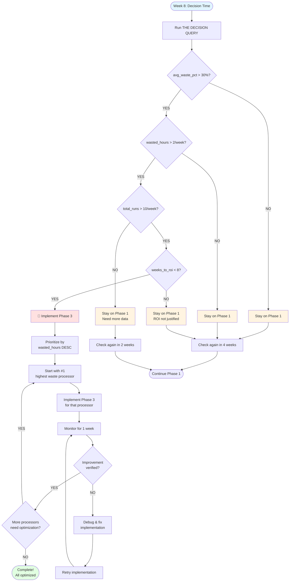

# 04 - Week 8 Decision Guide

**Created:** 2025-11-19 11:15 PM PST
**Last Updated:** 2025-11-19 11:15 PM PST
**Purpose:** Practical guide for Week 8 Phase 3 decision
**Usage:** Reference during weekly metric reviews

> **📌 NOTE:** This is a decision tool for Week 8 of the roadmap.
> For the full implementation plan, see [Phase 2→3 Implementation Roadmap](../architecture/09-phase2-phase3-implementation-roadmap.md).

---

## The Decision Question

After 5 weeks of monitoring (Week 3-7), you'll reach Week 8 with the question:

**"Should we implement Phase 3 entity-level processing for any processors?"**

This guide helps you answer that question with data, not guesswork.

---

## Decision Flowchart



---

## Decision Criteria (ALL must be TRUE)

| Criterion | Threshold | Why This Matters |
|-----------|-----------|------------------|
| **avg_waste_pct** | > 30% | High enough waste to justify optimization |
| **wasted_hours** | > 2/week | Absolute time savings worth the effort |
| **total_runs** | > 10/week | Enough data to be statistically meaningful |
| **weeks_to_roi** | < 8 weeks | Return on investment happens reasonably fast |

**Formula:**
```
weeks_to_roi = implementation_effort (15 hrs) / wasted_hours_per_week
```

---

## Concrete Scenarios

### Scenario 1: 🔴 Clear Optimization Needed

**Processor:** PlayerGameSummaryProcessor

```
Results from THE DECISION QUERY:
├─ avg_waste_pct: 42.3% ✓ (> 30%)
├─ wasted_hours: 3.2/week ✓ (> 2)
├─ total_runs: 28/week ✓ (> 10)
└─ weeks_to_roi: 4.7 ✓ (< 8)

Calculation: 15 hours / 3.2 hrs/week = 4.7 weeks ROI
```

**Decision:** 🔴 **IMPLEMENT PHASE 3 NOW**

**Action:**
1. Start implementation immediately
2. Prioritize this processor #1
3. Expect additional 10-15% efficiency gain
4. Monitor for 1 week to validate

**Expected Results:**
- Duration: 30s → 2s (15x faster)
- Waste: 42% → 8% (34% reduction)
- Entities processed: 450 → 35 (92% fewer)

---

### Scenario 2: 🟡 Monitor Closely

**Processor:** TeamDefenseGameSummaryProcessor

```
Results from THE DECISION QUERY:
├─ avg_waste_pct: 28.1% ✗ (< 30%)
├─ wasted_hours: 1.8/week ✗ (< 2)
├─ total_runs: 24/week ✓ (> 10)
└─ weeks_to_roi: 8.3 ✗ (> 8)

Calculation: 15 hours / 1.8 hrs/week = 8.3 weeks ROI
```

**Decision:** 🟡 **MONITOR CLOSELY**

**Action:**
1. Continue Phase 1 for now
2. Run decision query weekly (not monthly)
3. May hit threshold soon as patterns change

**Why wait:**
- Waste is borderline (28% vs 30% threshold)
- ROI barely misses threshold (8.3 vs 8.0 weeks)
- Might cross threshold in 1-2 weeks

---

### Scenario 3: 🟢 Phase 1 Sufficient

**Processor:** UpcomingPlayerGameContextProcessor

```
Results from THE DECISION QUERY:
├─ avg_waste_pct: 15.2% ✗ (< 30%)
├─ wasted_hours: 0.4/week ✗ (< 2)
├─ total_runs: 18/week ✓ (> 10)
└─ weeks_to_roi: 37.5 ✗ (> 8)

Calculation: 15 hours / 0.4 hrs/week = 37.5 weeks ROI
```

**Decision:** 🟢 **PHASE 1 SUFFICIENT**

**Action:**
1. Continue Phase 1 indefinitely
2. Check monthly (not weekly)
3. No optimization planned

**Why Phase 1 is enough:**
- Low waste (15%) - processor is already efficient
- Low absolute time (0.4 hrs/week) - not worth 15 hours effort
- Would take 9+ months to recoup implementation time

---

### Scenario 4: 🟡 Need More Data

**Processor:** NewProcessor (just deployed 2 weeks ago)

```
Results from THE DECISION QUERY:
├─ avg_waste_pct: 35.2% ✓ (> 30%)
├─ wasted_hours: 2.5/week ✓ (> 2)
├─ total_runs: 8/week ✗ (< 10)
└─ weeks_to_roi: 6.0 ✓ (< 8)

Calculation: 15 hours / 2.5 hrs/week = 6.0 weeks ROI
```

**Decision:** 🟡 **NEED MORE DATA**

**Action:**
1. Wait for 2 more weeks of metrics
2. Re-evaluate at Week 10
3. Meets 3/4 criteria but sample size too small

**Why wait:**
- Only 8 runs/week - not statistically significant yet
- Other metrics look good
- 2 more weeks will give confidence

---

## Decision Matrix

Quick reference table showing all possible combinations:

| Waste % | Hours/Week | Runs/Week | Weeks ROI | Decision | Action |
|---------|------------|-----------|-----------|----------|--------|
| 42% | 3.2 | 28 | 4.7 | 🔴 Implement | Start now |
| 38% | 2.8 | 24 | 5.4 | 🔴 Implement | Start now |
| 28% | 1.8 | 24 | 8.3 | 🟡 Monitor | Weekly check |
| 15% | 0.4 | 18 | 37.5 | 🟢 Sufficient | Monthly check |
| 35% | 2.5 | 8 | 6.0 | 🟡 Need Data | Wait 2 weeks |
| 45% | 0.3 | 25 | 50.0 | 🟢 Sufficient* | Monthly check |

**Note:** Even though waste is 45%, the absolute time (0.3 hrs/week) is too low to justify 15 hours of implementation effort. High waste % with low hours means the processor is already fast.

---

## Weekly Review Checklist

**Every Monday at 9 AM (starting Week 3):**

```
Week 3-7 Monitoring:
[ ] Run THE DECISION QUERY (see roadmap for query)
[ ] Check each processor's recommendation
[ ] Log results to tracking spreadsheet
[ ] For 🔴 processors: Note if appeared 2+ consecutive weeks
[ ] For 🟡 processors: Monitor trend direction
[ ] For 🟢 processors: Verify efficiency remains good
[ ] Update team on optimization status (if changes)

Time required: 5 minutes
```

**Week 8 Decision:**

```
[ ] Run THE DECISION QUERY with 5 weeks of data
[ ] Review all 4 scenarios above
[ ] For each 🔴 processor:
    [ ] Verify appeared for 2+ consecutive weeks (not a fluke)
    [ ] Calculate exact ROI
    [ ] Estimate implementation effort
    [ ] Prioritize by wasted_hours DESC
[ ] Make go/no-go decision
[ ] If GO: Start with highest waste processor
[ ] If NO-GO: Schedule next review in 4 weeks

Time required: 30 minutes
```

---

## Implementation Priority

When multiple processors show 🔴 (implement):

1. **Sort by `wasted_hours` DESC** (not waste_pct)
2. Start with #1 (highest absolute waste)
3. Implement Phase 3 for that processor only
4. Monitor for 1 week
5. Validate improvement (see validation section below)
6. Move to next processor

**Example Priority Queue:**

```
Priority 1: PlayerGameSummaryProcessor: 3.2 hrs/week ← START HERE
Priority 2: TeamDefenseGameSummaryProcessor: 2.8 hrs/week
Priority 3: UpcomingTeamGameContext: 1.2 hrs/week
```

**Why one at a time:**
- Easier to debug if issues arise
- Validate improvement before next
- Prevent scope creep
- Each processor may have unique patterns

---

## Validation Metrics

After implementing Phase 3 for a processor, verify improvement:

### Query: Compare Phase 1 vs Phase 3 Performance

```sql
-- Compare before/after Phase 3 implementation
SELECT
    processing_mode,
    COUNT(*) as executions,
    ROUND(AVG(duration_seconds), 1) as avg_duration,
    ROUND(AVG(waste_pct), 1) as avg_waste,
    ROUND(AVG(entities_processed), 0) as avg_entities
FROM nba_processing.analytics_processor_runs
WHERE processor_name = 'PlayerGameSummaryProcessor'
  AND date_range_start >= CURRENT_DATE() - 7
GROUP BY processing_mode
ORDER BY processing_mode;
```

### Expected Results:

| Mode | Avg Duration | Avg Waste | Avg Entities | Improvement |
|------|--------------|-----------|--------------|-------------|
| date_range | 30s | 42% | 450 | Baseline |
| entity_level | 2s | 8% | 35 | **15x faster, 34% less waste** |

### Success Criteria:

- ✅ Duration reduced by 10x or more
- ✅ Waste reduced by 20+ percentage points
- ✅ Entities processed reduced by 80%+
- ✅ No data quality regressions
- ✅ No increase in errors

If any criteria fail, debug before moving to next processor.

---

## Common Questions

### Q: What if waste is high but hours are low?

**A:** Don't optimize.

**Example:**
- Waste: 45%
- Hours: 0.3/week

High waste % with low hours means the processor is already fast. The 45% waste is 0.3 hours, which is only 18 minutes per week. Not worth 15 hours of implementation effort.

**ROI:** 15 hours / 0.3 hrs/week = 50 weeks to recoup investment. Not justified.

---

### Q: What if hours are high but waste is low?

**A:** Don't optimize with entity-level processing. Look for other bottlenecks.

**Example:**
- Waste: 10%
- Hours: 5/week
- Duration: 2 minutes per run

The processor is slow but efficient. The issue is not waste, it's something else:
- BigQuery query optimization needed
- Data volume too high
- Complex transformations
- Network/IO bottlenecks

**Action:** Profile the processor, optimize queries, consider caching, not entity-level processing.

---

### Q: What if we have 5 processors showing 🔴?

**A:** Do them sequentially, not in parallel.

**Priority order:**
1. Sort by `wasted_hours DESC`
2. Implement for #1
3. Monitor 1 week
4. Validate improvement
5. Move to #2
6. Repeat

**Why not parallel:**
- Easier to debug issues
- Prevents context switching
- Validates approach before scaling
- Each may need unique patterns

**Timeline:** 5 processors × 2 weeks each = 10 weeks total

---

### Q: Can we skip Phase 1/2 and go straight to Phase 3?

**A:** No! You need Phase 1 metrics to know WHERE to optimize.

**Without metrics:**
- 🎲 Guessing which processors to optimize
- ❌ May optimize the wrong ones
- ❌ Can't validate improvement
- ❌ Don't know if effort was worth it

**With metrics:**
- ✅ Data shows exactly which processors need optimization
- ✅ Can calculate exact ROI before starting
- ✅ Can validate improvement after
- ✅ Make data-driven decisions

**Phase 1 also gives you 80% of the value** with change detection and dependency checking.

---

## Next Steps After Week 8

### If NO processors show 🔴:

```
[ ] Celebrate! Phase 1 is sufficient
[ ] Continue Phase 1 monitoring
[ ] Check decision query monthly (not weekly)
[ ] Focus on other improvements (query optimization, etc.)
```

### If 1-3 processors show 🔴:

```
[ ] Prioritize by wasted_hours DESC
[ ] Start implementation for #1
[ ] Follow Week 9-10 plan in roadmap
[ ] Monitor and validate
[ ] Move to next processor
```

### If 5+ processors show 🔴:

```
[ ] This is a systemic issue - good catch!
[ ] May indicate Phase 3 is definitely needed
[ ] Still do sequentially (prioritize top 3 first)
[ ] Consider if infrastructure changes could help all processors
[ ] May warrant dedicated sprint for Phase 3 rollout
```

---

## Tracking Template

Use this spreadsheet structure to track weekly metrics:

| Week | Processor | Waste % | Hours/Week | Runs | ROI | Status | Notes |
|------|-----------|---------|------------|------|-----|--------|-------|
| 3 | PlayerGameSummary | 41.2% | 3.1 | 28 | 4.8 | 🔴 | First appearance |
| 4 | PlayerGameSummary | 43.5% | 3.3 | 27 | 4.5 | 🔴 | Consistent |
| 5 | PlayerGameSummary | 42.0% | 3.2 | 28 | 4.7 | 🔴 | Stable pattern |
| 6 | PlayerGameSummary | 44.1% | 3.4 | 29 | 4.4 | 🔴 | Still high |
| 7 | PlayerGameSummary | 41.8% | 3.1 | 28 | 4.8 | 🔴 | Ready for Phase 3 |
| **8** | **PlayerGameSummary** | **42.3%** | **3.2** | **28** | **4.7** | **🔴** | **Decision: IMPLEMENT** |

**Key observations:**
- Appeared as 🔴 for 5 consecutive weeks → Not a fluke
- Metrics stable (waste ~42%, hours ~3.2) → Reliable pattern
- ROI consistent ~4.7 weeks → Good investment
- Decision: Implement Phase 3 for this processor

---

## References

- [Phase 2→3 Implementation Roadmap](../architecture/09-phase2-phase3-implementation-roadmap.md) - Full plan
- [Optimization Pattern Catalog](02-optimization-pattern-catalog.md) - Pattern descriptions
- [Week 1 Schema and Code Changes](../architecture/10-week1-schema-and-code-changes.md) - Implementation details

---

**Remember:** This is data-driven, not guesswork! 📊

The decision criteria exist to prevent premature optimization. Trust the metrics, follow the process, and only implement Phase 3 when the data clearly justifies it.
