# NBA Workflows Configuration Guide
*Google Cloud Workflows Architecture for NBA Prop Betting Data Pipeline*

**Document Version:** 2.0  
**Last Updated:** August 2025  
**System Status:** Production ✅

---

## 📋 Table of Contents

1. [System Overview](#system-overview)
2. [Workflow Architecture](#workflow-architecture)
3. [Individual Workflow Configurations](#individual-workflow-configurations)
4. [Business Logic & Dependencies](#business-logic--dependencies)
5. [Scheduling Configuration](#scheduling-configuration)
6. [Status Tracking & Recovery Strategy](#status-tracking--recovery-strategy)
7. [Error Handling & Retry Logic](#error-handling--retry-logic)
8. [Monitoring & Observability](#monitoring--observability)
9. [Configuration Management](#configuration-management)

---

## 🏗️ System Overview

### **Architecture Transformation**
**From:** 17 individual Cloud Scheduler jobs → **To:** 5 orchestrated Google Cloud Workflows

### **Core Components**
- **Google Cloud Workflows** - Business process orchestration
- **Cloud Schedulers** - Automatic workflow triggers (12 total triggers)
- **Cloud Run Service** - Unified scraper execution
- **Google Cloud Storage** - Data persistence + workflow status tracking
- **Pub/Sub** - Event-driven processing triggers
- **BigQuery** - Structured data storage

### **Data Flow**
```
Cloud Scheduler → Google Cloud Workflow → Cloud Run Scrapers → GCS Storage → Status Tracking → Pub/Sub → Processors → BigQuery
```

### **5-Workflow Architecture**
1. **Early Morning Final Check** (6AM PT) - Last chance recovery
2. **Morning Operations** (8AM PT) - Daily setup + Enhanced PBP recovery
3. **Real-Time Business** (Every 2h, 8AM-8PM PT) - Revenue critical
4. **Post-Game Collection** (8PM & 11PM PT) - Core game data collection
5. **Late Night Recovery** (2AM PT) - Enhanced PBP + comprehensive retry

---

## 🔄 Workflow Architecture

### **System Architecture Diagram**


### **Critical Business Flow - Events → Props Dependency**


---

## ⚙️ Individual Workflow Configurations

### **1. Morning Operations Workflow** 🌅
**File:** `workflows/morning-operations.yaml`  
**Purpose:** Daily setup + overnight recovery + Enhanced PBP cleanup  
**Schedule:** Daily at 8 AM PT

#### **Configuration Details:**
```yaml
# Key Configuration Parameters
timeout: 900 seconds (15 minutes)
service_account: 756957797294-compute@developer.gserviceaccount.com
execution_model: Parallel phases with final recovery
critical_failures: Continue with warnings

# Phase Execution:
phases:
  1: Daily Setup (Rosters, schedules, standings)
  2: Foundation Data (Players, injuries)
  3: Overnight Recovery (Enhanced PBP from yesterday)
  4: Status Tracking (Write results to GCS)
```

#### **Scrapers Executed:**
- **NBA Rosters** (`nbac_roster`) - Team composition
- **ESPN Rosters** (`espn_roster_api`) - Backup roster data  
- **Player Movement** (`nbac_player_movement`) - Trades/signings
- **NBA Schedule** (`nbac_schedule_api`) - Game scheduling
- **BDL Standings** (`bdl_standings`) - League standings
- **Player List** (`nbac_player_list`) - Active players
- **Injury Report** (`nbac_injury_report`) - Health status
- **Enhanced PBP Recovery** (`pbp_enhanced_pbp`) - Yesterday's play-by-play

### **2. Real-Time Business Workflow** 💰
**File:** `workflows/real-time-business.yaml`  
**Purpose:** Revenue-critical Events→Props dependency management  
**Schedule:** Every 2 hours (8 AM - 8 PM PT) - 7 executions daily

#### **Configuration Details:**
```yaml
# Key Configuration Parameters
timeout: 600 seconds (10 minutes)
service_account: 756957797294-compute@developer.gserviceaccount.com
retry_policy: Built into workflow logic
critical_nature: Revenue blocking

# Phase Execution:
phases:
  1: Events API (Critical - Revenue Blocking)
  2: Foundation Scrapers (Parallel, non-blocking)
  3: 30-second delay (API processing time)
  4: Props API (Only if Events succeeds)
  5: Status Tracking (Write results to GCS)
```

#### **Scrapers Executed:**
- **Events API** (`oddsa_events`) - Must succeed for Props (**CRITICAL**)
- **Props API** (`oddsa_player_props`) - Revenue generation (**CRITICAL**)
- **Player List** (`nbac_player_list`) - Foundation data
- **Injury Report** (`nbac_injury_report`) - Foundation data  
- **BDL Players** (`bdl_active_players`) - Validation data

#### **Business Logic:**


### **3. Post-Game Collection Workflow** 🎮
**File:** `workflows/post-game-collection.yaml`  
**Purpose:** Collect completed game data (early + late games)  
**Schedule:** 8PM PT & 11PM PT (same workflow, 2 schedulers)

#### **Configuration Details:**
```yaml
# Key Configuration Parameters
timeout: 600 seconds (10 minutes)
service_account: 756957797294-compute@developer.gserviceaccount.com
execution_model: Sequential ESPN dependency + parallel collection
schedule_strategy: Same workflow triggered twice daily

# Phase Execution:
phases:
  1: ESPN Chain (Scoreboard → Boxscore sequentially)
  2: Independent Scrapers (Parallel)
  3: Status Tracking (Write results to GCS)
```

#### **Scrapers Executed:**
- **ESPN Scoreboard** (`espn_scoreboard_api`) - Game IDs (dependency source)
- **ESPN Game Boxscore** (`espn_game_boxscore`) - Detailed analysis (depends on above)
- **NBA Scoreboard** (`nbac_scoreboard_v2`) - Official scores
- **BDL Box Scores** (`bdl_box_scores`) - Complete statistics
- **Player Box Scores** (`bdl_player_box_scores`) - Individual stats
- **BDL Live Scores** (`bdl_live_box_scores`) - Real-time stats
- **Player Averages** (`bdl_player_averages`) - Season statistics
- **Advanced Stats** (`bdl_game_adv_stats`) - Analytics

#### **Timing Strategy:**
- **8PM PT Execution**: Captures East Coast games (finished ~6:30PM PT)
- **11PM PT Execution**: Captures West Coast games + retries failures
- **Processor Deduplication**: Handles duplicate data from both runs

### **4. Late Night Recovery Workflow** 🌙
**File:** `workflows/late-night-recovery.yaml`  
**Purpose:** Enhanced PBP collection + comprehensive retry of game data  
**Schedule:** Daily at 2 AM PT

#### **Configuration Details:**
```yaml
# Key Configuration Parameters
timeout: 900 seconds (15 minutes)
service_account: 756957797294-compute@developer.gserviceaccount.com
execution_model: Enhanced PBP priority + full game data retry
recovery_strategy: Run all relevant scrapers (Option 1 approach)

# Phase Execution:
phases:
  1: Enhanced PBP (Available 2+ hours after games)
  2: Game Data Recovery (All post-game scrapers)
  3: Status Updates (Injury, movement)
  4: Status Tracking (Write results to GCS)
```

#### **Scrapers Executed:**
- **Enhanced PBP** (`pbp_enhanced_pbp`) - Play-by-play analysis (newly available)
- **BDL Box Scores** (`bdl_box_scores`) - Complete statistics (retry)
- **Player Box Scores** (`bdl_player_box_scores`) - Individual stats (retry)
- **Player Averages** (`bdl_player_averages`) - Season statistics (retry)
- **Advanced Stats** (`bdl_game_adv_stats`) - Analytics (retry)
- **Injury Updates** (`nbac_injury_report`) - Health status updates
- **Player Movement** (`nbac_player_movement`) - Roster changes

### **5. Early Morning Final Check Workflow** ☀️
**File:** `workflows/early-morning-final-check.yaml`  
**Purpose:** Last chance recovery + Enhanced PBP final attempt  
**Schedule:** Daily at 6 AM PT

#### **Configuration Details:**
```yaml
# Key Configuration Parameters
timeout: 900 seconds (15 minutes)
service_account: 756957797294-compute@developer.gserviceaccount.com
execution_model: Comprehensive final sweep
recovery_strategy: All critical scrapers + ESPN dependency chain

# Phase Execution:
phases:
  1: Enhanced PBP Final Attempt
  2: ESPN Chain (Scoreboard → Boxscore)
  3: Game Data Final Sweep
  4: Status Tracking (Write results to GCS)
```

#### **Scrapers Executed:**
- **Enhanced PBP Final** (`pbp_enhanced_pbp`) - Final attempt for play-by-play
- **ESPN Scoreboard** (`espn_scoreboard_api`) - Game IDs (dependency)
- **ESPN Game Boxscore** (`espn_game_boxscore`) - Detailed analysis (sequential)
- **BDL Box Scores** (`bdl_box_scores`) - Complete statistics
- **Player Box Scores** (`bdl_player_box_scores`) - Individual stats
- **Player Averages** (`bdl_player_averages`) - Season statistics
- **Advanced Stats** (`bdl_game_adv_stats`) - Analytics

---

## 💼 Business Logic & Dependencies

### **Critical Revenue Dependency**


### **Data Dependencies**
- **Events → Props**: Must have betting events before getting prop odds (Real-Time Business only)
- **ESPN Scoreboard → ESPN Boxscore**: Must get Game IDs before detailed analysis (Post-Game, Final Check)
- **Player Lists → All**: Foundation data for player identification
- **Injury Reports → All**: Health status affects all analysis
- **Rosters → Stats**: Team composition affects statistical analysis

### **Timing Dependencies**
- **Morning Operations**: Runs before business hours (8 AM) + yesterday's cleanup
- **Real-Time Business**: Runs during active trading (8 AM - 8 PM)
- **Post-Game Collection**: Captures games as they complete (8 PM + 11 PM)
- **Late Night Recovery**: Enhanced PBP available (2 AM - 5+ hours after games)
- **Early Morning Final Check**: Last chance before business day (6 AM)

### **Recovery Strategy Logic**


---

## ⏰ Scheduling Configuration

### **Cloud Scheduler Triggers**

| Workflow | Trigger Name | Schedule | Time Zone | Frequency | Purpose |
|----------|--------------|----------|-----------|-----------|---------|
| Early Morning Final Check | `early-morning-final-check-trigger` | `0 6 * * *` | America/Los_Angeles | Daily | Last Chance |
| Morning Operations | `morning-operations-trigger` | `0 8 * * *` | America/Los_Angeles | Daily | Setup + Recovery |
| Real-Time Business | `real-time-business-trigger` | `0 8-20/2 * * *` | America/Los_Angeles | Every 2h | Revenue Critical |
| Post-Game Collection | `post-game-collection-trigger-1` | `0 20 * * *` | America/Los_Angeles | Daily 8PM | Early Games |
| Post-Game Collection | `post-game-collection-trigger-2` | `0 23 * * *` | America/Los_Angeles | Daily 11PM | Late Games |
| Late Night Recovery | `late-night-recovery-trigger` | `0 2 * * *` | America/Los_Angeles | Daily | Enhanced PBP |

**Total Schedulers:** 12 triggers (1 + 1 + 7 + 1 + 1 + 1)

### **Daily Schedule Timeline**

```mermaid
gantt
    title NBA Workflows - Daily Schedule (Pacific Time)
    dateFormat HH:mm
    axisFormat %H:%M
    
    section Early Morning
    Final Check             :active, fc, 06:00, 15m
    
    section Morning
    Morning Operations      :done, mo, 08:00, 15m
    
    section Business Hours (Revenue Critical)
    Real-Time Business 1    :crit, rt1, 08:00, 10m
    Real-Time Business 2    :crit, rt2, 10:00, 10m
    Real-Time Business 3    :crit, rt3, 12:00, 10m
    Real-Time Business 4    :crit, rt4, 14:00, 10m
    Real-Time Business 5    :crit, rt5, 16:00, 10m
    Real-Time Business 6    :crit, rt6, 18:00, 10m
    Real-Time Business 7    :crit, rt7, 20:00, 10m
    
    section Evening Game Coverage
    Post-Game Collection 1  :active, pg1, 20:00, 10m
    Post-Game Collection 2  :active, pg2, 23:00, 10m
    
    section Recovery
    Late Night Recovery     :milestone, lnr, 02:00, 15m
```


### **Schedule Coverage Strategy**
- **6AM**: Final recovery window before business day
- **8AM**: Morning setup + Real-Time Business begins
- **8AM-8PM**: Revenue-critical business operations (every 2 hours)
- **8PM**: Early game collection (East Coast games completed)
- **11PM**: Late game collection (West Coast games completed)
- **2AM**: Enhanced PBP collection + comprehensive recovery

---

## 📊 Status Tracking & Recovery Strategy

### **Status File Structure**
Each workflow writes execution results to GCS:
```
Path: /workflow-status/YYYY-MM-DD/workflow-name-HHhMMm.json
Example: /workflow-status/2025-08-01/post-game-collection-20h15m.json
```

#### **Status File Format:**
```json
{
  "workflow": "post-game-collection",
  "execution_time": "2025-08-01T20:15:00Z",
  "execution_id": "c434267b-09a0-4c7d-b34f-db68dc767651",
  "total_duration": 342.5,
  "scrapers": {
    "espn_scoreboard_api": {
      "status": "success", 
      "duration": 12.3,
      "http_code": 200
    },
    "espn_game_boxscore": {
      "status": "failed", 
      "error": "timeout",
      "duration": 300.0,
      "dependency_met": true
    },
    "bdl_box_scores": {
      "status": "success",
      "duration": 45.1,
      "http_code": 200
    }
  },
  "dependencies": {
    "espn_scoreboard_api → espn_game_boxscore": "blocked_by_failure"
  }
}
```

### **Current Recovery Approach (Option 1)**
**Simple & Reliable Strategy:**
- **Recovery workflows run ALL relevant scrapers**
- **No complex retry logic** - just comprehensive re-execution
- **Processor deduplication** - Data layer handles duplicates
- **Multiple recovery windows** - 2AM, 6AM, next-day 8AM

#### **Benefits:**
- ✅ **Guaranteed coverage** - Nothing gets missed
- ✅ **Simple to maintain** - No complex failure tracking logic
- ✅ **Reliable operation** - Fewer edge cases and bugs
- ✅ **API headroom** - Current usage well within rate limits

### **Future Smart Recovery (Option 2)**
**Foundation already built** with status tracking:
- **Rich failure data** available in GCS status files
- **Dependency tracking** - Knows which scrapers depend on others
- **Performance metrics** - Duration and error patterns
- **Upgrade path** - Can implement selective retry when needed

#### **Example Smart Recovery Logic:**
```yaml
# Future enhancement possibility
recovery_logic:
  read_status_files: "Yesterday's execution results"
  determine_failures: "Which scrapers actually failed"
  handle_dependencies: "If ESPN Scoreboard failed, retry both ESPN scrapers"
  selective_execution: "Only run failed scrapers + their dependencies"
```

---

## 🛡️ Error Handling & Retry Logic

### **Workflow-Level Error Handling**

#### **Real-Time Business (Revenue Critical)**
```yaml
error_handling:
  events_api_failure: 
    action: "Return CRITICAL_FAILURE"
    impact: "Revenue generation blocked"
    business_logic: "Skip Props API (cannot bet without events)"
    recovery: "Next 2-hour execution attempts retry"
  
  props_api_failure:
    action: "Return CRITICAL_FAILURE" 
    impact: "Revenue generation blocked"
    prerequisite: "Events API must succeed first"
    recovery: "Next 2-hour execution attempts retry"
  
  foundation_scraper_failure:
    action: "Continue execution + log warning"
    impact: "Reduced data quality (non-blocking)"
    recovery: "Multiple daily recovery opportunities"
```

#### **All Other Workflows (Non-Revenue)**
```yaml
error_handling:
  individual_scraper_failure:
    action: "Continue execution (exception_policy: continueAll)"
    impact: "Partial data collection"
    business_logic: "Collect what's available"
    recovery: "Multiple recovery workflows attempt retry"
  
  dependency_chain_failure:
    action: "Skip dependent scrapers"
    example: "ESPN Scoreboard fails → Skip ESPN Boxscore"
    recovery: "Retry entire chain in recovery workflows"
  
  total_workflow_failure:
    action: "Return failure status + write to GCS"
    impact: "Missing scheduled data collection"
    recovery: "Recovery workflows + next scheduled execution"
```

### **Scraper-Level Error Handling**


### **Recovery Time Windows**
- **Immediate**: Next scheduled execution of same workflow
- **Same Day**: 2AM Late Night Recovery + 6AM Final Check
- **Next Day**: 8AM Morning Operations (final cleanup)
- **Manual**: Workflows can be manually triggered if needed

---

## 📊 Monitoring & Observability

### **Key Metrics to Monitor**

#### **Business Metrics**
- **Revenue Protection**: Events→Props success rate in Real-Time Business
- **Data Completeness**: Overall scraper success rates across all workflows
- **Schedule Adherence**: On-time execution percentage (11 daily triggers)
- **Recovery Effectiveness**: Success rate of recovery workflows
- **API Rate Limits**: Usage vs. limits across all external APIs

#### **Technical Metrics**
- **Workflow Duration**: Execution time trends per workflow
- **Error Rates**: By workflow, by scraper, by time of day
- **Execution Frequency**: Missed vs. completed executions
- **Resource Usage**: Timeout occurrences and resource consumption
- **Status Tracking**: GCS file write success and completeness

#### **Recovery Metrics**
- **Enhanced PBP Collection**: Success rate at 2AM vs 6AM vs 8AM
- **Multi-attempt Success**: Scrapers failing at 8PM but succeeding at 11PM
- **Final Recovery Rate**: Data completeness after all recovery attempts

### **Monitoring Tools & Commands**

#### **Workflow Health Dashboard**
```bash
# Comprehensive monitoring
./bin/monitoring/monitor_workflows.sh detailed

# Business metrics focus  
./bin/monitoring/monitor_workflows.sh business

# Recovery analysis
./bin/monitoring/monitor_workflows.sh recovery

# Quick health check
./bin/monitoring/monitor_workflows.sh
```

#### **Google Cloud Commands**
```bash
# Recent executions for all workflows
gcloud workflows executions list real-time-business --location=us-west2 --limit=5
gcloud workflows executions list post-game-collection --location=us-west2 --limit=5
gcloud workflows executions list late-night-recovery --location=us-west2 --limit=5

# Execution details
gcloud workflows executions describe EXECUTION_ID --location=us-west2 --workflow=WORKFLOW_NAME

# Workflow logs with filtering
gcloud logging read 'resource.type="cloud_workflow" AND jsonPayload.workflow="real-time-business"' --limit=20

# All scheduler status
gcloud scheduler jobs list --location=us-west2 --filter="name ~ .*trigger"

# Status file analysis
gsutil ls gs://your-bucket/workflow-status/$(date +%Y-%m-%d)/
```

#### **Status File Analysis Commands**
```bash
# Daily status summary
gsutil cat gs://your-bucket/workflow-status/2025-08-01/*.json | jq '.scrapers | to_entries[] | select(.value.status=="failed") | .key'

# Recovery effectiveness
gsutil cat gs://your-bucket/workflow-status/2025-08-01/late-night-recovery-*.json | jq '.scrapers | to_entries[] | select(.value.status=="success") | .key'

# Performance analysis
gsutil cat gs://your-bucket/workflow-status/2025-08-01/*.json | jq '.scrapers[] | select(.duration > 60) | {scraper: .., duration: .duration}'
```

### **Alert Conditions**
- **Critical**: Real-Time Business Events→Props failures (revenue impact)
- **High**: Post-Game Collection total failures (data pipeline impact)
- **Medium**: Individual scraper failures in recovery workflows
- **Low**: Enhanced PBP collection failures (non-critical data)
- **Info**: Successful execution completions with performance metrics

---

## ⚙️ Configuration Management

### **Environment Configuration**
```yaml
project_id: "nba-props-platform"
region: "us-west2"
cloud_run_endpoint: "https://nba-scrapers-756957797294.us-west2.run.app"

service_accounts:
  workflows: "756957797294-compute@developer.gserviceaccount.com"
  schedulers: "workflow-scheduler@nba-props-platform.iam.gserviceaccount.com"

storage:
  raw_data_bucket: "nba-props-raw-data"
  status_tracking_bucket: "nba-props-status"
  status_path_pattern: "/workflow-status/YYYY-MM-DD/"
```

### **API Rate Limits & Usage**
```yaml
external_apis:
  ball_dont_lie:
    limit: "600 requests/minute"
    daily_usage: "~50-80 requests/day (5 workflows)"
    status: "Well within limits ✅"
  
  odds_api:
    limit: "500 requests/month"
    daily_usage: "~15-20 requests/day (7 Real-Time executions)"
    monthly_projection: "~450-600 requests/month"
    status: "Monitor closely ⚠️"
  
  nba_com:
    limit: "No official limit"
    daily_usage: "~30-50 requests/day"
    monitoring: "Watch for 429 responses"
  
  espn:
    limit: "No official limit"
    daily_usage: "~20-30 requests/day"
    monitoring: "Watch for 429 responses"
```

### **Workflow File Management**
```
workflows/
├── morning-operations.yaml         # Daily setup + recovery
├── real-time-business.yaml         # Revenue-critical workflow
├── post-game-collection.yaml       # Game data collection
├── late-night-recovery.yaml        # Enhanced PBP + recovery
├── early-morning-final-check.yaml  # Last chance recovery
└── backup/                         # Archived versions
    ├── game-day-evening.yaml       # Removed (no live monitoring)
    └── post-game-analysis.yaml     # Replaced with recovery approach
```

### **Deployment Process**
```bash
# Deploy all workflow changes
./bin/deployment/deploy_workflows.sh

# Deploy individual workflow
gcloud workflows deploy WORKFLOW_NAME --source=workflows/WORKFLOW_NAME.yaml --location=us-west2

# Update schedulers (if schedule changes)
./bin/scheduling/setup_workflow_schedulers.sh

# Monitor deployment
./bin/monitoring/monitor_workflows.sh

# Validate status tracking
gsutil ls gs://your-bucket/workflow-status/$(date +%Y-%m-%d)/
```

---

## 🎯 Performance Optimization

### **Execution Time Targets**
- **Early Morning Final Check**: < 10 minutes (final comprehensive sweep)
- **Morning Operations**: < 10 minutes (comprehensive setup + Enhanced PBP recovery)
- **Real-Time Business**: < 5 minutes (revenue critical, frequent execution)
- **Post-Game Collection**: < 8 minutes (core game data collection)
- **Late Night Recovery**: < 12 minutes (Enhanced PBP + comprehensive retry)

### **Daily Execution Pattern**
**Total Daily Executions:** 12 workflow runs
- **6:00 AM**: Final Check (1)
- **8:00 AM**: Morning Operations (1) + Real-Time Business #1 (1)  
- **10:00 AM - 8:00 PM**: Real-Time Business #2-7 (6)
- **8:00 PM**: Post-Game Collection #1 (1)
- **11:00 PM**: Post-Game Collection #2 (1)
- **2:00 AM**: Late Night Recovery (1)

### **Resource Allocation & Scaling**
- **Cloud Run**: Auto-scaling based on demand (up to 100 concurrent executions)
- **Workflows**: Stateless execution with efficient timeout management
- **Storage**: Automatic GCS scaling for raw data + status files
- **Pub/Sub**: Event-driven processing (decoupled from workflow execution)
- **Status Tracking**: Lightweight JSON files with automatic lifecycle management

### **Future Optimization Opportunities**
- **Smart Recovery**: Upgrade to Option 2 selective retry when API limits tighten
- **Predictive Scheduling**: Adjust timing based on actual game schedules
- **Dynamic Timeouts**: Adjust scraper timeouts based on historical performance
- **Parallel Recovery**: Run recovery scrapers in parallel when dependencies allow

---

## 📚 Additional Resources

### **Related Documentation**
- **System Architecture**: `docs/architecture.md`
- **Scraper Reference**: `docs/scrapers/25-07-21-operational-ref__.md`
- **Deployment Guide**: `bin/README.md`
- **Visual Workflow Guide**: `docs/workflow/25-07-31-visual-guide.md`
- **Simple Schedule Reference**: `docs/workflow/25-07-31-schedule-reference.md`

### **Workflow YAML Files**
- All workflow configurations: `workflows/` directory
- Backup/archive versions: `workflows/backup/`
- Configuration guide: This document

### **Operational Scripts**
- **Deployment**: `bin/deployment/deploy_workflows.sh`
- **Monitoring**: `bin/monitoring/monitor_workflows.sh`
- **Scheduling**: `bin/scheduling/setup_workflow_schedulers.sh`
- **Testing**: `bin/testing/test_workflow.sh`
- **Status Analysis**: `bin/utilities/analyze_status_files.sh`

### **Status Tracking & Analysis**
- **GCS Status Files**: `/workflow-status/YYYY-MM-DD/`
- **Analysis Scripts**: `bin/utilities/` directory
- **Monitoring Dashboards**: `monitoring/dashboards/`

---

*This document provides comprehensive configuration details for the NBA prop betting data pipeline's 5-workflow Google Cloud system. The architecture reflects the actual implemented workflow files and provides the definitive deployment and operational guide.*

**Document Status:** Ready for Production Deployment ✅  
**System Version:** 2.0 (5-Workflow Architecture with Status Tracking)  
**Implementation Status:** Workflow files created, ready for deployment  
**Last Updated:** August 2025  
**Next Review:** After successful deployment and first month of operation
