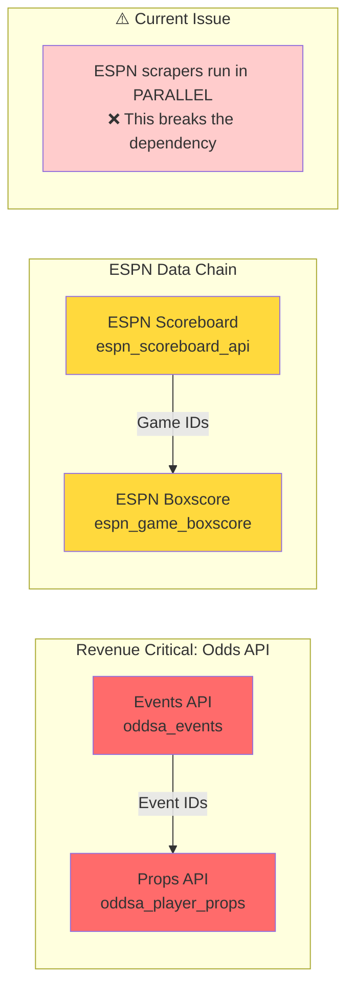
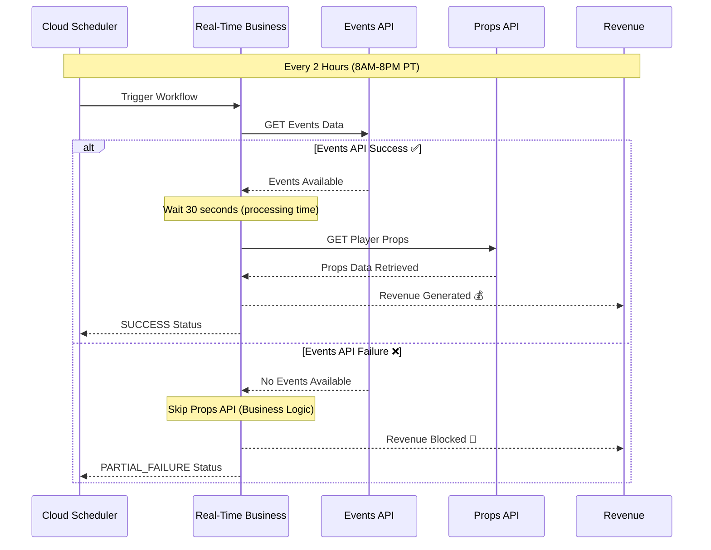
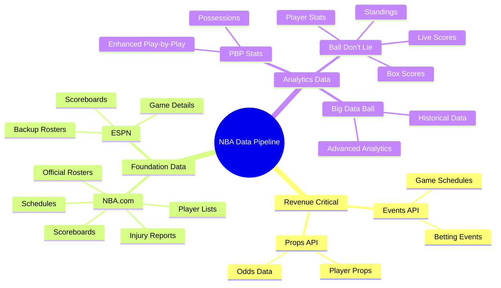

# NBA Workflows: Visual System Overview
*Comprehensive visual guide to NBA prop betting data pipeline workflows*

---

## 📅 Daily Schedule Overview

```mermaid
gantt
    title NBA Data Collection - Daily Schedule (Pacific Time)
    dateFormat HH:mm
    axisFormat %H:%M
    
    section Morning Setup
    Morning Operations        :morning, 08:00, 15m
    
    section Business Hours (Revenue Critical)
    Real-Time Business 1      :crit, rt1, 08:00, 10m
    Real-Time Business 2      :crit, rt2, 10:00, 10m
    Real-Time Business 3      :crit, rt3, 12:00, 10m
    Real-Time Business 4      :crit, rt4, 14:00, 10m
    Real-Time Business 5      :crit, rt5, 16:00, 10m
    Real-Time Business 6      :crit, rt6, 18:00, 10m
    Real-Time Business 7      :crit, rt7, 20:00, 10m
    
    section Game Day Coverage
    Game Day Evening 1        :active, ge1, 18:00, 10m
    Game Day Evening 2        :active, ge2, 21:00, 10m
    Post-Game Analysis        :done, pga, 21:00, 20m
    Game Day Evening 3        :active, ge3, 23:00, 10m
```



---

## 🔄 Updated Workflow Architecture & Dependencies

```mermaid
flowchart TD
    Schedule["📅 SCHEDULE<br/>6AM: Final Check | 8AM: Morning Ops | Every 2h: Real-Time | 8PM & 11PM: Post-Game | 2AM: Recovery"]
    
    Schedule --> FinalStart
    FinalStart --> FinalEnd
    FinalEnd --> MorningStart
    MorningStart --> MorningEnd
    MorningEnd --> RTStart
    RTStart --> RTEnd  
    RTEnd --> PostGameStart
    PostGameStart --> PostGameEnd
    PostGameEnd --> RecoveryStart
    
    subgraph " "
        FinalStart -.-> FinalEnd
        subgraph "☀️ Early Morning Final Check (6AM PT) - Last Chance Recovery"
            FC1["▶️ Enhanced PBP Final (pbp_enhanced_pbp)"]
            FC2["📊 ESPN Scoreboard (espn_scoreboard_api)"]
            FC3["🎯 ESPN Boxscore (espn_game_boxscore)"]
            FC4["📈 BDL Box Scores (bdl_box_scores)"]
            FC5["👤 Player Box Scores (bdl_player_box_scores)"]
            FC6["📊 Player Averages (bdl_player_averages)"]
            FC7["🧮 Advanced Stats (bdl_game_adv_stats)"]
            FC8["📝 Write Status to GCS"]
            
            FC2 -.->|Game IDs| FC3
        end
    end
    
    subgraph "  "
        MorningStart -.-> MorningEnd
        subgraph "🌅 Morning Operations (8AM PT) - Setup & Enhanced PBP Recovery"
            MO1["📋 NBA Rosters (nbac_roster)"]
            MO2["📋 ESPN Rosters (espn_roster_api)"]
            MO3["🔄 Player Movement (nbac_player_movement)"]
            MO4["📅 NBA Schedule (nbac_schedule_api)"]
            MO5["🏆 BDL Standings (bdl_standings)"]
            MO6["👥 Player List (nbac_player_list)"]
            MO7["🏥 Injury Report (nbac_injury_report)"]
            MO8["▶️ Enhanced PBP Recovery (pbp_enhanced_pbp)"]
            MO9["📝 Write Status to GCS"]
        end
    end
    
    subgraph "   "
        RTStart -.-> RTEnd
        subgraph "💰 Real-Time Business (Every 2h: 8AM-8PM PT) - Revenue Critical"
            RT1["🎯 Events API (oddsa_events)"]
            RT2["💸 Props API (oddsa_player_props)"]
            RT3["👥 Player List (nbac_player_list)"]
            RT4["🏥 Injury Report (nbac_injury_report)"]
            RT5["✅ BDL Players (bdl_active_players)"]
            RT6["📝 Write Status to GCS"]
            
            RT1 -.->|Must Succeed| RT2
        end
    end
    
    subgraph "    "
        PostGameStart -.-> PostGameEnd
        subgraph "🎮 Post-Game Collection (8PM & 11PM PT) - Core Game Data"
            PG1["📊 NBA Scoreboard (nbac_scoreboard_v2)"]
            PG2["⚡ BDL Live Scores (bdl_live_box_scores)"]
            PG3["📊 ESPN Scoreboard (espn_scoreboard_api)"]
            PG4["🎯 ESPN Boxscore (espn_game_boxscore)"]
            PG5["📈 BDL Box Scores (bdl_box_scores)"]
            PG6["👤 Player Box Scores (bdl_player_box_scores)"]
            PG7["📊 Player Averages (bdl_player_averages)"]
            PG8["🧮 Advanced Stats (bdl_game_adv_stats)"]
            PG9["📝 Write Status to GCS"]
            
            PG3 -.->|Game IDs| PG4
        end
    end
    
    subgraph "     "
        RecoveryStart
        subgraph "🌙 Late Night Recovery (2AM PT) - Enhanced PBP + Comprehensive Retry"
            LN1["▶️ Enhanced PBP (pbp_enhanced_pbp)"]
            LN2["📈 BDL Box Scores (bdl_box_scores)"]
            LN3["👤 Player Box Scores (bdl_player_box_scores)"]
            LN4["📊 Player Averages (bdl_player_averages)"]
            LN5["🧮 Advanced Stats (bdl_game_adv_stats)"]
            LN6["🏥 Injury Updates (nbac_injury_report)"]
            LN7["🔄 Player Movement (nbac_player_movement)"]
            LN8["📝 Write Status to GCS"]
        end
    end
    
    style FinalStart fill:transparent,stroke:transparent
    style FinalEnd fill:transparent,stroke:transparent
    style MorningStart fill:transparent,stroke:transparent
    style MorningEnd fill:transparent,stroke:transparent
    style RTStart fill:transparent,stroke:transparent
    style RTEnd fill:transparent,stroke:transparent
    style PostGameStart fill:transparent,stroke:transparent
    style PostGameEnd fill:transparent,stroke:transparent
    style RecoveryStart fill:transparent,stroke:transparent
    
    style RT1 fill:#ff6b6b
    style RT2 fill:#ff6b6b
    style PG3 fill:#ffd93d
    style PG4 fill:#ffd93d
    style FC1 fill:#96ceb4
    style LN1 fill:#96ceb4
    style FC2 fill:#ffd93d
    style FC3 fill:#ffd93d
```



---

## 🔧 Critical Dependencies That Must Be Sequential



## 💰 Critical Business Logic: Events → Props Revenue Flow



---

## 📊 Data Sources & API Usage



---


## 🏗️ System Architecture Flow

```mermaid
flowchart LR
    subgraph "Triggers"
        CS[Cloud Scheduler<br/>4 Triggers]
    end
    
    subgraph "Orchestration"
        WF[Google Cloud Workflows<br/>4 Business Processes]
    end
    
    subgraph "Execution"
        CR[Cloud Run Scrapers<br/>25+ Data Sources]
    end
    
    subgraph "Storage"
        GCS[(Google Cloud Storage<br/>Raw JSON Data)]
    end
    
    subgraph "Processing"
        PS[Pub/Sub Topics<br/>Event-Driven Processing]
        PROC[Data Processors<br/>Business Intelligence]
    end
    
    subgraph "Output"
        DB[(Database<br/>Structured Data)]
        RPT[Player Reports<br/>Predictions & Analysis]
    end
    
    CS --> WF
    WF --> CR
    CR --> GCS
    GCS --> PS
    PS --> PROC
    PROC --> DB
    DB --> RPT
    
    style CS fill:#ffd93d
    style WF fill:#ff6b6b
    style CR fill:#4ecdc4
    style GCS fill:#45b7d1
    style PROC fill:#96ceb4
    style RPT fill:#a8e6cf
```



---

## 📈 Data Volume & Frequency

| Workflow | Frequency | Scrapers | Avg Duration | Priority |
|----------|-----------|----------|--------------|-----------|
| **Real-Time Business** | Every 2h (8AM-8PM) | 5 scrapers | ~5 minutes | 🔴 Critical |
| **Morning Operations** | Daily 8AM | 7 scrapers | ~10 minutes | 🟡 High |
| **Game Day Evening** | 6PM, 9PM, 11PM | 5 scrapers | ~5 minutes | 🟢 Medium |
| **Post-Game Analysis** | Daily 9PM | 9 scrapers | ~15 minutes | 🔵 Low |

---

## 🎯 Next Phase: Implementation Status

### **📂 Current File Structure Status**

| Workflow File | Status | Implementation | Scrapers | Schedule |
|---------------|--------|----------------|----------|----------|
| `real-time-business.yaml` | ✅ Exists | 🔄 **UPDATE** | 5 + status | Every 2h (8AM-8PM) |
| `morning-operations.yaml` | ✅ Exists | 🔄 **UPDATE** | 8 + status | Daily 8AM |
| `post-game-collection.yaml` | ✅ Created | ✅ **DEPLOY** | 8 + status | 8PM & 11PM |
| `late-night-recovery.yaml` | ✅ Created | ✅ **DEPLOY** | 7 + status | Daily 2AM |
| `early-morning-final-check.yaml` | ✅ Created | ✅ **DEPLOY** | 7 + status | Daily 6AM |
| `post-game-analysis.yaml` | ❌ Delete | 🗑️ **REMOVE** | Replaced | N/A |

### **🚀 Ready for Deployment**

The foundation is complete! All workflow files are created with:
- ✅ **Status tracking** to GCS implemented
- ✅ **Dependencies** properly handled (Events→Props, ESPN chains)
- ✅ **Recovery strategy** using Option 1 approach
- ✅ **Comprehensive logging** and error handling

### **📊 Daily Execution Pattern**
```
Total Daily Executions: 12 workflows
- 6:00 AM → Final Check (1)
- 8:00 AM → Morning Ops (1) + Real-Time #1 (1)
- 10:00 AM - 8:00 PM → Real-Time #2-7 (6)
- 8:00 PM → Post-Game #1 (1)
- 11:00 PM → Post-Game #2 (1)
- 2:00 AM → Recovery (1)
```

### **🎯 Implementation Priority**
1. **Update existing workflows** (maintain revenue stream)
2. **Deploy new workflows** (add recovery capabilities)  
3. **Update schedulers** (12 total triggers)
4. **Clean up old files** (remove post-game-analysis)

**System ready for production deployment with comprehensive data collection and recovery capabilities!**

---

*This visual guide provides a comprehensive overview of your NBA data collection system. The foundation is solid and operational - ready for the next phase of data processing and player report generation!*
