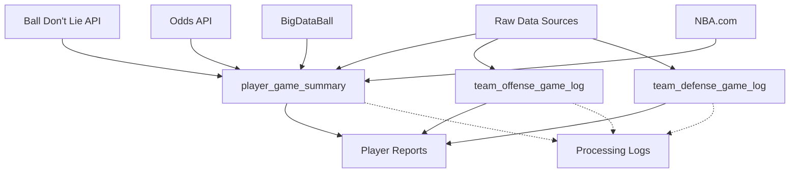

# NBA Analytics BigQuery Schema

Comprehensive analytics tables for NBA player prop betting analysis. This schema transforms raw scraped data into structured analytics optimized for player performance prediction and prop bet evaluation.

## 📋 Table of Contents

- [Overview](#overview)
- [Schema Architecture](#schema-architecture)
- [Table Relationships](#table-relationships)
- [Core Analytics Tables](#core-analytics-tables)
- [Processing & Monitoring](#processing--monitoring)
- [Data Sources & Tracking](#data-sources--tracking)
- [Query Examples](#query-examples)
- [Deployment](#deployment)
- [Performance Optimization](#performance-optimization)

## Overview

**Purpose**: Transform raw NBA data into analytics tables optimized for:
- Player prop betting analysis (points, rebounds, assists)
- Team strength-of-schedule evaluation  
- Performance prediction based on situational factors
- Real-time prop outcome tracking

**Data Pipeline**: Raw GCS JSON → BigQuery Raw Tables → Analytics Tables → Player Reports

**Key Features**:
- ✅ Comprehensive source tracking with timestamps
- ✅ Blowout-aware analysis (5-level game context system)
- ✅ Shot zone breakdowns (paint/mid-range/3PT)
- ✅ Advanced efficiency metrics (usage rate, true shooting %)
- ✅ Prop betting integration with timing analysis
- ✅ Processing monitoring and data quality tracking

## Schema Architecture

```
nba-props-platform.nba_analytics/        # Main analytics dataset
├── player_game_summary                   # Individual player performance per game
├── team_offense_game_log                 # Team offensive metrics per game  
├── team_defense_game_log                 # Team defensive metrics per game
└── [views]                               # Pre-built views for common queries

nba-props-platform.nba_processing/       # Pipeline monitoring dataset
├── analytics_processor_runs             # Processor execution logs
├── analytics_data_issues                # Data quality issue tracking
└── analytics_source_freshness           # Data arrival monitoring
```

## Table Relationships



**Primary Keys**:
- `player_game_summary`: `(player_lookup, game_id)`
- `team_offense_game_log`: `(team_abbr, game_id)`  
- `team_defense_game_log`: `(defending_team_abbr, game_id)`

**Foreign Key Relationships**:
- All tables share `game_id` for cross-table joins
- `team_abbr` links player data to team performance
- `opponent_team_abbr` enables strength-of-schedule analysis

## Core Analytics Tables

### 🏀 player_game_summary

**Purpose**: Individual player performance data per game with comprehensive metrics for prop betting analysis.

**Key Features**:
- **Prop Integration**: Lines, outcomes, timing analysis (`minutes_elapsed_when_over`)
- **Shot Zones**: Paint/mid-range/3PT attempts and makes + defensive blocks by zone
- **Efficiency Metrics**: Usage rate, true shooting %, effective FG%
- **Context**: Rest days, load management, injury status, blowout level
- **Source Tracking**: Performance, injury, prop, timing, and shot zone sources with timestamps

**Partitioning**: `game_date` (daily partitions)  
**Clustering**: `player_lookup`, `team_abbr`, `player_status`, `performance_source`

**Common Queries**:
```sql
-- Player's last 5 games with prop outcomes
SELECT * FROM player_game_summary 
WHERE player_lookup = 'lebronjames' 
AND game_date >= DATE_SUB(CURRENT_DATE(), INTERVAL 30 DAY)
ORDER BY game_date DESC LIMIT 5;

-- Players with 3+ days rest at home vs weak defense
SELECT p.*, d.defensive_rating
FROM player_game_summary p
JOIN team_defense_game_log d ON p.opponent_team_abbr = d.defending_team_abbr 
WHERE p.days_rest >= 3 AND p.home_game = TRUE AND d.defensive_rating > 115;
```

### 🏀 team_offense_game_log

**Purpose**: Team offensive performance data per game with detailed shot zones and efficiency metrics.

**Key Features**:
- **Shot Distribution**: Paint/mid-range/3PT with corner vs above-the-break 3PT breakdown
- **Four Factors**: Effective FG%, turnover rate, offensive rebounding %, free throw rate
- **Pace Analysis**: Possessions per 48 minutes, seconds per possession
- **Scoring Context**: Points in paint, second chance points, blowout level

**Use Cases**:
- Opponent strength evaluation for prop betting
- Pace impact analysis (faster teams = more possessions = higher scoring)
- Shot distribution trends (teams that allow more 3PT attempts)

### 🏀 team_defense_game_log

**Purpose**: Team defensive performance data per game with opponent shooting allowed and defensive metrics.

**Key Features**:
- **Opponent Shooting**: FG% allowed by zone, blocks by zone
- **Defensive Impact**: Turnovers forced, deflections, pace impact
- **Four Factors**: Defensive FG% allowed, turnover rate forced, rebounding %
- **Strength Metrics**: Defensive rating, points allowed per 100 possessions

**Use Cases**:
- Identify "defense-proof" players (perform well vs strong defenses)
- Pace impact analysis (slow defenses reduce total possessions)
- Matchup analysis (weak paint defense vs paint-heavy players)

## Processing & Monitoring

### 📊 analytics_processor_runs

Tracks execution of analytics processors with performance metrics:

```sql
-- Recent processor performance
SELECT processor_name, success_rate, avg_duration 
FROM processor_performance_summary 
WHERE run_date >= DATE_SUB(CURRENT_DATE(), INTERVAL 7 DAY);
```

### 🚨 analytics_data_issues

Monitors data quality with automated issue detection:

**Issue Types**: `missing_data`, `data_quality`, `validation_error`, `source_conflict`  
**Severity Levels**: `CRITICAL`, `HIGH`, `MEDIUM`, `LOW`

```sql
-- Active critical issues
SELECT * FROM active_data_issues 
WHERE severity = 'CRITICAL';
```

### ⏱️ analytics_source_freshness  

Tracks data arrival and processing delays:

```sql
-- Sources running behind schedule
SELECT source_name, arrival_delay_minutes 
FROM source_freshness_status 
WHERE arrival_delay_minutes > 60;
```

## Data Sources & Tracking

Each analytics table tracks multiple data sources with timestamps to enable:
- **Data lineage**: Know exactly where each field came from
- **Quality comparison**: Compare accuracy across sources  
- **Fallback logic**: Use backup sources when primary fails
- **Freshness monitoring**: Track delays and processing times

### Source Types by Table:

**player_game_summary**:
- `performance_source`: "bdl_boxscores", "nbac_gamebook", "bigdataball"
- `injury_source`: "nbac_gamebook", "injury_report", "bdl_injury"  
- `prop_source`: "odds_api", "bettingpros_backup"
- `timing_source`: "bigdataball"
- `shot_zone_source`: "bigdataball", "bdl_backup"

**team_offense_game_log / team_defense_game_log**:
- `shot_zone_source`: "bigdataball", "calculated_from_players"
- `team_stats_source`: "player_aggregation", "nbac_official_team_totals"
- `pace_source`: "bigdataball_possessions", "standard_formula"

### Blowout Analysis System

5-level categorization for game context:

| Level | Description | Point Margin | Use Case |
|-------|-------------|--------------|----------|
| 1 | Close Game | 0-8 points | Players likely play full minutes |
| 2 | Solid Win | 9-15 points | Competitive but decided |
| 3 | Comfortable Win | 16-20 points | Some rest in 4th quarter |
| 4 | Clear Blowout | 21-25 points | Stars may sit entire 4th |
| 5 | Massive Blowout | 26+ points | Garbage time from 3rd quarter |

## Query Examples

### Player Prop Analysis

```sql
-- LeBron's points performance vs different defensive strengths
SELECT 
  p.game_date,
  p.points,
  p.points_line,
  p.over_under_result,
  p.minutes_played,
  p.blowout_description,
  d.defensive_rating as opp_def_rating,
  CASE 
    WHEN d.defensive_rating <= 110 THEN 'Elite Defense'
    WHEN d.defensive_rating <= 115 THEN 'Good Defense' 
    WHEN d.defensive_rating <= 120 THEN 'Average Defense'
    ELSE 'Weak Defense'
  END as defense_strength
FROM player_game_summary p
JOIN team_defense_game_log d 
  ON p.opponent_team_abbr = d.defending_team_abbr 
  AND p.game_date = d.game_date
WHERE p.player_lookup = 'lebronjames'
  AND p.is_active = TRUE
  AND p.points_line IS NOT NULL
ORDER BY p.game_date DESC;
```

### Rest Days Impact Analysis

```sql
-- Performance by rest days for active prop players
SELECT 
  days_rest,
  COUNT(*) as games,
  AVG(points) as avg_points,
  AVG(points_line) as avg_line,
  AVG(CAST(went_over_prop AS INT64)) as over_rate,
  AVG(minutes_played) as avg_minutes
FROM player_game_summary
WHERE is_active = TRUE 
  AND points_line IS NOT NULL
  AND game_date >= '2024-10-01'  -- Current season
GROUP BY days_rest
ORDER BY days_rest;
```

### Team Pace Impact on Player Props

```sql
-- How team pace affects player scoring vs props
SELECT 
  CASE 
    WHEN o.pace >= 102 THEN 'Fast Pace (102+)'
    WHEN o.pace >= 98 THEN 'Medium Pace (98-102)'
    ELSE 'Slow Pace (<98)'
  END as pace_group,
  COUNT(*) as games,
  AVG(p.points) as avg_points,
  AVG(p.points_line) as avg_line,
  AVG(CAST(p.went_over_prop AS INT64)) as over_rate
FROM player_game_summary p
JOIN team_offense_game_log o 
  ON p.team_abbr = o.team_abbr 
  AND p.game_date = o.game_date
WHERE p.is_active = TRUE 
  AND p.points_line IS NOT NULL
  AND o.pace IS NOT NULL
GROUP BY pace_group
ORDER BY AVG(o.pace) DESC;
```

### Shot Zone Efficiency Analysis

```sql
-- Player performance by shot zone vs league average
WITH league_avg AS (
  SELECT 
    AVG(SAFE_DIVIDE(paint_makes, paint_attempts)) as avg_paint_pct,
    AVG(SAFE_DIVIDE(three_pt_makes, three_pt_attempts)) as avg_three_pct,
    AVG(SAFE_DIVIDE(mid_range_makes, mid_range_attempts)) as avg_midrange_pct
  FROM player_game_summary 
  WHERE is_active = TRUE AND game_date >= '2024-10-01'
)
SELECT 
  p.player_lookup,
  p.player_full_name,
  COUNT(*) as games,
  AVG(SAFE_DIVIDE(p.paint_makes, p.paint_attempts)) - l.avg_paint_pct as paint_vs_avg,
  AVG(SAFE_DIVIDE(p.three_pt_makes, p.three_pt_attempts)) - l.avg_three_pct as three_vs_avg,
  AVG(SAFE_DIVIDE(p.mid_range_makes, p.mid_range_attempts)) - l.avg_midrange_pct as midrange_vs_avg,
  AVG(CAST(p.went_over_prop AS INT64)) as over_rate
FROM player_game_summary p
CROSS JOIN league_avg l
WHERE p.is_active = TRUE 
  AND p.points_line IS NOT NULL
  AND p.game_date >= '2024-10-01'
GROUP BY p.player_lookup, p.player_full_name, l.avg_paint_pct, l.avg_three_pct, l.avg_midrange_pct
HAVING games >= 10
ORDER BY over_rate DESC;
```

## Deployment

### Prerequisites
1. **BigQuery API enabled** in your GCP project
2. **Service account** with BigQuery Data Editor permissions
3. **US-West2 region** for data locality with GCS buckets

### Deployment Steps

```bash
# 1. Create datasets
bq query --use_legacy_sql=false < schemas/bigquery/analytics/datasets.sql

# 2. Create analytics tables
bq query --use_legacy_sql=false < schemas/bigquery/analytics/player_game_summary_tables.sql
bq query --use_legacy_sql=false < schemas/bigquery/analytics/team_offense_game_log_tables.sql  
bq query --use_legacy_sql=false < schemas/bigquery/analytics/team_defense_game_log_tables.sql

# 3. Create processing tables
bq query --use_legacy_sql=false < schemas/bigquery/analytics/processing_tables.sql

# 4. Verify deployment
bq ls nba_analytics
bq ls nba_processing
```

### Validation Queries

```sql
-- Verify table structure
SELECT table_name, partition_id, total_rows 
FROM `nba-props-platform.nba_analytics.__TABLES_SUMMARY__`;

-- Check clustering effectiveness  
SELECT table_name, clustering_ordinal_position, clustering_fields
FROM `nba-props-platform.nba_analytics.INFORMATION_SCHEMA.CLUSTERING_FIELDS`;

-- Verify views are accessible
SELECT table_name, table_type 
FROM `nba-props-platform.nba_analytics.INFORMATION_SCHEMA.TABLES`
WHERE table_type = 'VIEW';
```

## Performance Optimization

### Partitioning Strategy
- **All tables partitioned by `game_date`** for efficient date-range queries
- **3-year retention policy** (1,095 days) balances cost and historical analysis needs
- **Partition pruning** automatically applied for date-filtered queries

### Clustering Strategy
Each table clustered on high-cardinality, frequently-filtered columns:

- **player_game_summary**: `player_lookup`, `team_abbr`, `player_status`, `performance_source`
- **team_offense_game_log**: `team_abbr`, `opponent_team_abbr`, `season_year`  
- **team_defense_game_log**: `defending_team_abbr`, `opponent_team_abbr`, `season_year`

### Query Optimization Tips

**✅ Efficient Queries**:
```sql
-- Good: Uses partition pruning + clustering
SELECT * FROM player_game_summary 
WHERE game_date >= '2024-11-01'    -- Partition pruning
  AND player_lookup = 'lebronjames' -- Clustering benefit
  AND is_active = TRUE;
```

**❌ Inefficient Queries**:
```sql
-- Bad: No date filter, scans all partitions
SELECT * FROM player_game_summary 
WHERE points > 30;

-- Bad: Function on clustered column prevents optimization  
SELECT * FROM player_game_summary
WHERE UPPER(player_lookup) = 'LEBRONJAMES';
```

### Cost Management
- **Partition expiration**: Automatically removes old data after 3 years
- **Clustering**: Reduces scan costs for filtered queries
- **Views**: Pre-computed common filters reduce query complexity
- **Processing logs**: 1-year retention prevents unbounded growth

---

## 📞 Support & Contribution

**File Issues**: Use GitHub issues for schema improvements or bug reports  
**Questions**: Reference this README and table schemas before asking  
**Updates**: Follow semantic versioning for schema changes

**Next Steps**: Deploy schema → Implement analytics processors → Build player report generator

---

*Schema Version: 2.0 | Last Updated: September 2025 | NBA Props Platform Team*